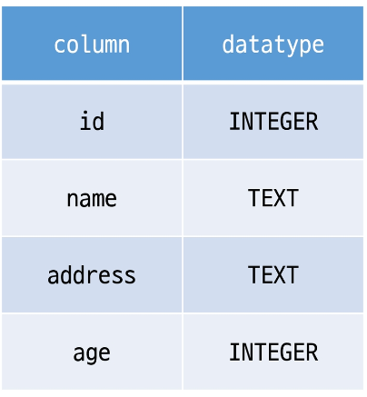
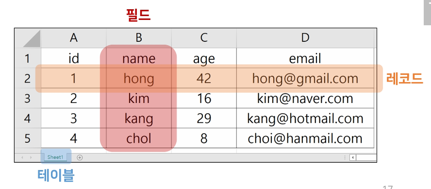
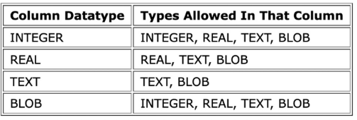

# ✨ Database

## 📌 Database

### 💡 Intro

#### [지금은 데이터의 시대]

- 세상에는 수 많은 데이터들이 존재한다.

- 인터넷만 떠올려봐도 셀 수 없이 많은 데이터가 지금 이 순간에도 우리가 사용하는 웹 서비스나 애플리케이션 등을 통해 생성 수정 삭제 되고 있다.

  (내 아이디, 이메일, 비밀번호, 접속기록 등)

- 과거와 달리 이러한 데이터 규모는 점점 더 빠른 속도로 증가하고 있고, 이 데이터를 다루는 기술 또한 점점 중요해지고 있다.


#### [데이터베이스의 등장]

- 이러한 서비스 혹은 애플리케이션들은 대체 어떻게 어디에 저장할까 ? → 데이터베이스
- 파일을 이용한 데이터 관리
  - 우리는 일반적으로 데이터를 파일에 저장한다.
  - **장점**
    - 운영체제에 관계 없이 어디에서나 쉽게 사용가능
    - 이메일이나 메신저를 이용해 간편하게 전송 가능
  - **단점**
    - 성능과 보안적 측면에서 한계가 명확
    - 대용량 데이터를 다루기에 적합하지 않음
    - 데이터를 구조적으로 정리하기에 어려움
    - 확장이 불가능한 구조
- 스프레드 시트를 이용한 데이터 관리
  - 스프레드 시트 (엑셀 시트) 을 사용
  - 스프레드 시트는 컬럼 (열) 을 통해 데이터의 유형을 지정하고 레코드(행) 을 통해 구체적인 데이터 값을 포함
  - 스프레드 시트 자체를 데이터베이스라고 부를 수는 없지만 데이터베이스로 가는 길목정도로 생각해볼 수 있음

- 스프레드 시트와 달리 프로그래밍 언어를 사용해 작동 시킬 수 있음
- 데이터베이스는 많은 형태가 있지만 실제 가장 많이 쓰이는 유형은 RDB (Relational Database) 라고 부르는 관계형 데이터베이스
- RDB는 각각의 데이터를 테이블에 기입함 (마치 스프레드 시트에 작성하는 것처럼)
- 쉽게 생각하면 스프레드시트 파일 모음을 관계형 RDB라고 생각하자 !


#### [Database 학습 목표]

- 데이터베이스를 사용하면 데이터를 안전하고 편리하고 빠르게 보관하고 사용할 수 있음
- 거대하고 복잡하고 데이터를 다루기 위해서 고안된 도구이기 때문에 매우 많은 기능을 제공
  - 기능이 많다 == 데이터 관련해서 할 수 있는 일들이 많다
  - 모든 기능을 학습하는 것은 불필요함 → 우선 기초적인 부분에 집중하자
- DB 학습의 기초
  - "데이터베이스에 데이터를 어떻게 입력하고, 어떻게 출력하는가"
- 즉 데이터베이스에서의 CRUD와 여러 키워드들 위주로 학습할 예정


#### [Database 정의]

- 체계화된 데이터의 모임
- 여러 사람이 공유하고 사용할 목적으로 통합 관리되는 정보의 집합
- 검색, 구조화 같은 작업을 보다 쉽게 하기 위해 조직화된 데이터를 수집하는 저장 시스템
  - 내용을 고도로 구조화 함으로써 검색과 갱신의 효율화를 꾀한 것
  - 즉, 자료 파일을 조직적으로 통합하여 자료 항목의 중복을 없애고 구조화하여 기억시켜 놓은 자료의 집합체
- 이러한 Database를 조작하는 프로그램 = DBMS(Database Management System)
  - 한 번쯤 들어봤을 Oracle, MySQL, SQLite ... 등이 모두 DBMS
  - DBMS 에서 Database를 조작하기 위해 사용하는 언어를 SQL 이라 함
- 웹 개발에서 대부분의 데이터베이스는 '관계형 데이터베이스 관리 시스템(REDMS)' 을 사용하여 SQL로 데이터와 프로그래밍을 구성


### 💡 RDB

#### [RDB란]

- Relational Database (관계형 데이터베이스)
- 데이터를 테이블, 행, 열 등으로 나누어 구조화 하는 방식
- 자료를 여러 테이블로 나누어서 관리하고, 이 테이블간 관계를 설정해 여러 데이터를 조작할 수 있다는 장점
- SQL을 사용하여 데이터를 조회하고 조작


#### [RDB 기본 구조]

1. 스키마
2. 테이블
   - 필드
   - 레코드
   - 기본 키

##### 📢 스키마 (Schema)

- 테이블의 구조 (Structure)
- 데이터베이스에서 자료의 구조, 표현 방법, 관계 등 전반적인 명세를 기술한 것



##### 📢 테이블 (Table)

- 필드와 레코드를 사용해 조직된 데이터 요소들의 집합
- 관계(Relation) 라고도 부름

1. 필드 (field)
   - 속성, 컬럼 (Column)
2. 레코드 (record)
   - 튜플, 행 (Row)
   - 테이블의 데이터는 레코드에 저장됨



##### 📢 PK (Primary Key)

- 기본 키
- 각 레코드의 고유한 값
  - 각각의 데이터를 구분할 수 있는 고윳값
- 기술적으로 다른 항목과 절대로 중복될 수 없는 **단일 값(unique)**
- 데이터베이스 관리 및 테이블


#### [관계형 데이터베이스의 이점]

- 데이터를 직관적으로 표현할 수 있음
- 관련한 각 데이터에 쉽게 접근할 수 있음
- 대량의 데이터도 효율적으로 관리 가능


#### [RDBMS]

- Relational Database Management System (관계형 데이터베이스 관리 시스템)
- 관계형 데이터베이스를 만들고 업데이트하고 관리하는 데 사용하는 프로그램
- 예시
  - SQLite, MySQL, PostgreSQL, Microsoft SQL Server, Oracle Databse 등


#### [SQLite]

- 응용 프로그램에 파일 형식으로 넣어 사용하는 비교적 가벼운 데이터베이스
- 안드로이드, iOS, macOS 에 기본적으로 탑재되어 있으며 임베디드 소프트웨어에서도 많이 활용됨
- 오픈 소스 프로젝트이기 때문에 자유롭게 사용가능


- 단점
  - 대규모 동시 처리 작업에는 적합하지 않음
  - 다른 RDMBS 에서 지원하는 SQL 기능을 지원하지 않을 수 있음
- SQLite를 학습하는 이유
  - 어떤 환경에서나 실행 가능한 호환성
  - 데이터 타입이 비교적 적고 강하지 않기 때문에 유연한 학습 환경을 제공
  - Django Framework의 기본 데이터베이스


## 📌 SQL

#### [SQL 이란]

- "Structured Query Language"
- RDBMS의 데이터를 관리하기 위해 설계된 특수 목적의 프로그래밍 언어
- RDBMS에서 데이터베이스 스키마를 생성 및 수정할 수 있으며, 테이블에서의 자료 검색 및 관리도 할 수 있음
- 데이터베이스 객체에 대한 처리를 관리하거나 접근 권한을 설정하여 허가된 사용자만 RDBMS를 관리할 수 있도록 할 수 있음
- 많은 데이터베이스 관련 프로그램들이 SQL을 표준으로 채택하고 있음


- SQL은 데이터베이스와 상호작용하는 방법
- 따라서 SQL을 배우면서 데이터베이스의 동작원리 또한 익힐 수 있음


### 💡SQL Commands

#### [SQL Commands 종류]

- 명령어는 특성에 따라 다음 세 가지 그룹으로 분류

1. DDL (Data Definition Language)
2. DML (Data Manipulation Language)
3. DCL (Data Control Language)

|                           분류                           |                             개념                             |                 SQL 키워드                  |
| :------------------------------------------------------: | :----------------------------------------------------------: | :-----------------------------------------: |
|  DDL - 데이터 정의 언어<br />(Data Definition Language)  | 관계형 데이터베이스 구조(테이블, 스키마)를<br />정의(생성, 수정 및 삭제) 하기 위한 명령어 |         CREATE<br />DROP<br />ALTER         |
| DML - 데이터 조작 언어<br />(Data Manipulation Language) | 데이터를 조작 (추가, 조회, 변경, 삭제)<br />하기 위한 명령어 | INSERT<br />SELECT<br />UPDATE<br />DELETE  |
|   DCL - 데이터 제어 언어<br />(Data Control Language)    | 데이터의 보안, 수행제어, 사용자 권한 부여 등을<br />정의하기 위한 명령어 | GRANT<br />REVOKE<br />COMMIT<br />ROLLBACK |

- SQLite는 파일로 관리되는 DB이기 때문에 SQL을 이용한 접근 제한이 아닌 운영 체제의 파일 접근 권한으로만 제어가능. 그래서 SQLite에는 권한 설정을 담당하는 GRANT(권한 부여)와 REVOKE(권한 회수)는 지원하지 않아 DCL 부분은 생략


### 💡 SQL Syntax

```sqlite
-- SQL Syntax 예시

SELECT column_name FROM table_name;
```

- 모든 SQL 문 (statement)는 SELECT, INSERT, UPDATE 등과 같은 키워드로 시작하고, 하나의 statement는 세미콜론(;)으로 끝남
  - 세미콜론은 각 SQL 문을 구분하는 표준 방법
- SQL 키워드는 대소문자를 구분하지 않음
  - 즉, SELECT 와 select는 SQL 문에서 동일한 의미
  - 하지만 대문자로 작성하는 것을 권장


#### [참고] Statement & Clause

- Statement (문)
  - 독립적으로 실행할 수 있는 완전한 코드 조각
  - statement는 clause로 구성됨
- Clause (절)
  - statement의 하위 단위

```sql
SELECT column_name FROM table_name;
```

- SELECT statement 라 부름
- 이 statement는 다음과 같이 2개의 clause로 구성 됨
  1. SELECT column_name
  2. FROM table_name


## 📌 DDL

### 💡 사전 준비

1. 데이터베이스 `mydb.sqlite3` 파일 생성
2. `DDL.sql` 파일 생성
3. vscode 실행 후 `DDL.sql` 화면에서 마우스 우측 버튼 클릭
   - Use Database 선택
   - 데이터베이스 목록에서 `mydb.sqlite3` 선택


#### [개요]

- "Data definition"
- SQL 데이터 정의 언어를 사용하여 테이블 데이터베이스 개체를 만드는 방법을 학습
- DDL은 테이블 구조를 관리
  - CREATE, ALTER, DROP


### 💡 CREATE TABLE

#### [CREATE TABLE statement]

- "Create a new table in the database."
- 데이터베이스에 새 테이블을 만듦

```sql
CREATE TABLE table_name (
    column_1 data_type constraints,
    column_2 data_type constraints,
    column_3 data_type constraints,
);
```


#### [CREATE TABLE 실습]

- contacts 테이블 생성

```sql
-- DDL.sql

CREATE TABLE contacts (
	name TEXT NOT NULL,
    age INTEGER NOT NULL,
    email TEXT NOT NULL UNIQUE
);
```

- Query 실행하기

  - 실행하고자 하는 명령문에 커서를 두고 마우스 우측 버튼 →  'Run Selected Query' 선택

  - 명령문을 모두 선택 할 필요 없으며, 실행하고자 하는 명령문 안에 커서가 올라가 있으면 가능

- 쿼리 실행 후 테이블 및 스키마 확인
  - id 컬럼은 우리가 직접 기본 키 역할의 컬럼을 정의하지 않으면 자동으로 rowid 라는 컬럼으로 만들어짐


### 💡 SQLite Data Types

#### [Data Types 종류]

1. NULL
   - NULL value
   - 정보가 없거나 알 수 없음을 의미 (missing information or unknown)
2. INTEGER
   - 정수
   - 크기에 따라 0, 1, 2, 3, 4, 6 또는 8 바이트와 같은 가변 크기를 가짐
3. REAL
   - 실수
   - 8바이트 부동 소수점을 사용하는 10진수 값이 있는 실수
4. TEXT
   - 문자 데이터
5. BLOB (Binary Large Object)
   - 입력된 그래도 저장된 데이터 덩어리 (대용 타입 없음)
   - 바이너리 등 멀티미디어 파일
   - 예시
     - 이미지 데이터

#### [참고] Boolean type

- SQLite 에는 별도의 Boolean 타입이 없음
- 대신 Boolean 값은 정수 0 (false) 과 1 (true) 로 저장됨


#### [참고] Data & Time Datatype

- SQLite 에는 날짜 및 시간을 저장하기 위한 타입이 없음
- 대신 SQLite의 built-in "Data And Time Functions" 으로 TEXT, REAL 또는 INTEGER 값으로 저장할 수 있음


#### [참고] Binary Data

- 데이터의 저장과 처리를 목적으로 0과 1의 이진 형식으로 인코딩 된 파일
- 기본적으로 컴퓨터의 모든 데이터는 binary data
  - 다만, 이를 필요에 따라서 텍스트 타입으로 변형해서 사용하는 것


#### 📢 SQLite는 다음 규칙을 기반으로 데이터 타입을 결정

- 값에 둘러싸는 따옴표와 소수점 또는 지수가 없으면 - INTEGER
- 값이 작은 따옴표나 큰따옴표로 묶이면 - TEXT
- 값에 따옴표나 소수점, 지수가 없으면 - REAL
- 값이 따옴표 없이 NULL 이면 - NULL


#### 📢 SQLite Datatypes 특징

- SQLite 다른 모든 SQL 데이터베이스 엔진 (MySQL, PostgreSQL 등)의 정적이고 엄격한 타입(static, rigid typing)이 아닌 "동적 타입 시스템(dynamic type system)"을 사용

  - 컬럼에 선언된 데이터 타입에 의해서가 아니라 컬럼에 저장된 값에 따라 데이터 타입이 결정됨

- 또한 테이블을 생성할 때 컬럼에 대해 특정 데이터 타입을 선언하지 않아도 됨

  - 예를 들어 동일한 컬럼에 정수 1을 넣을 경우 INTEGER로 타입이 지정되고, 문자 '1'을 넣을 경우는 TEXT 타입으로 지정됨
  - 이러한 SQLite의 동적 타입 시스템을 사용하면 기존의 엄격하게 타입이 지정된 데이터베이스에서는 불가능한 작업을 유연하게 수행할 수 있음
  - 게다가 정적 타입 시스템이 지정된 데이터베이스에서 작동하는 SQL 문이 SQLite에서 동일한 방식으로 작동한다는 점
  - 다만 이는 다른 데이터베이스와의 호환성 문제가 있기 때문에 테이블 생성 시 데이터 타입을 지정하는 것을 권장

- 데이터 타입을 지정하게 되면 SQLite는 입력된 데이터의 타입을 지정된 데이터 타입으로 변환

  - 예를 들어 TEXT 타입 컬럼에 정수 1을 저장할 경우 문자 타입의 '1'로 저장됨

  - 허용 가능한 타입 변환

    


#### [참고] "Static, rigid typing" 데이터베이스

- statically, rigidly typed databases 라고도 부름

- 저장되는 값의 데이터 타입은 컬럼에 선언된 데이터 타입에 의해 결정된다.

- 동작 예시

  ```sql
  CREATE TABLE my_table (
  	a INTEGER NOT NULL,
      b TEXT NOT NULL,
  );
  ```

- 만약 a 컬럼에 '123', b 컬럼에 456 데이터를 삽입하려는 경우 삽입을 수행하기 전에 문자열 '123'을 정수 123으로 변환하고, 정수 456을 문자열 '456'으로 변환


#### Type Affinity

- "타입 선호도"
- 특정 컬럼에 저장된 데이터에 권장되는 타입
- 데이터 타입 작성 시 SQLite의 5가지 데이터 타입이 아닌 다른 데이터 타입을 선언한다면, 내부적으로 각 타입의 지정된 선호도에 따라 5가지 선호도로 인식됨
  1. INTEGER
  2. TEXT
  3. BLOB
  4. REAL
  5. NUMERIC
- 타입 선호도 존재 이유
  - 다른 데이터베이스 엔진 간의 호환성을 최대화
  - 정적이고 엄격한 타입을 사용하는 데이터베이스의 SQL 문을 SQLite 에서도 작동하도록 하기 위함


### 💡 Constraints


## 📌 DML

