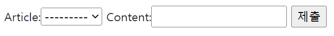
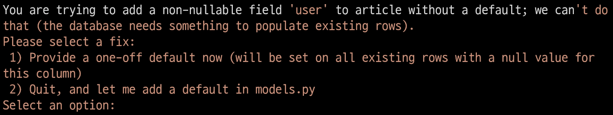
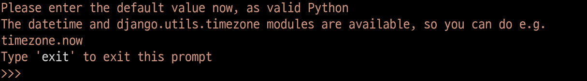
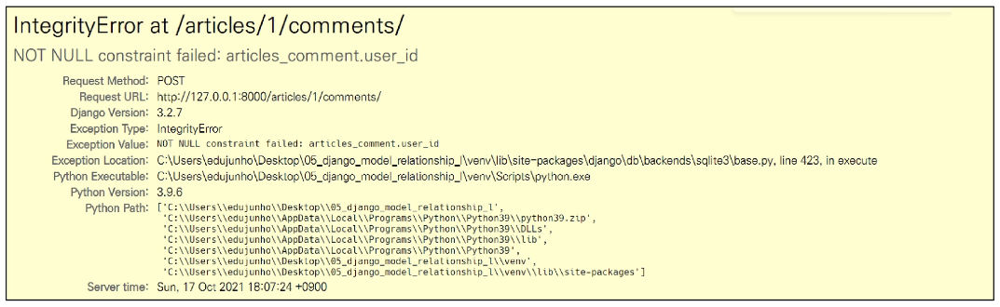
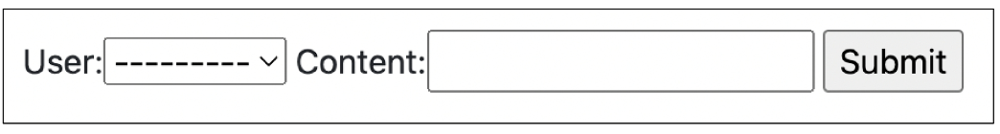
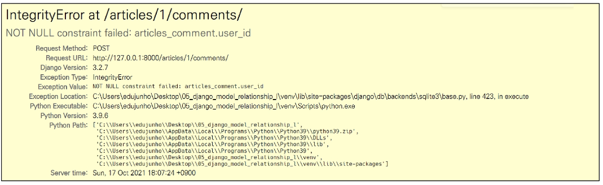

# ✨ Database

## 📌 A many-to-one relationship

##### 관계형 데이터베이스에서의 외래 키 속성을 사용해 모델간 N:1 관계 설정하기

#### 📢 RDB에서의 관계

1. **1:1**

   - One-to-one relationships
   - 한 테이블의 레코드 하나가 다른 테이블의 레코드 단 한 개와 관련된 경우

2. **N:1**

   - Many-to-one relationships
   - 한 테이블의 0개 이상의 레코드가 다른 테이블의 레코드 한 개와 관련된 경우
   - 기준 테이블에 따라 (1:N, One-to-many relationships)이라고도 함
   - **만약 고객이 단 한 개의 주문만 생성할 수 있다면 두 테이블은 1:1 관계라 할 수 있음**

3. **M:N**

   - Many-to-many relationships
   - 한 테이블의 0개 이상의 레코드가 다른 테이블의 0개 이상의 레코드와 관련된 경우
   - 양쪽 모두에서 N:1 관계를 가짐

   

### 💡 Foreign Key (외래 키)

#### [개념]

- 외래 키 (외부 키)
- 관계형 데이터베이스에서 한 테이블의 필드 중 다른 테이블의 행을 식별할 수 있는 키
- 참조하는 테이블에서 1개의 키에 해당하고, 이는 참조되는 측 테이블의 기본 키(Primary Key)를 가리킴
- 참조하는 테이블의 행 1개의 값은, 참조되는 측 테이블의 행 값에 대응됨
  - 이 때문에 참조하는 테이블의 행에는, 참조되는 테이블에 나타나지 않는 값을 포함할 수 없음
- 참조하는 테이블 행 여러 개가, 참조되는 테이블의 동일한 행을 참조할 수 있음


#### [특징]

- 키를 사용하여 부모 테이블의 유일한 값을 참조 (by 참조 무결성)
- 외래 키의 값이 반드시 부모 테이블의 기본 키 일 필요는 없지만 유일한 값이어야 함


#### [참조] 참조 무결성

- 데이터베이스 관계 모델에서 관련된 2개의 테이블 간의 일관성을 말함
- 외래 키가 선언된 테이블의 외래 키 속성(열)의 값은 그 테이블의 부모가 되는 테이블의 기본 키 값으로 존재해야 함


## 📌 N:1 (Comment - Article)

- Comment(N) - Article(1)
  - Comment 모델과 Article 모델 간 관계 설정
- "0개 이상의 댓글은 1개의 게시글에 작성될 수 있음"


### 💡 모델 관계 설정

- N:1 관계에서 댓글을 담당할 Comment 모델은 N, Article 모델은 1이 될 것

  


### 💡 Django Relationship fields

#### [Django Relationship fields 종류]

1. `OneToOneField()`
   - A one-to-one relationship
2. `ForeignKey()`
   - A many-to-one relationship
3. `ManyToManyField()`
   - A many-to-many relationship


#### 📢 ForeignKey (to, on_delete, **options)

- A many-to-one relationship 을 담당하는 Django의 모델 필드 클래스
- Django 모델에서 관계형 데이터베이스의 외래 키 속성을 담당
- 2개의 필수 위치 인자가 필요
  1. 참조하는 `model class`
  2. `on-delete` 옵션


### 💡 Comment Model

#### 📢 Comment 모델 정의

```python
class Comment(models.Model):
    article = models.ForeignKey(Article, on_delete=models.CASCADE)
    content = models.TextField()
    created_at = models.DateTimeField(auto_now_add=True)
    updated_at = models.DateTimeField(auto_now=True)
    
    def __str__(self):
        return self.content
```

- 외래 키 필드는 ForeignKey 클래스를 작성하는 위치와 관계 없이 필드의 마지막에 작성됨
- `ForeignKey()` 클래스의 인스턴스 이름은 참조하는 모델 클래스 이름의 단수형(소문자)으로 작성하는 것을 권장


#### 📢 ForeignKey arguments - `on_delete`

- 외래 키가 참조하는 객체가 사라졌을 때, 외래 키를 가진 객체를 어떻게 처리할 지를 정의
- 데이터 무결성을 위해서 매우 중요한 설정
- on_delete 옵션 값
  - `CASCADE` : 부모 객체 (참조 된 객체)가 삭제됐을 때 이를 참조하는 객체도 삭제
  - `PROTECT`, `SET_NULL`, `SET_DEFAULT` ... 등 여러 옵션 값들이 존재


#### [참고] 데이터 무결성 (Data Integrity)

- 데이터의 정확성과 일관성을 유지하고 보증하는 것
- 데이터베이스나 RDBMS의 중요한 기능
- 무결성 제한의 유형
  1. 개체 무결성 (Entity integrity)
  2. 참조 무결성 (Referential integrity)
  3. 범위 무결성 (Domain integrity)


#### 📢 Migration 과정 진행

```bash
$ python manage.py makemigrations
$ python manage.py migrate
```

- ForeignKey 모델 필드로 인해 작성된 컬럼의 이름이 `article_id`인 것을 확인
- 만약 ForeignKey 인스턴스를 article이 아닌 abcd로 생성했다면 abcd_id로 만들어짐
  - 이처럼 명시적인 모델 관계를 파악을 위해 참조하는 클래스 이름의 소문자(단수형)로 작성하는 것이 권장 되었던 이유


#### 📢 댓글 생성 연습하기

```bash
# shell_plus 실행
$ python manage.py shell_plus
```

1. 댓글 생성

```bash
# Comment 클래스의 인스턴스 comment 생ㅇ성
comment = Comment()

# 인스턴스 변수 저장
comment.content = 'first comment'

# DB에 댓글 저장
comment.save()

#에러 발생
django.db.utils.IntegrityError: NOT NULL constraint failed: articles_comment.article_id
# articles_comment 테이블의 ForeignKeyField, article_id  값이 저장시 누락되었기 때문
```

```bash
# 게시글 생성 및 확인
article = Article.objects.create(title='title', content='content')
article
=> <Article: title>

# 외래 키 데이터 입력
# 다음과 같이 article 객체 자체를 넣을 수 있음
comment.article = article
# 또는 comment.article_id = article.pk 처럼 pk 값을 직접 외래 키 컬럼에
# 넣어 줄 수도 있지만 권장하지 않음

# DB에 댓글 저장 및 확인
comment.save()
comment
=> <Comment: first comment>
```

2. 댓글 속성 값 확인

```bash
comment.pk
=> 1

comment.content
=> 'first comment'

# 클래스 변수명인 article로 조회 시 해당 참조하는 게시물 객체를 조회할 수 있음
comment.article
=> <Article: title>

# article_pk 는 존재하지 않는 필드이기 때문에 사용 불가
comment.article_id
=> 1
```

3. comment 인스턴스를 통한 article 값 접근하기

```bash
# 1번 댓글이 작성된 게시물의 pk 조회
comment.article.pk
=> 1

# 1번 댓글이 작성된 게시물의 content 조회
comment.article.content
=> 'content'
```

4. 두번째 댓글 작성해보기

```shell
comment = Comment(content='secone comment', article=article)
comment.save()

comment.pk
=> 2

comment
=> <Comment: second comment>

comment.article_id
=> 1
```


### 💡 관계 모델 참조

#### 📢 Related manager

- Related manager 는 N:1 혹은 M:N 관계에서 사용 가능한 문맥 (context)
- Django 는 모델 간 N:1 혹은 M:N 관계가 설정되면 역참조할 때에 사용할 수 있는 manager 를 생성
  - 우리가 이전에 모델 생성 시 `objects` 라는 매니저를 통해 queryset api를 사용했던 것처럼 related manager를 통해 queryset api를 사용할 수 있게 됨


#### 📢 역참조

- 나를 참조하는 테이블(나를 외래 키로 지정한)을 참조하는 것
- 즉, 본인을 외래 키로 참조 중인 다른 테이블에 접근하는 것
- N:1 관계에서는 1이 N을 참조하는 상황
  - 외래 키를 가지지 않은 1이 외래 키를 가진 N을 참조


#### 📢 `article.comment_set.method()`

- Article 모델이 Comment 모델을 참조(역참조)할 때 사용하는 매니저
- `article.comment` 형식으로는 댓글 객체를 참조할 수 없음
  - 실제로 Article 클래스에는 Comment 와의 어떠한 관계도 작성되어 있지 않음
- 대신 Django 가 역참조 할 수 있는 `comment_set` manager 를 자동으로 생성해 `article.comment_set` 형태로 댓글 객체를 참조할 수 있음
  - N:1 관계에서 생성되는 Related manager 의 이름은 참조하는 "모델명_set"이름 규칙으로 만들어짐

- 반면 참조 상황 (Comment → Article) 에서는 실제 ForeignKey 클래스로 작성한 인스턴스가 Comment 클래스의 클래스 변수이기 때문에 comment.article 형태로 작성 가능


#### 📢 Related manager 연습하기

1. 1번 게시글 조회하기

```shell
article = Article.objects.get(pk=1)
```

2. `dir()` 함수를 사용해 클래스 객체가 사용할 수 있는 메서드를 확인하기

```shell
dir(article)

[...
 'comment_set',
 'content',
 'created_at',
 'date_error_message',
 'delete',
 'from_db',
 'full_clean',
...]
```

3. 1번 게시글에 작성된 모든 댓글 조회하기 (역참조)

```shell
In [24]: article.comment_set.all()
Out[24]: <QuerySet [<Comment: first comment>, <Comment: second comment>]>
```

4. 1번 게시글에 작성된 모든 댓글 출력하기

```shell
comments = article.comment_set.all()

for comment in comments:
	print(comment.content)
```


#### 📢 ForeignKey arguments - `related_name`

```python
# articles/models.py

class Comment(models.Model):
    article = models.ForeignKey(Article, on_delete=models.CASCADE, related_name='comments')
```

- ForeignKey 클래스의 선택 옵션
- 역참조 시 사용하는 매니저 이름(model_set manager)을 변경할 수 있음
- 작성 후, migration 과정이 필요
- 선택 옵션이지만 상황에 따라 반드시 작성해야 하는 경우가 생기기도 함


#### 📢 admin site 등록

- 새로 작성한 Comment 모델을 admin site에 등록하기

```python
# articles/admin.py

from .models import Article, Comment

admin.site.register(Article)
admin.site.register(Comment)
```


### 💡 Comment 구현

#### 📢 CREATE

- 사용자로부터 댓글 데이터를 입력 받기 위한 CommentFrom 작성

```python
# articles/forms.py

from .models import Article, Comment

class CommentForm(forms.ModelForm):
    
    class Meta:
        model = Comment
        fields = '__all__'
```

- detail 페이지에서 CommentForm 출력 (view 함수)

```python
# articles/views.py

from .forms import ArticleForm, CommentForm

def detail(request, pk):
    article = Article.objects.get(pk=pk)
    comment_form = CommentForm()
    context = {
        'article': article,
        'comment_form': comment_form,
    }
    return render(request, 'articles/detail.html', context)
```

- detail 페이지에서 CommentForm 출력 (템플릿)

```django
<!-- articles/detail.html -->




  ...
  <a href="">back</a>
  <hr>
  <form action="#" method="POST">
    
    {{ comment_form }}
    <input type="submit">
  </form>

```



- detail 페이지에 출력된 CommentForm을 살펴보면 다음과 같이 출력됨
- 실 서비스에서는 댓글을 작성할 때 댓글을 어떤 게시글에 작성하는지 직접 게시글 번호를 선택하지 않음
- 실제로는 해당 게시글에 댓글을 작성하면 자연스럽게 그 게시글에 댓글이 작성되어야 함
- 다음과 같이 출력되는 이유는 Comment 클래스의 외래 키 필드 article 또한 데이터 입력이 필요하기 때문에 출력되고 있는 것
- 하지만, 외래 키 필드는 **사용자의 입력으로 받는 것이 아니라 view 함수 내에서 받아 별도로 처리되어 저장**되어야 함


- 외래 키 필드를 출력에서 제외 후 확인

```python
# articles/forms.py

class CommentForm(forms.ModelForm):
    
    class Meta:
        model = Comment
        exclude = ('article',)
```


- 출력에서 제외된 외래 키 데이터는 어디서 받아와야 할까 ?
- detail 페이지의 url 을 살펴보면 `path('<int:pk>/', views.detail, name='detail')` 
  url 에 해당 게시글의 pk 값이 사용 되고 있음
- 댓글의 외래 키 데이터에 필요한 정보가 바로 게시글의 pk 값
- 이전에 학습했던 url 을 통해 변수를 넘기는 variable routing 을 사용


```python
# articles/urls.py

urlpatterns = [
    ...,
    path('<int:pk>/comments/', views.comments_create, name='comments_create'),
]
```

```python
# articles/views.py

def comments_create(request, pk):
    article = Article.objects.get(pk=pk)
    comment_form = CommentForm(request.POST)
    if comment_form.is_valid():
        comment_form.save()
    return redirect('articles:detail', article.pk)
```

```django
<!-- articles/detail.html -->

  <form action="" method="POST">
    
    {{ comment_form }}
    <input type="submit">
  </form>
```

- 작성을 마치고 보면 article 객체 저장이 이루어질 타이밍이 보이지 않음
- 그래서 `save()` 메서드는 데이터베이스에 저장하기 전에 객체에 대한 추가적인 작업을 진행할 수 있도록 인스턴스만을 반환해주는 옵션 값을 제공


- save 메서드의 commit 옵션을 사용해 DB에 저장되기 전  article 객체 저장하기

```python
# articles/views.py

def comments_create(request, pk):
    article = Article.objects.get(pk=pk)
    comment_form = CommentForm(request.POST)
    if comment_form.is_valid():
        comment = comment_form.save(commit=False)
        comment.article = article
        comment.save()
    return redirect('articles:detail', article.pk)
```


####  💛 the `save()` method

- `save(commit=False)`
  - "Create, but don't save the new instance."
  - 아직 데이터베이스에 저장되지 않은 인스턴스를 반환
  - 저장하기 전에 객체에 대한 사용자 지정 처리를 수행할 때 유용하게 사용


#### 📢 READ

- 작성한 댓글 목록 출력하기
- 특정 article에 있는 모든 댓글을 가져온 후 context에 추가

```python
# aritlces/views.py

from .models import Article, Comment

def detail(request, pk):
    article = Article.objects.get(pk=pk)
    comment_form = CommentForm()
    comments = article.comment_set.all()
    context = {
        'article': article,
        'comment_form': comment_form,
        'comments': comments,
    }
    return render(request, 'articles/detail.html', context)
```

- detail 템플릿에서 댓글 목록 출력하기

```django



  ...
  <a href="">back</a>
  <hr>
  <h4>댓글 목록</h4>
  <ul>
    
    	<li>{{ comment.content }}</li>
    
  </ul>
  <hr>
  ...

```


#### 📢 DELETE

- 댓글 삭제 구현하기

```python
# articles/urls.py

urlpatterns = [
    ...,
    path('<int:article_pk>/comments/<int:comment_pk>/delete/', views.comments_delete, name='comments_delete'),
]
```

```python
# articles/views.py

def comments_delete(request, article_pk, comment_pk):
    comment = Comment.objects.get(pk=comment_pk)
    comment.delete()
    return redirect('articles:detail', article_pk)
```

- 댓글을 삭제할 수 있는 버튼을 각각의 댓글 옆에 출력될 수 있도록 함

```django
<!-- articles/detail.html -->


  ...
  <h4>댓글 목록</h4>
  <ul>
    
      <li>{{ comment.content }}</li>
      <form action="" method="POST">
        
        <input type="submit" value="DELETE">
      </form>
    
  </ul>
  <hr>
  ...

```


### 💡 Comment 추가 사항

- 댓글에 관련된 아래 2가지 사항을 작성하면서 마무리하기
  1. 댓글 개수 출력하기
     1. DTL filter - length 사용
     2. Queryset API -count() 사용
  2. 댓글이 없는 경우 대체 컨텐츠 출력하기


#### 📢 댓글 개수 출력하기

1. DTL filter - length 사용

   ```django
   {{ comments|length }}
   
   {{ article.comment_set.all|length }}
   ```

2. Queryset API - count() 사용

   ```django
   {{ comments.count }}
   
   {{ article.comment_set.count }}
   ```

- detail 템플릿에 작성하기

  ```django
  <!-- articles/detail.html -->
  
  <h4>댓글 목록</h4>
  
    <p><b>{{ comments|length }}개의 댓글이 있습니다.</b></p>
  
  ```


#### 📢 댓글이 없는 경우 대체 컨텐츠 출력하기

- DTL for empty 활용하기

```django
<!-- articles/detail.html -->


    <li>{{ comment.content }}
    <form action="" method="POST">
      
      <input type="submit" value="DELETE">
    </form>
  </li>
  
   <li>댓글이 없어요..</li>

```


## 📌 N:1 (Article - User)

- Article(N) - User(1)
- Article 모델과 User 모델 간 관계 설정
- "0개 이상의 게시글은 1개의 회원에 의해 작성 될 수 있음"


### 💡 Referencing the User model

#### 📢 Django 에서 User 모델을 참조하는 방법

1. `settings.AUTH_USER_MODEL`
   - 반환 값: 'accounts.User' (문자열)
   - User 모델에 대한 외래 키 또는 M:N 관계를 정의할 때 사용
   - models.py 의 모델 필드에서 User 모델을 참조할 때 사용
2. `get_user_model()`
   - 반환 값 : User Object (객체)
   - 현재 활성화(active) 된 User 모델을 반환
   - 커스터마이징한 User 모델이 있을 경우는 Custom User 모델, 그렇지 않으면 User를 반환
   - models.py가 아닌 다른 모든 곳에서 유저 모델을 참조할 때 사용


#### 📢 정리

- 문자열과 객체를 반환하는 특징과 Django의 내부적인 실행 원리에 관련된 것이므로 이렇게만 외우도록
- User 모델을 참조할 때
  - models.py 에서는 `settings.AUTH_USER_MODEL`
  - 다른 모든 곳에서는 `get_user_model()`


### 💡 모델 관계 설정

#### 📢 Article과 User 간 모델 관계 설정

- Article 모델에 User 모델을 참조하는 외래 키 작성

```python
# articles/models.py

from django.conf import settings

class Article(models.Model):
    user = models.ForeignKey(settings.AUTH_USER_MODEL, on_delete=models.CASCADE)
```


#### 📢 Migration 진행

- 기존에 존재하던 테이블에 새로운 컬럼이 추가됭어ㅑ 하는 상황이기 때문에 migrations 파일이 곧바로 만들어지지 않고 일련의 과정이 필요

```bash
$ python manage.py makemigrations
```



- 첫번째 화면
  - 기본적으로 모든 컬럼은 NOT NULL 제약 조건이 있기 때문에 데이터가 없이는 새로 추가되는 외래 키 필드 user_id가 생성되지 않음
  - 그래서 기본값을 어떻게 작성할 것인지 선택해야 함
  - 1을 입력하고 Enter진행 (다음 화면에서 직접 기본 값 입력)



- 두번째 화면
  - article 의 user_id에 어떤 데이터를 넣을 것인지 직접 입력해야 함
  - 마찬가지로 1 입력하고 Enter 진행
  - 그러면 기존에 작성된 게시글이 있다면 모두 1번 회원이 작성한 것으로 처리됨


### 💡 CREATE

- 인증된 회원의 게시글 작성 구현하기
- 작성하기 전 로그인을 먼저 진행한 상태로 진행

#### 📢 ArticleForm

- Article Form 출력을 확인해보면 create 템플릿에서 불필요한 필드 (user) 가 출력됨
- 이전에 CommentForm 에서 외래 키 필드 article이 출력되는 상황과 동일한 상황
- user 필드도 마찬가지로 사용자로부터 받는 것이 아니라 request 객체를 통해 가져와야 함


#### 📢 외래 키 데이터 누락

- 게시글 작성시 `NOT NULL constraint failed: articles_comment.user_id` 에러 발생



- "NOT NULL 제약 조건이 실패했다. articles_comment 테이블의 user_id 컬럼에서"
- 댓글 작성 시 외래 키에 저장되어야 할 작성자 정보가 누락 되었기 때문

- 댓글 작성 시 작성자 정보가 함께 저장될 수 있도록 save의 commit 옵션을 활용

```python
# articles/views.py

def comments_create(request, pk):
    article = Article.objects.get(pk=pk)
    comment_form = CommentForm(request.POST)
    if comment_form.is_valid():
        comment = comment_form.save(commit=False)
        comment.article = article
        comment.user = request.user
        comment.save()
    return redirect('articles:detail', article.pk)
```


### 💡 DELETE

#### 📢 게시글 삭제 시 작성자 확인

- 이제 게시글에는 작성자 정보가 함께 들어있기 때문에 현재 삭제 요청하려는 사람과 게시글을 작성한 사람을 비교하여 본인의 게시글만 삭제할 수 있도록 함

```python
# articles/views.py

@require_POST
def delete(request, pk):
    article = Article.objects.get(pk=pk)
    if request.user.is_authenticated:
        if request.user == article.user:
            article.delete()
            return redirect('articles:index')
    return redirect('articles:detail', article.pk)
```


### 💡 UPDATE

- 수정도 마찬가지로 수정을 요청하려는 사람과 게시글을 작성한 사람을 비교하여 본인의 게시글만 수정 할 수 있도록 함

```python
# articles/views.py

@login_required
@require_http_methods(['GET', 'POST'])
def update(request, pk):
    article = Article.objects.get(pk=pk)
    if request.user == article.user:
        if request.method == 'POST':
            form = ArticleForm(request.POST, instance=article)
            # form = ArticleForm(data=request.POST, instance=article)
            if form.is_valid():
                form.save()
                return redirect('articles:detail', article.pk)
        else:
            form = ArticleForm(instance=article)
    else:
        return redirect('articles:index')
    context = {
        'form': form,
        'article': article,
    }
    return render(request, 'articles/update.html', context)
```

- 추가로 해당 게시글의 작성자가 아니라면, 수정/삭제 버튼을 출력하지 않도록 함

```django
<!-- darticles/detail.html -->




  ...
  
    <a href="">UPDATE</a>
    <form action="" method="POST">
      
      <input type="submit" value="DELETE">
    </form>
  
...
```


### 💡 READ

#### 📢 게시글 작성자 출력

- index 템플릿과 detail 템플릿에서 각 게시글의 작성자 출력

```django
<!-- articles/index.html -->




  <h1>Articles</h1>
  
    <a href="">CREATE</a>
  
  <hr>
  
    <p><b>작성자 : {{ article.user }}</b></p>
    <p>글 번호 : {{ article.pk }}</p>
    <p>제목 : {{ article.title }}</p>
    <p>내용 : {{ article.content }}</p>
    <a href="">상세 페이지</a>
    <hr>
  

```

```django
<!-- articles/detail.html -->




  <h1>DETAIL</h1>
  <h2>{{ article.pk }}번째 글입니다.</h2>
  <hr>
  <p><b>작성자 : {{ article.user }}</b></p>
  <p>제목 : {{ article.title }}</p>
  <p>내용 : {{ article.content }}</p>
  <p>작성 시각 : {{ article.created_at }}</p>
  <p>수정 시각 : {{ article.updated_at }}</p>
  <hr>
```


## 📌 N:1 (Comment - User)

- Comment(N) - User(1)
  - Comment 모델과 User 모델 간 관계 설정
- "0개 이상의 댓글은 1개의 회원에 의해 작성 될 수 있음"


### 💡 모델 관계 설정

- Comment 모델에 User 모델을 참조하는 외래 키 작성

```python
# articles/models.py

class Comment(models.Model):
    article = models.ForeignKey(Article, on_delete=models.CASCADE, null=True)
    user = models.ForeignKey(settings.AUTH_USER_MODEL, on_delete=models.CASCADE)
    ...
```


- **Migration 진행**


### 💡 CREATE

- 인증된 회원의 댓글 작성 구현하기
- 작성하기 전 로그인을 먼저 진행한 상태로 진행


#### 📢 CommentForm



- CommentForm 출력을 확인해보면 create 템플릿에서 불필요한 필드(user)가 출력됨

- user 필드도 마찬가지로 사용자로부터 받는 것이 아니라 request 객체를 통해 가져와야 함

```python
# articles/forms.py

class CommentForm(forms.ModelForm):
    
    class Meta:
        model = Comment
        exclude = ('article', 'user',)
```


#### 📢 외래 키 데이터 누락

- 댓글 작성 시` NOT NULL constraint failed: articles_comment.user_id `에러 발생

  

- "NOT NULL 제약 조건이 실패했다. articles_comment 테이블의 user_id 컬럼에서"

- 댓글 작성 시 외래 키에 저장되어야 할 작성자 정보가 누락 되었기 때문
- 댓글 작성 시 작성자 정보가 함께 저장될 수 있도록 save 의 commit  옵션을 활용

```python
# articles/views.py

def comments_create(request, pk):
    article = Article.objects.get(pk=pk)
    comment_form = CommentForm(request.POST)
    if comment_form.is_valid():
        comment = comment_form.save(commit=False)
        comment.article = article
        comment.user = request.user
        comment.save()
    return redirect('articles:detail', article.pk)
```


### 💡 READ

#### 📢 댓글 작성자 출력

- detail 템플릿에서 각 게시글의 작성자 출력

```django
<!-- articles/detail.html -->




  ...
  <h4>댓글 목록</h4>
  ...
  <ul>
    
      <li>
        {{ comment.user }} - {{ comment.content }}
        <form action="" method="POST">
          
          <input type="submit" value="DELETE">
        </form>
   ...
```


### 💡 DELETE

#### 📢 댓글 삭제 시 작성자 확인

- 이제 댓글에는 작성자 정보가 함께 들어있기 때문에 현재 삭제를 요청하려는 사람과 댓글을 작성한 사람을 비교하여 본인의 댓글만 삭제할 수 있도록 함

```python
# articles/views.py

def comments_delete(request, article_pk, comment_pk):
    comment = Comment.objects.get(pk=comment_pk)
    if request.user == comment.user:
        comment.delete()
    return redirect('articles:detail', article_pk)
```

- 추가로 해당 댓글의 작성자가 아니라면, 삭제 버튼을 출력하지 않도록 함

```django
<!-- articles/detail.html --<




  ...
    <ul>
    
      <li>
        {{ comment.user }} - {{ comment.content }}
        
          <form action="" method="POST">
            
            <input type="submit" value="DELETE">
          </form>
        
        ...
```


### 💡 인증된 사용자에 대한 접근 제한하기

- `is_authenticated` 와 View decorator를 활용하여 코드 정리하기


#### 📢 인증된 사용자인 경우에만 댓글 작성 및 삭제하기

```python
# articles/views.py

@require_POST
def comments_create(request, pk):
    if request.user.is_authenticated:
        article = Article.objects.get(pk=pk)
        comment_form = CommentForm(request.POST)
        if comment_form.is_valid():
            comment = comment_form.save(commit=False)
            comment.article = article
            comment.user = request.user
            comment.save()
        return redirect('articles:detail', article.pk)
    return redirect('accounts:login')

@require_POST
def comments_delete(request, article_pk, comment_pk):
    if request.user.is_authenticated:
        comment = Comment.objects.get(pk=comment_pk)
        if request.user == articles.user:
            comment.delete()
        return redirect('articles:detail', article_pk)
```


#### 📢 비인증 사용자는 CommentForm을 볼 수 없도록 하기

```django
<!-- articles/detail.html -->




  ...
  <hr>
  
    <form action="" method="POST">
      
      {{ comment_form }}
      <input type="submit">
    </form>
  
    <a href="">[댓글을 작성하려면 로그인하세요.]</a>
  

```


## 📌 마무리

- A many-to-one relationship
  - Foreign Key
  - Django Relationship fields
  - Related manager
- N:1 모델 관계 설정
  1. Comment - Article
  2. Article - User
     - Referencing the User model
  3. Comment - User