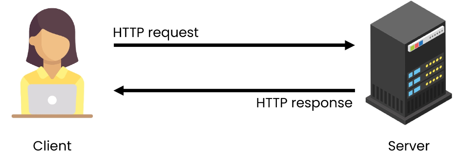
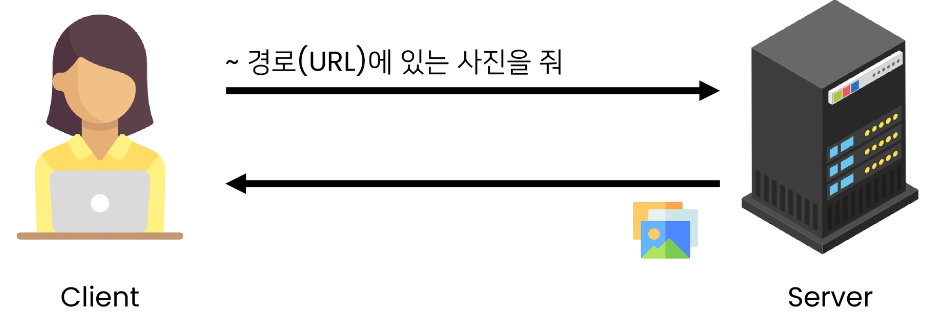
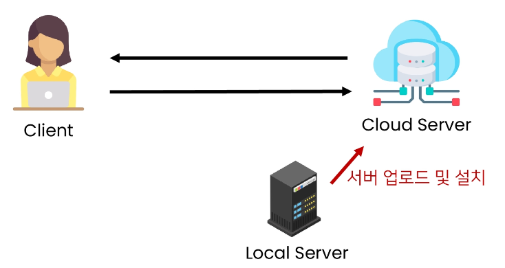

# 💫 title

## ✨ Managing static files

- 개발자가 서버에 미리 준비한 혹은 사용자가 업로드한 정적파일을 클라이언트에게 제공하는 방법


### 📌 Static files

#### 💡 정적 파일

- 응답할 때 별도의 처리 없이 파일 내용을 그대로 보여주면 되는 파일
  - 사용자의 요청에 따라 내용이 바뀌는 것이 아니라 요청한 것을 그대로 보여주는 파일
- **파일 자체가 고정**되어 있고, 서비스 중에도 추가되거나 **변경되지 않고 고정**되어있음
  - 예를 들어, 웹 사이트는 일반적으로 이미지, 자바 스크립트 또는 CSS 와 같은 미리 준비된 추가 파일(움직이지 않는)을 제공해야 함
- Django 에서는 이러한 파일들을 "static file" 이라 함
  - Django는 staticfiles 앱을 통해 정적 파일과 관련된 기능을 제공


#### 💡 Media file

- 미디어 파일
- 사용자가 웹에서 업로드하는 정적 파일 (user-uploaded)
- 유저가 업로드 한 모든 정적 파일


#### 💡 웹 서버와 정적 파일



- 웹 서버의 기본 동작은
  - 특정 위치 (URL) 에 있는 자원을 요청 (HTTP request) 받아서
  - 응답 (HTTP response) 을 처리하고 제공 (serving) 하는 것



- 이는 "자원과 자원에 접근 가능한 주소가 있다." 라는 의미
  - 예를 들어, 사진 파일은 자원이고 해당 **사진 파일을 얻기 위한 경로인 웹 주소(URL)가 존재**함
- 즉, 웹 서버는 요청 받은 URL 로 서버에 존재하는 정적 자원(static resource) 을 제공함


### 📌 Static files 구성하기

#### 💡 Django에서 정적파일을 구성하고 사용하기 위한 몇가지 단계

1. `INSTALLED_APPS` 에 `django.contrib.staticfiles` 가 포함되어 있는지 확인하기
2. `settings.py` 에서 `STATIC_URL`을 정의하기
3. 앱의 `static` 폴더에 정적 파일을 위치하기
   - 예시 ) `my_app/static/sample_img.jpg`
4. 템플릿에서 static 템플릿 태그를 사용하여 지정된 경로에 있는 정적 파일의 URL 만들기

```django



```


#### 💡 Django template tag

- ``
  - load tag
  - 특정 라이브러리, 패키지에 등록된 모든 템플릿 태그와 필터를 로드
- ``
  - static tag
  - `STATIC_ROOT` 에 저장된 정적 파일을 연결


#### 💡 Static files 관련 Core Settings

1. `STATIC_ROOT`

   - Default : None
   - Django 프로젝트에서 사용하는 모든 정적 파일을 한곳에 모아 넣는 경로
   - `collectstatic` 이 배포를 위해 정적 파일을 수집하는 디렉토리의 절대 경로
   - 개발 과정에서 `setting.py` 의 DEBUG 값이 True 로 설정되어 있으면 해당 값은 작용되지 않음
   - 실 서비스 환경(배포 환경) 에서 Django의 모든 정적 파일을 다른 웹 서버가 직접 제공하기 위해 사용
   - 배포 환경에서는 Django를 직접 실행하는 것이 아니라, 다른 서버에 의해 실행되기 때문에 실행하는 다른 서버는 Django에 내장되어 있는 정적 파일들을 인식하지 못함
     (내장되어 있는 정적 파일들을 밖으로 꺼내는 이유)

   - **[참고] collectstatic**

     - `STATIC_ROOT`에 Django 프로젝트의 모든 정적 파일을 수집

     ```
     # settings.py
     
     STATIC_ROOT = BASE_DIR / 'staticfiles'
     ```

   - **[참고] 소프트웨어 배포 (Deploy)**
     - 프로그램 및 애플리케이션을 서버와 같은 기기에 설치하여 서비스를 제공하는 것
     - 클라우딩 컴퓨팅 서비스(AWS, Googld Cloud, MS Azure 등) 에 프로그램 및 애플리케이션을 설치해 제공하는 것

​				


2. `STATICFILES_DIRS`

   - Default : [] (Empty list)
   - `app/static/` 디렉토리 경로를 사용하는 것 (기본 경로) 외에 추가적인 정적 파일 경로 목록을 정의하는 리스트
   - 추가 파일 디렉토리에 대한 전체 경로를 포함하는 문자열 목록으로 작성되어야 함

   ```python
   STATICFILES_DIRS = [
       BASE_DIR / 'static',
   ]
   ```

   

3. `STATIC_URL`

   - Default : None
   - `STATIC_ROOT` 에 있는 정적 파일을 참조할 때 사용할 URL
   - 개발 단계에서는 실제 정적 파일들이 저장되어 있는 `app/static/` 경로 (기본 경로) 및 `STATICFILES_DIRS` 에 정의된 추가 경로들을 탐색
   - 실제 파일이나 디렉토리가 아니며, URL 로만 존재
   - 비어 있지 않은 값으로 설정한다면 반드시 slash(/) 로 끝나야 함

   ```python
   STATIC_URL = '/static/'
   ```

   

### 📌 Static files 사용하기

#### 💡 static file 가져오기

1.  **기본 경로에 있는 static file 가져오기**

   1) `articles/static/articles` 경로에 이미지 파일 배치하기
   2) `static tag`를 사용해 이미지 파일 출력하기

   ```django
   <!-- articles/index.html -->
   
   
   
   
   
     
     <h1>Articles</h1>
   ...
   ```

   	3. 이미지 출력 확인

2.  **추가 경로에 있는 static file 가져오기**

   1. 추가 경로 작성

   ```python
   # settings.py
   
   STATICFILES_DIRS = [
       BASE_DIR / 'static',
   ]
   ```

   2. `static/` 경로에 이미지 파일 배치하기
   3. `static tag를 사용해 이미지 파일 출력하기

   ```django
   <!-- articles/index.html -->
   
   
   
   
   
      # 1번
      # 2번
     <h1>Articles</h1>
   ...
   ```

   4. 이미지 출력 확인


#### 💡 `STATIC_URL` 확인하기

- Django 가 해당 이미지를 클라이언트에게 응답하기 위해 만든 `image url` 확인하기
  - 개발자도구 - Inspect 버튼을 통해 확인
- `STATIC_URL + static file 경로` 로 설정됨
  - `http://127.0.0.1:8000/static/articles/sample_img_1.png`

- 개발자도구 - Network 에서 Request URL 확인해보기
  - 클라이언트에게 이미지를 응답하기 위한 요청 URL 을 만든 것


## ✨ Image Upload

- Django ImageField 를 사용해 사용자가 업로드한 정적 파일 (미디어 파일) 관리하기


### 📌 ImageField

#### 💡 `ImageField()`

- 이미지 업로드에 사용하는 모델 필드
- FileField 를 상속 받는 서브 클래스이기 때문에 FileField 의 모든 속성 및 메서드 사용 가능
- 사용자에 의해 업로드 된 객체가 유효한 이미지인지 검사
- ImageField 인스턴스는 최대 길이가 100자인 **문자열** 로 DB에 생성, max_length 인자를 사용하여 최대 길이를 변경할 수 있음


#### 💡 `FileField()`

- `FileField(upload_to=' ', storage=None, max_length=100, **options)`
- 파일 업로드에 사용하는 모델 필드
- 2개의 선택 인자를 가지고 있음
  1. `upload_to`
  2. `storage`


#### 💡 FileField / ImageField 를 사용하기 위한 단계

1. settings.py 에 `MEDIA_ROOT` , `MEDIA_URL` 설정
2. `upload_to` 속성을 정의하여 업로드 된 파일에 사용할 `MEDIA_ROOT` 의 하위 경로를 지정 (선택사항)


##### 1. `MEDIA_ROOT`

- Default : ' ' (Empty string)
- 사용자가 업로드 한 파일 (미디어 파일) 들을 보관할 디렉토리의 절대 경로
- Django 는 성능을 위해 업로드 파일은 데이터베이스에 저장하지 않음
  - 데이터베이스에 저장되는 것은 **"파일 경로"**
- `MEDIA_ROOT` 는 `STATIC_ROOT` 와 반드시 다른 경로로 지정해야 함

```python
# settings.py

MEDIA_ROOT = BASE_DIR / 'media'
```


##### 2. `MEDIA_URL`

- Default : ' ' (Empty string)
- `MEDIA_ROOT` 에서 제공되는 미디어 파일을 처리하는 URL
- 업로드 된 파일의 주소 (URL) 를 만들어 주는 역할
  - 웹 서버 사용자가 사용하는 public URL
- 비어 있지 않은 값으로 설정 한다면 반드시 slash(/) 로 끝나야 함
- `MEDIA_URL` 은 `STATIC_URL` 과 반드시 다른 경로로 지정해야 함

```python
# settings.py

MEDIA_URL = '/media/'
```


#### 💡 개발 단계에서 사용자가 업로드한 미디어 파일 제공하기

```python
# crud/urls.py

from django.conf import settings
from django.conf.urls.static import static

urlpatterns = [
    path('admin/', admin.site.urls),
    path('articles/', include('articles.urls')),
    path('accounts/', include('accounts.urls')),
] + static(settings.MEDIA_URL, document_root=settings.MEDIA_ROOT)
```

- 사용자로부터 업로드 된 파일이 프로젝트에 업로드 되고나서, 실제로 사용자에게 제공하기 위해서는 업로드 된 파일의 URL이 필요함
  - 업로드 된 파일의 URL == `settings.MEDIA_URL`
  - 위 URL 을 통해 참조하는 파일의 실제 위치 == `settings.MEDIA_ROOT`


### 📌 CREATE


### 📌 UPDATE

- 이미지는 바이너리 데이터이기 때문에 텍스트처럼 일부만 수정하는 것은 불가능
- 때문에 새로운 사진으로 대체하는 방식을 사용

#### 💡 업로드 이미지 수정하기

- enctype 속성값 추가

  ```html
  <!-- articles/update.html -->
  
  
  
  
    <h1>UPDATE</h1>
    <form action="" method="POST" enctype="multipart/form-data">
  ```

- 이미지 파일이 담겨있는 request.FILES 추가 작성

  ```python
  # articles/views.py
  
  @login_required
  @require_http_methods(['GET', 'POST'])
  def update(request, pk):
      article = Article.objects.get(pk=pk)
      if request.user == article.user:
          if request.method == 'POST':
              form = ArticleForm(request.POST, request.FILES, instance=article)
  ```

  

### 📌 `upload_to` argument

#### 💡 사용자 지정 업로드 경로와 파일 이름 설정하기

- `ImageField`는 업로드 디렉토리와 파일 이름을 설정하는 2가지 방법을 제공

  1. **문자열 값이나 경로 지정 방법**

     - `upload_to` 인자에 새로운 이미지 저장 경로를 추가 후 migration 과정 진행

     ```python
     # articles/models.py
     
     class Article(models.Model):
         user = models.ForeignKey(settings.AUTH_USER_MODEL, on_delete=models.CASCADE)
         title = models.CharField(max_length=10)
         content = models.TextField()
         image = models.ImageField(blank=True, upload_to='images/')
         created_at = models.DateTimeField(auto_now_add=True)
         updated_at = models.DateTimeField(auto_now=True)
     ```

     - 이미지 업로드 후 변경된 업로드 경로 확인
     - MEDIA_ROOT 이후 경로가 추가 되는 것

     

     -  단순 문자열 뿐만 아니라 파이썬 time 모듈의 `strftime()` 형식도 포함될 수 있으며, 이는 파일 업로드 날짜 / 시간으로 대체 됨

     ```python
     # articles/models.py
     
     class Article(models.Model):
         user = models.ForeignKey(settings.AUTH_USER_MODEL, on_delete=models.CASCADE)
         title = models.CharField(max_length=10)
         content = models.TextField()
         image = models.ImageField(blank=True, upload_to='%Y/%m/%d/')
         created_at = models.DateTimeField(auto_now_add=True)
         updated_at = models.DateTimeField(auto_now=True)
     ```

     

  2. **함수 호출 방법**

     - `upload_to`는 독특하게 함수처럼 호출이 가능하며 해당 함수가 호출되면서 반드시 2개의 인자 받음

     ```python
     # articles/models.py
     
     def articles_image_path(instance, filename):
         return f'images/{instance.user.username}/{filename}'
     
     class Article(models.Model):
         user = models.ForeignKey(settings.AUTH_USER_MODEL, on_delete=models.CASCADE)
         title = models.CharField(max_length=10)
         content = models.TextField()
         image = models.ImageField(blank=True, upload_to=articles_image_path)
     ```

     1. `instance`
        - FileField 가 정의된 모델의 인스턴스
        - 대부분 이 객체는 아직 데이터베이스에 저장되기 전이므로 아직 PK 값이 없을 수 있으니 주의
     2. `filename`
        - 기존 파일 이름

​			


## ✨ Image Resizing

- 실제 원본 이미지를 서버에 그대로 로드 하는 것은 여러 이유로 부담이 큼
- HTML  태그에서 직접 사이즈를 조정할 수도 있지만, 업로드 될 때 이미지 자체를 resizing 하는 것을 사용해 볼 것


### 📌 사전 준비

- `django-imagekit`  모듈 설치 및 등록

```bash
$ pip install django_imagekit
$ pip freeze > requirements.txt
```

```python
# settings.py

INSALLED_APPS = [
    'articles',
    'accounts',
    'django_extensions',
    'imagekit',
]
```

#### [참고] django-imagekit

- 이미지 처리를 위한 Django 앱
  - 썸네일, 해상도, 사이즈, 색깔 등을 조정할 수 있음


### 📌 썸네일 만들기

- 2가지 방식으로 썸네일 만들기를 진행
  1. 원본 이미지 저장 X
  2. 원본 이미지 저장 O


#### 💡 원본 이미지 저장 X

```python
# aritlces/models.py

from imagekit.processors import Thumbnail
from imagekit.models import ProcessedImageField


# Create your models here.
class Article(models.Model):
    user = models.ForeignKey(settings.AUTH_USER_MODEL, on_delete=models.CASCADE)
    title = models.CharField(max_length=10)
    content = models.TextField()
    # image = models.ImageField(blank=True)
    # image = models.ImageField(blank=True, upload_to='%Y/%m/%d/')
    # image = models.ImageField(blank=True, upload_to='images/')
    image = ProcessedImageField(
        blank=True,
        upload_to='thumbnails/',
        processors=[Thumbnail(200,300)],
        format='JPEG',
        options={'quality':80},
    )
```

#### [참고] pilkit

- processors 에 작성하는 여러 클래스는 해당 라이브러리 문서를 별도로 확인
- [https://github.com/matthewwithanm/pilkit](https://github.com/matthewwithanm/pilkit)


#### 💡 원본 이미지 저장 O

```python
# aritlces/models.py

from imagekit.processors import Thumbnail
from imagekit.models import ProcessedImageField, ImageSpecField

# Create your models here.
class Article(models.Model):
    user = models.ForeignKey(settings.AUTH_USER_MODEL, on_delete=models.CASCADE)
    title = models.CharField(max_length=10)
    content = models.TextField()
    image = models.ImageField(blank=True)
    image_thumbnail = ImageSpecField(
        source='image',
        processors=[Thumbnail(200, 300)],
        format='JPEG',
        options={'quality': 80},
    )
```


## ✨ QuerySet API Advanced

### 📌 사전 준비

1. 가상 환경 생성 및 활성화
2. 패키지 목록 설치
3. migrate 진행
4. sqlite3 에서 csv 데이터 import 하기

```bash
$ python manage.py migrate

$ sqlite3 db.sqlite3
sqlite > .mode csv
sqlite > .import users.csv users_user
sqlite > .exit
```

- shell_plus 실행

```bash
$ python manage.py shell_plus
```


### 📌 CRUD 기본

#### 💡 모든 user 레코드 조회

```shell
User.objects.all()
```


#### 💡 user 레코드 생성

```shell
User.objects.create(
  first_name='길동',
  last_name='홍',
  age=100,
  country='제주도',
  phone='010-123-4567',
  balance=10000,
)
```


#### 💡 101번 user 레코드 조회

```shell
User.objects.get(pk=101)
```


#### 💡 101번 user 레코드의 last_name 을 김 으로 수정

```shell
user = User.objects.get(pk=101)
user.last_name = '김'
user.save()

# 확인
user.last_name
```


#### 💡101번 user 레코드 삭제

```shell
user = User.objects.get(pk=101)
user.delete()

# 확인
user.objects.get(pk=101)
```


#### 💡 전체 인원 수 조회

```shell
# 1
User.objects.count()

# 2
len(User.objects.all())
```

- `.count()`
  - QuerySet 과 일치하는 데이터베이스의 개체 수를 나타내는 정수를 반환
  - `.all()` 을 사용하지 않아도 됨


### 📌 Sorting data

#### 💡 나이가 어린 순으로 이름과 나이 조회하기

```
User.objects.order_by('age').values('first_name', 'age')
```

- `order_by()`
  - `.order_by(*fields)`
  - QuerySet의 정렬을 재정의
  - 기본적으로 오름차순으로 정렬하며 필드명에 '-'(하이픈) 을 작성하면 내림차순으로 정렬
  - 인자로 '?' 를 입력하면 랜덤으로 정렬

- `values()`
  - `.values(*fields, **expressions)`
  - 모델 인스턴스가 아닌 딕셔너리 요소들을 가진 QuerySet을 반환
  - *fields 는 선택인자이며 조회하고자 하는 필드명을 가변인자로 받음
    - 필드를 지정하면 각 딕셔너리에는 지정한 필드에 대한 key 와 value 만을 출력
    - 입력하지 않을 경우 각 딕셔너리에는 레코드의 모든 필드에 대한 key와 value를 출력

- values 사용 여부에 따른 출력 비교

```
# 미사용
User.objects.filter(age=30)
<QuerySet [<User: User object (5)>, <User: User object (57)>, <User: User object (60)>]>

# 사용
User.objects.filter(age=30).values('first_name')
<QuerySet [{'first_name': '영환'}, {'first_name': '보람'}, {'first_name': '은영'}]>
```


#### 💡 이름과 나이를 나이가 많은 순서대로 조회하기

```
User.objects.order_by('-age').values('first_name', 'age')
```


#### 💡 이름, 나이, 계좌 잔고를 나이가 어린순으로, 

#### 	만약 같은 나이라면 계좌 잔고가 많은 순으로 정렬, 조회

```
User.objects.order_by('age', '-balance').values('first_name', 'age', 'balance')
```


#### [참고] order_by 주의사항

- 다음과 같이 작성할 경우 앞에 호출은 모두 지워지고 마지막 호출만 적용됨

```
User.objects.order_by('balance').order_by('-age')

# 결국 User.objects.order_by('-age')와 같다
```


### 📌 Filtering data

#### 💡 중복없이 모든 지역 조회하기

```
User.objects.distinct().values('country')
```


#### 💡 지역 순으로 오름차순 정렬하여 중복없이 모든 지역 조회하기

```
User.objects.distinct().values('country').order_by('country')
```


#### 💡 이름과 지역이 중복 없이 모든 이름과 지역 조회하기

```
User.objects.distinct().values('first_name', 'country')
```


#### 💡 이름과 지역 중복 없이 지역 순으로 오름차순 정렬하여 모든 이름과 지역 조회

```
User.objects.distinct().values('first_name', 'country').order_by('country')
```


#### 💡 나이가 30인 사람들의 이름 조회

```
User.objects.filter(age=30).values('first_name')
```


#### 💡 나이가 30살 이상인 사람들의 이름과 나이 조회하기

```
User.objects.filter(age__gte=30).values('first_name', 'age')
```


#### 💡 Field lookups

- SQL WHERE 절의 상세한 조건을 지정하는 방법

- QuerySet 메서드 `filter()`, `exclude()` 및 `get()` 에 대한 키워드 인자로 사용됨

- 문법 규칙

  - 필드명 뒤에 "double-underscore" 이후 작성함

    `filed__lookuptype=value`


#### 💡 나이가 30살 이상이고 계좌 잔고가 50만원 초과인 사람들의 

#### 	  이름, 나이 계좌 잔고 조회하기

```
User.objects.filter(age__gte=30, balance__gt=500000).values('first_name', 'age', 'balance')
```


#### 💡 이름에 '호'가 포함되는 사람들의 이름과 성 조회하기

```
User.objects.filter(first_name__contains='호').values('first_name', 'last_name')
```


#### 💡 핸드폰 번호가 011로 시작하는 사람들의 이름과 핸드폰 번호 조회

```
User.objects.filter(phone__startswith='011-').values('first_name', 'phone')
```

- SQL 에서의 '%' 와일드 카드와 같음
- '_' (under score) 는 별도로 정규 표현식을 사용해야 함


#### 💡 이름이 '준' 으로 끝나는 사람들의 이름 조회하기

```
User.objects.filter(first_name__endswith='준').values('first_name')
```


#### 💡 경기도 혹은 강원도에 사는 사람들의 이름과 지역 조회하기

```
User.objects.filter(country__in=['경기도', '강원도']).values('first_name', 'country')
```


#### 💡 경기도 혹은 강원도에 살지 않는 사람들의 이름과 지역 조회하기

```
User.objects.exclude(country__in=['경기도', '강원도']).values('first_name', 'country')
```


#### - `exclude()`

- `exclude(**kwargs)`
- 주어진 매개변수와 일치하지 않는 객체를 포함하는 QuerySet 반환


#### 💡 나이가 가장 어린 10명의 이름과 나이 조회하기

```
User.objects.order_by('age').values('first_name', 'age')[:10]
```


#### 💡 나이가 30이거나 성이 김씨인 사람들 조회

```python
# shell_plus 에서는 import 문 생략 가능
from django.db.models import Q

User.objects.filter(Q(age=30) | Q(last_name='김'))
```


#### - 'Q' object

- 기본적으로 `filter()` 와 같은 메서드의 키워드 인자는 AND statement 를 따름

- 만약 더 복잡한 쿼리를 실행해야 하는 경우가 있다면 Q 객체가 필요함

  - 예를 들어 OR statement 같은 경우

  ```python
  from django.db.models import Q
  
  Q(question__startswith='What')
  ```

- '&' 및 '|' 를 사용하여 Q 객체를 결합할 수 있음

  ```python
  Q(question__startswith='Who') | Q(question__startwith='What')
  ```

- 조회를 하면서 여러 Q 객체를 제공할 수도 있음

  ```python
  Article.objects.get(
    Q(title__startswith='Who'),
    Q(created_at=date(2005, 5, 2)) | Q(created_at=date(2005, 5, 6))
  )
  ```

  

### 📌 Aggregation (Grouping data)

#### 💡 `aggregate()`

- "Aggregate calculates values for the **entire** queryset."
- 전체 queryset 에 대한 값을 계산
- 특정 필드 전체의 합, 평균, 개수 등을 계산할 때 사용
- 딕셔너리를 반환


- Aggregation functions
  - `Avg`, `Count`, `Max`, `Min`, `Sum` 등


#### 💡 나이가 30살 이상인 사람들의 평균 나이 조회하기

```python
# shell_plus 에서는 import 하지 않아도 된다.

from django.db.models import Avg

User.objects.filter(age__get=30).aggregate(Age('age'))
=> {'age__avg': 37.65909090909091}
```

```python
# 딕셔너리 key 이름을 수정할 수도 있다.

User.objects.filter(age__gte=30).aggregate(avg_value=Ave('age'))
=> {'age__value': 37.65909090909091}
```


#### 💡 가장 높은 계좌 잔액 조회하기

```python
from django.db.models import Max

User.objects.aggregate(Max('balance'))
=> {'balance__max': 1000000}
```


#### 💡 모든 계좌 잔액 총액 조회하기

```python
from django.db.models import Sum

User.objects.aggregate(Sum('balance'))
=> {'balance__sum': 14435040}
```


#### 💡 `annotate()`

- 쿼리의 각 항목에 대한 요약 값을 계산
- SQL 의 `GROUP BY` 에 해당
- '주석을 달다' 라는 사전적 의미를 가지고 있음


#### 💡 각 지역별로 몇 명씩 살고 있는지 조회하기

```python
from django.db.models import Count

User.objects.values('country').annotate(Count('country'))

=> <QuerySet [{'country': '강원도', 'country__count': 14},
             {'country': '경기도', 'country__count': 9}.
             {'country': '경상남도', 'country__count': 9},]...>

# aggregate 와 마찬가지로 딕셔너리의 key 값을 변경할 수 있다.

User.objects.values('country').annotate(num_of_country=Count('country'))

=> <QuerySet [{'country': '강원도', 'num_of_country': 14},
             {'country': '경기도', 'num_of_country': 9}.
             {'country': '경상남도', 'num_of_country': 9},]...>

```


#### 💡 각 지역별로 몇 명씩 살고 있는지 + 지역별 계좌 잔액 평균 조회하기

- 한 번에 여러 값을 계산해 조회할 수 있음

```python
User.objects.values('country').annotate(Count('country'), avg_balance=Avg('balance'))
```


#### 💡 각 성씨가 몇 명씩 있는지 조회하기

```python
User.objects.values('last_name').annotate(Count('last_name'))
```


#### 💡 N:1 예시

- 만약 Comment - Article  관계가 N:1 인 경우 다음과 같은 참조도 가능

  ```python
  Article.objects.annotate(
  	number_of_comment=Count('comment'),
  	pub_date=Count('comment', filter=Q(comment__created_at__lte='2000-01-01'))
  )
  ```

- 전체 게시글을 조회하면서 (`Article.objects.all()`)
  annotate 로 각 게시글의 댓글 개수 (`number_of_comment`) 와
  2000-01-01 보다 나중에 작성된 댓글의 개수(`pub_date`) 를 함께 조회하는 것