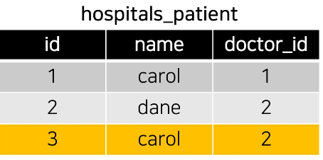
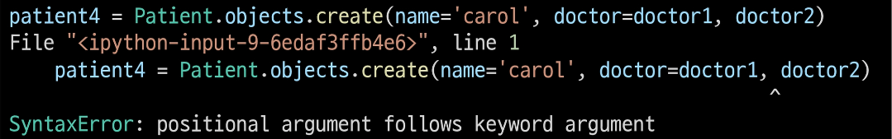
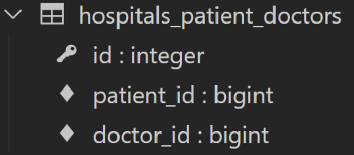
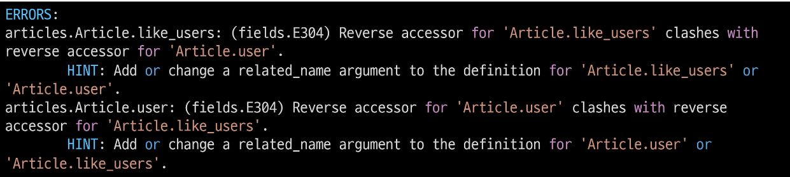
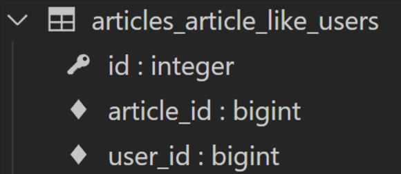

# 💫 Database - M:N

## ✨ Many to many relationship


### 📌 Intro

- 일상에 가까운 예시를 통해 DB를 모델링하고 그 내부에서 일어나는 데이터의 흐름을 어떻게 제어할 수 있을지 고민해보기

  


#### [참고] 데이터 모델링

- 주어진 개념으로부터 논리적인 데이터 모델을 구성하는 작업
- 물리적인 데이터베이스 모델로 만들어 고객의 요구에 따라 특정 정보 시스템의 데이터베이스에 반영하는 작업


#### 💡 용어 정리

1. **target model**
   - 관계 필드를 가지지 않은 모델
2. **source model**
   - 관계 필드를 가진 모델


#### 💡 N:1 의 한계

- 의사와 환자간 예약 시스템을 구현
- N:1 관계를 생각해 한 명의 의사에게 여러 환자가 예약할 수 있다고 모델 관계를 설정

```python
# hospitals/models.py

from django.db import models

# Create your models here.
class Doctor(models.Model):
    name = models.TextField()

    def __str__(self):
        return f'{self.pk}번 의사 {self.name}'


class Patient(models.Model):
    doctors = models.ForeignKey(Doctor, on_delete=models.CASCADE)
    name = models.TextField()

    def __str__(self):
        return f'{self.pk}번 환자 {self.name}'

```

- Migration 진행 및 shell_plus 실행

```bash
$ python manage.py makemigrations
$ python manage.py migrate
$ python manage.py shell_plus
```

- 각각 2명의 의사와 환자를 생성, 환자는 서로 다른 의사에게 예약을 했다고 가정

```shell
doctor1 = Doctor.objects.create(name='alice')
doctor2 = Doctor.objects.create(name='bella')
patient1 = Patient.objects.create(name='carol', doctor=doctor1)
patient2 = Patient.objects.create(name='dane', doctor=doctor2)

doctor1
<Doctor: 1번 의사 alice>

doctor2
<Doctor: 2번 의사 bella>

patient1
<Patient: 1번 환자 carol>

patient2
<Patient: 2번 환자 dane>
```

- 1번 환자 (carol) 가 두 의사 모두에게 방문하려고 함

```shell
patient3 = Patient.objects.create(name='carol', doctor=doctor2)
```



- 동시에 예약하려고 하면 ?



- 동일한 환자지만 다른 의사에게 예약하기 위해서는 객체를 하나 더 만들어서 예약을 진행해야 함
  - 새로운 환자 객체를 생성할 수 밖에 없음
- 외래 키 컬럼에 '1, 2' 형태로 참조하는 것은 Integer 타입이 아니기 때문에 불가능


#### 💡 중개 모델

- 환자 모델의 외래 키를 삭제하고 별도의 예약 모델을 새로 작성
- 예약 모델은 의사와 환자에 각각 N:1 관계를 가짐

```python
class Doctor(models.Model):
    name = models.TextField()

    def __str__(self):
        return f'{self.pk}번 의사 {self.name}'


class Patient(models.Model):
    name = models.TextField()

    def __str__(self):
        return f'{self.pk}번 환자 {self.name}'

class Reservation(models.Model):
        doctor = models.ForeignKey(Doctor, on_delete=models.CASCADE)
        patient = models.ForeignKey(Patient, on_delete=models.CASCADE)
        
        def __str__(self):
            return f'{self.doctor_id}번 의사의 {self.patient_id}번 환자'
```

- 데이터베이스 초기화 후 Migration 진행 및 shell_plus 실행
  1. migration 파일 삭제
  2. 데이터베이스 파일 삭제

```bash
$ python manage.py makemigrations
$ python manage.py migrate
$ python manage.py shell_plus
```

- 의사와 환자 생성 후 예약 만들기

```shell
doctor1 = Doctor.objects.create(name='alice')
patient1 = Patient.objects.create(name='carol')

Reservation.objects.create(doctor=doctor1, patient=patient1)
```

- 예약 정보 조회

```shell
# 의사 -> 예약 정보 찾기
doctor1.reservation_set.all()
<QuerySet [<Reservation: 1번 의사의 1번 환자>]>

# 환자 -> 예약 정보 찾기
patient1.reservation_set.all()
<QuerySet [<Reservation: 1번 의사의 1번 환자>]>
```

- 1번 의사에게 새로운 환자 예약이 생긴다면

```shell
patient2 = Patient.objects.create(name='dane')

Reservation.objects.create(doctor=doctor1, patient=patient2)
```

- 1번 의사의 예약 정보 조회

```shell
# 의사 -> 환자 목록
doctor1.reservation_set.all()
<QuerySet [<Reservation: 1번 의사의 1번 환자>, <Reservation: 1번 의사의 2번 환자>]>
```


#### 💡 Django ManyToManyField

- 환자 모델에 Django ManytoManyField 작성

```python
# hospitals/models.py

class Patient(models.Model):
    doctors = models.ManyToManyField(Doctor)
    name = models.TextField()

    def __str__(self):
        return f'{self.pk}번 환자 {self.name}'
    
# Reservation Class 주석 처리
```

- 데이터베이스 초기화 후 Migration 진행 및 shell_plus 실행

  1. migration 파일 삭제
  2. 데이터베이스 파일 삭제

  ```bash
  $ python manage.py makemigrations
  $ python manage.py migrate
  $ python manage.py shell_plus
  ```

  


- 의사 1명과 환자 2명 생성

```shell
doctor1 = Doctor.objects.create(name='alice')
patient1 = Patient.objects.create(name='carol')
patient2 = Patient.objects.create(name='dane')
```

- 예약 생성 (환자가 의사에게 예약)

```shell
# patient1이 doctor1 에게 예약
patient1.doctors.add(doctor1)

# patient1 - 자신이 예약한 의사 목록 확인
patient1.doctors.all()
<QuerySet [<Doctor: 1번 의사 alice>]>

# doctor1 - 자신의 예약된 환자 목록 확인
doctor1.patient_set.all()
<QuerySet [<Patient: 1번 환자 carol>]>
```

- 예약 생성 (의사가 환자를 예약)

```shell
# doctor1이 patient2을 예약
doctor1.patient_set.add(patient2)

# doctor1 - 자신의 예약 환자목록 확인
doctor1.patient_set.all()
<QuerySet [<Patient: 1번 환자 carol>, <Patient: 2번 환자 dane>]>

# patient1, 2 - 자신이 예약한 의사목록 확인
patient1.doctors.all()
<QuerySet [<Doctor: 1번 의사 alice>]>

patient2.doctors.all()
<QuerySet [<Doctor: 1번 의사 alice>]>
```

- 예약 취소하기 (삭제)
- 기존에는 해당하는 Reservation 을 찾아서 지워야 했다면, 이제는 `.remove()` 사용

```shell
# doctor1이 patient1 진료 예약 취소
doctor1.patient_set.remove(patient1)

doctor1.patient_set.all()
<QuerySet [<Patient: 2번 환자 harry>]>

patient1.doctors.all()
<QuerySet []>

# patient2가 doctor1 진료 예약 취소
patient2.doctors.remove(doctor1)

patient2.doctors.all()
<QuerySet[]>

doctor1.patient_set.all()
<QuerySet []>
```

- Djago는 ManyToManyField 를 통해 중계 테이블을 자동으로 생성함


#### 💡 'related_name' argument

- target model 이 source model 을 참조할 때 사용할 manager name
- `ForeignKey()` 의 related_name 과 동일

```python
class Patient(models.Model):
    doctors = models.ManyToManyField(Doctor, related_name='patients')
    name = models.TextField()
    
    def __str__(self):
        return f'{self.pk}번 환자 {self.name}''
```


#### 💡 'through' argument

- 중개 테이블을 수동으로 지정하려는 경우 `through` 옵션을 사용하여 사용하려는 중개 테이블을 나타내는 Django 모델을 지정할 수 있음
- 가장 일반적인 용도는 중개테이블에 추가 데이터를 사용해 다대다 관계와 연결하려는 경우

- through 설정 및 Reservation Class 수정
  - 이제는 예약 정보에 증상과 예약일이라는 추가 데이터가 생김

```python
class Patient(models.Model):
    doctors = models.ManyToManyField(Doctor, through='Reservation')
    name = models.TextField()
    
    def __str__(self):
        return f'{self.pk}번 환자 {self.name}}

class Reservation(models.Model):
        doctor = models.ForeignKey(Doctor, on_delete=models.CASCADE)
        patient = models.ForeignKey(Patient, on_delete=models.CASCADE)
        symptom = models.TextField()
        reserved_at = models.DateTimeField(auto_now_add=True)
        
        def __str__(self):
            return f'{self.doctor.pk}번 의사의 {self.patient.pk}번 환자'
```

- 데이터베이스 초기화 후 Migration 진행 및 shell_plus 실행

1. migration 파일 삭제
2. 데이터베이스 파일 삭제

```bash
$ python manage.py makemigrations
$ python manage.py migrate
$ python manage.py shell_plus
```

- 의사 1명과 환자 2명 생성

```shell
doctor1 = Doctor.objects.create(name='alice')
patient1 = Patient.objects.create(name='carol')
patient2 = Patient.objects.create(name='dane')
```

- 예약 생성 1

```shell
# 1. Reservation class 를 통한 예약 생성

reservation1 = Reservation(doctor=doctor1, patient=patient1, symptom='headache')
reservation1.save()

doctor1.patient_set.all()
<QuerySet [<Patient: 1번 환자 carol>]>

patient1.doctors.all()
<QuerySet [<Doctor: 1번 의사 alice>]>
```

- 예약 생성 2

```shell
# 2. Patient 객체를 통한 예약 생성

patient2.doctors.add(doctor1, through_defaults={'symptom': 'flu'})

doctor1.patient_set.all()
<QuerySet [<Patient: 1번 환자 carol>, <Patient: 2번 환자 dane>]>

patient2.doctors.all()
<QuerySet [<Doctor: 1번 의사 alice>]>
```

- 예약 삭제

```shell
doctor1.patient_set.remove(patient1)

patient2.doctors.remove(doctor1)
```


#### 💡 정리

- M:N 관계로 맺어진 두 테이블에는 변화가 없음
- Django의 ManyToManyField은 중개 테이블을 자동으로 생성함
- Django의 ManyToManyField는 M:N 관계를 맺는 두 모델 어디에 위치해도 상관 없음
  - 대신 필드 작성 위치에 따라 참조와 역참조 방향을 주의할 것
- N:1은 완전한 종속의 관계였지만 M:N은 의사에게 진찰받는 환자, 환자를 진찰하는 의사의 두 가지 형태로 모두 표현이 가능한 것


### 📌 ManyToManyField

#### 💡 ManyToManyField 란

- `ManyToManyField(to, **options)`
- 다대다 (M:N, many-to-many) 관계 설정 시 사용하는 모델 필드
- 하나의 필수 위치인자 (M:N 관계로 설정할 모델 클래스) 가 필요
- 모델 필드의 RelatedManager를 사용하여 관련 개체를 추가, 제거 또는 만들 수 있음
  - `add()`, `remove()`, `create()`, `clear()` ...


#### 💡 데이터베이스에서의 표현

- Django는 다대다 관계를 나타내는 중개 테이블을 만듦
- 테이블 이름은 ManyToManyField 이름과 이를 포함하는 모델의 테이블 이름을 조합하여 생성됨
- `db_table` arguments을 사용하여 중개 테이블의 이름을 변경할 수도 있음


#### 💡 ManyToManyField's Arguments

1. `related_name`

   - target model 이 source model 을 참조할 때 사용할 manager name
   - ForeignKey 의 related_name 과 동일

2. `through`

   - 중개 테이블을 직접 작성하는 경우, `through` 옵션을 사용하여 중개 테이블을 나타내는 Django 모델 지정
   - 일반적으로 중개 테이블에 추가 데이터를 사용하는 다대다 관계와 연결하려는 경우 (extra data with a many-to-many relationship) 에 사용됨

3. `symmetrical`

   - 기본 값 : True
   - ManyToManyField 가 동일한 모델 (on self) 을 가리키는 정의에서만 사용

   ```python
   # 예시
   
   class Person(models.Model):
       friends = models.ManyToManyField('self')
       # friends = models.ManyToManyField('self', symmetrical=False)
   ```

   - True  일 경우
     - `_set` 매니저를 추가 하지 않음
     - source 모델의 인스턴스가 target 모델의 인스턴스를 참조하면 자동으로 target 모델 인스턴스도 source 모델 인스턴스를 자동으로 참조하도록 함 (대칭)
     - 즉, 내가 당신의 친구라면 당신도 내 친구ㅏㄱ 됨
   - 대칭을 원하지 않는 경우 False 로 설정
     - Follow 기능 구현에서 다시 확인할 예정


#### 💡 Related Manager

- N:1 혹은 M:N 관계에서 사용 가능한 문맥 (context)
- Django 는 모델 간 N:1 혹은 M:N 관계가 설정되면 역참조시에 사용할 수 있는 manager 를 생성
  - 우리가 이전에 모델 생성 시 objects 라는 매니저를 통해 queryset api 를 사용했던 것처럼 related manager를 통해 queryset api를 사용할 수 있게 됨
- 같은 이름의 메서드여도 각 관계 (N:1, M:N) 에 따라 다르게 사용 및 동작됨
  - N:1 에서는 target 모델 객체만 사용 가능
  - M:N 관계에서는 관련된 두 객체에서 모두 사용 가능
- 메서드 종류
  - `add()`, `remove()`, `create()`, `clear()`, `set()` 등


#### 💡 methods

- `add()`
  - "지정된 객체를 관련 객체 집합에 추가"
  - 이미 존재하는 관계에 사용하면 관계가 복제되지 않음
  - 모델 인스턴스, 필드 값(PK)을 인자로 허용
- `remove()`
  - "관련 객체 집합에서 지정된 모델 개체를 제거"
  - 내부적으로 `QuerySet.delete()` 를 사용하여 관계가 삭제됨
  - 모델 인스턴스, 필드 값(PK) 을 인자로 허용


#### 💡 중개 테이블 필드 생성 규칙

1. 소스 (source model) 및 대상 (target model) 모델이 다른 경우
   - `id`
   - `<containing_model>_id`
   - `<other_model>_id`
2. ManyToManyField 가 동일한 모델을 가리키는 경우
   - `id`
   - `from_<model>_id`
   - `to_<model>_id`


## ✨ M:N (Article-User)

- Article 과 User 의 M:N 관계 설정을 통한 좋아요 기능 구현하기

### 📌 LIKE

#### 💡 모델 관계 설정

- ManyToManyField 작성

```python
# articles/models.py

class Article(models.Model):
    user = models.ForeignKey(settings.AUTH_USER_MODEL, on_delete=models.CASCADE)
    like_users = models.ManyToManyField(settings.AUTH_USER_MODEL)
    title = models.CharField(max_length=10)
    content = models.TextField()
    created_at = models.DateTimeField(auto_now_add=True)
    updated_at = models.DateTimeField(auto_now=True)
```

- Migration 진행 후 에러 확인

  

- `like_users` 필드 생성 시 자동으로 역참조에는 `.article_set` 매니저가 생성됨
- 그러나 이전 N:1 (Article-User) 관계에서 이미 해당 매니저를 사용 중
  - `user.article_set.all()`  → 해당 유저가 작성한 모든 게시글 조회
  - user 가 작성한 글들 (user.article_set) 과 user 가 좋아요를 누른 글 (user.article_set) 을 구분 X
- user 와 관계된 **ForeignKey** 혹은 **ManyToManyField** 중 하나에  **related_name** 을 작성해야 함 

- ManyToManyField 에 related_name 작성 후 Migration

```python
# articles/models.py

class Article(models.Model):
    user = models.ForeignKey(settings.AUTH_USER_MODEL, on_delete=models.CASCADE)
    like_users = models.ManyToManyField(settings.AUTH_USER_MODEL, related_name='like_articles')
    title = models.CharField(max_length=10)
    content = models.TextField()
    created_at = models.DateTimeField(auto_now_add=True)
    updated_at = models.DateTimeField(auto_now=True)
```

```bash
$ python manage.py makemigrations
$ python manage.py migrate
```

- 생성된 중개 테이블 확인  

- **User - Article 간 사용 가능한 related manager 정리**
  - `article.user`
    - 게시글을 작성한 유저 - N:1
  - `user.article_set`
    - 유저가 작성한 게시글 (역참조) - N:1
  - `article.like_users`
    - 게시글을 좋아요한 유저 - M:N
  - `user.like_articles`
    - 유저가 좋아요한 게시글 (역참조) - M:N


#### 💡 LIKE 구현

- url 및 view 함수 작성

```python
# articles/urls.py

urlpatterns = [
    ...
    path('<int:article_pk>/likes/', views.likes, name='likes'),
]
```

```python
# articles/views.py

def likes(request, article_pk):
    article = Article.objects.get(pk=article_pk)
    
    if article.like_users.filter(pk=request.user.pk).exists():
        article.like_users.remove(request.user)
    else:
        article.like_users.add(request.user)
    return redirect('articles:index')
```


##### - `exists()`

- QuerySet에 결과가 포함되어 있으면 True를 반환하고 그렇지 않으면 False 를 반환
- 특히 큰 QuerySet에 있는 특정 개체의 존재와 관련된 검색에 유용


- index 템플릿에서 각 게시글에 좋아요 버튼 출력하기

```django
<!-- articles/index.html -->




  ...
  
    ...
    <div>
      <form action="" method="POST">
        
        
          <input type="submit" value="좋아요 취소">
        
          <input type="submit" value="좋아요">
        
      </form>
    </div>
    <a href="">DETAIL</a>
    <hr>
  

```

- 데코레이터 및 `is_authenticated` 추가

```python
# articles/views.py

@require_POST
def likes(request, article_pk):
    if request.user.is_authenticated:
        article = Article.objects.get(pk=article_pk)

        if article.like_users.filter(pk=request.user.pk).exists():
            article.like_users.remove(request.user)
        else:
            article.like_users.add(request.user)
        return redirect('articles:index')
   	return redirect('accounts:login')
```


## ✨ M:N (User-User)

- User 자기 자신과의 M:N 관계 설정을 통한 팔로우 기능 구현하기


### 📌 Profile

- 자연스러운 follow 흐름을 위한 프로필 페이지를 먼저 작성

#### 💡 Profile 구현

- url 및 view 함수 작성

```python
# accounts/urls.py

urlpatterns = [
    ...
    path('profile/<username>/', views.profile, name='profile'),
]
```

```python
# accounts/views.py

from django.contrib.auth import get_user_model

def profile(request, username):
    User = get_user_model()
    person = User.objects.get(username=username)
    context = {
        'person': person,
    }
    return render(request, 'accounts/profile.html', context)
```

- profile 템플릿 작성

```django
<!-- accounts/profile.html -->




  <h1>{{ person.username }}님의 프로필</h1>

  <hr>

  <h2>{{ person.username }}'s 게시글</h2>
  
    <div>{{ article.title }}</div>
  
    
  <hr>

  <h2>{{ person.username }}'s 댓글</h2>
  
    <div>{{ comment.content }}</div>
  

  <hr>

  <h2>{{ person.username }}'s 좋아요한 게시글</h2>
  
    <div>{{ article.title }}</div>
  

  <hr>

  <a href="">back</a>

```

- profile 템플릿으로 이동할 수 있는 하이퍼 링크 작성

```django
<!-- base.html -->

<body>
  <div class="container">
    
      <h3>Hello, {{ user }}</h3>
      <a href="">내 프로필</a>
...
```

```django
<!-- articles/index.html -->

<p>
    <b>작성자 : <a href="">{{article.user}}</a></b>
</p>
```


### 📌 Follow

#### 💡 모델 관계 설정

- ManyToManyField 작성 및 Migration 진행

```python
# accounts/models.py

class User(AbstractUser):
    followings = models.ManyToManyField('self', symmetrical=False, related_name='followers')
```

```bash
$ python manage.py makemigrations
$ python manage.py migrate
```


#### 💡 Follow 구현

- url 및 view 함수 작성

```python
# accounts/urls.py

urlpatterns = [
    ...,
    path('<int:user_pk>/follow/', views.follow, name='follow'),
]
```

```python
# accounts/views.py

def follow(request, user_pk):
    User = get_user_model()
    person = User.objects.get(pk=user_pk)
    if person != request.user:
        if person.followers.filter(pk=request.user.pk).exists():
        # if request.user in person.followers.all():
            person.followers.remove(request.user)
        else:
            person.followers.add(request.user)
    return redirect('accounts:profile', person.username)
```

- 프로필 유저의 팔로잉, 팔로워 수 & 팔로우, 언팔로우 버튼 작성

```django
<!-- accounts/profile.html -->




  <h1>{{ person.username }}님의 프로필</h1>
  <div>
    <div>
        팔로잉 : {{ person.followings.all|length }} / 팔로워 : {{ person.followers.all|length }}
    </div>
    
      <div>
        <form action="" method="POST">
            
            
              <input type="submit" value="Unfollow">
            
              <input type="submit" value="Follow">
            
        </form>
      </div>
    
  </div>
...
```

- 데코레이터 및 `is_authenticated` 추가

```python
# accounts/views.py

@require_POS
def follow(request, user_pk):
    if request.user.is_authenticated:
        User = get_user_model()
        person = User.objects.get(pk=user_pk)
        if person != request.user:
            if person.followers.filter(pk=request.user.pk).exists():
            # if request.user in person.followers.all():
                person.followers.remove(request.user)
            else:
                person.followers.add(request.user)
        return redirect('accounts:profile', person.username)
    return redirect('accounts:login')
```

