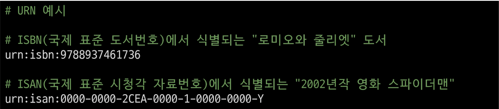
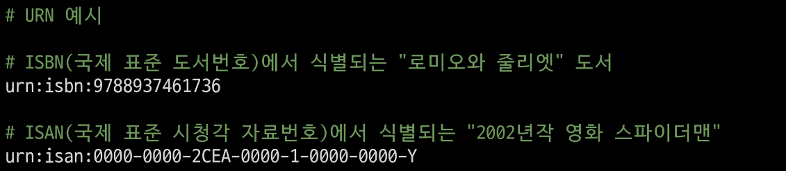
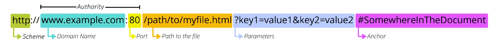

# 💫 REST API

## ✨ REST API

### 📌 HTTP

- HyperText Transfer Protocol
- HTML 문서와 같은 리소스 (resource, 자원) 들을 가져올 수 있도록 하는 프로토콜 (규칙, 약속)
- 웹 상에서 컨텐츠를 전송하기 위한 약속
- 웹에서 이루어지는 모든 데이터 교환의 기초가 됨
- "클라이언트-서버 프로토콜" 이라고도 부름
- 클라이언트와 서버는 다음과 같은 개별적인 메시지 교환에 의해 통신
  - 요청 (request)
    - 클라이언트에 의해 전송되는 메시지
  - 응답 (response)
    - 서버에서 응답으로 전송되는 메시지
- 실제로는 브라우저와 요청을 처리하는 서버 사이에는 더 많은 기술 및 컴퓨터들이 존재하지만 우리는 HTTP의 기본 명세에 대해서만 학습할 예정


#### 💡 HTTP 특징

- **Stateless (무상태)**
  - 동일한 연결 (connection) 에서 연속적으로 수행되는 두 요청 사이에 링크가 없음
  - 즉, 응답을 마치고 연결을 끊는 순간 클라이언트와 서버 간의 통신이 끝나며 상태 정보가 유지되지 않음
- 이는 특정 페이지와 일관되게 상호작용 하려는 사용자에게 문제가 될 수 있으며, 
  (ex. e-commerce 에서 장바구니를 사용하는 경우)
  이를 해결하기 위해 쿠키와 세션을 사용해 서버 상태를 요청과 연결하도록 함


#### 💡 HTTP Request Methods

- 리소스에 대한 행위 (수행하고자 하는 동작)를 정의
- 즉, 리소스에 대해 수행할 원하는 작업을 나타나내는 메서드 모음을 정의
- HTTP verbs 라고도 함
- HTTP Method 예시
  - `GET`, `POST`, `PUT`, `DELETE` ...


##### [참고] 리소스 (resource)

- HTTP 요청의 대상을 리소스 (resource, 자원) 라고 함


1. `GET`
   - 서버에 리소스의 표현을 요청
   - GET을 사용하는 요청은 데이터만 검색해야 함
2. `POST`
   - 데이터를 지정된 리소스에 제출
   - 서버의 상태를 변경
3. `PUT`
   - 요청한 주소의 리소스를 수정
4. `DELETE`
   - 지정된 리소스를 삭제


#### 💡 HTTP response status codes

- 특정 HTTP 요청이 성공적으로 완료 되었는지 여부를 나타냄
- 응답은 5개의 그룹으로 나뉨
  1. Informational responses (100-199)
  2. Successful responses (200-299)
  3. Redirection messages (300-399)
  4. Client error responses (400-499)
  5. Server error responses (500-599)


### 📌 Identifying resources on the Web

- 웹에서 리소스를 식별하는 방법에 대해 학습


#### 💡 웹에서의 리소스 식별

- HTTP 요청의 대상을 리소스 (resource, 자원)라고 함
- 리소스는 문서, 사진 또는 기타 어떤 것이든 될 수 있음
- 각 리소스는 식별을 위해 `URI`로 식별됨


### 📌 URI

- Uniform Resource Identifier (통합 자원 식별자)

- 인터넷에서 하나의 리소스를 가리키는 문자열

- 가장 일반적인 URI 는 웹 주소로 알려진 **URL**

  

- 특정 이름공간에서 이름으로 리소스를 식별하는 URI 는 **URN**

  


#### 💡 URL

- Uniform Resource Locator (통합 자원 위치)
- 웹에서 주어진 리소스의 주소
- 네트워크 상에 리소스가 어디 있는지 (주소) 를 알려주기 위한 약속
  - 이러한 리소스는 HTML, CSS, 이미지 등이 될 수 있음
- URL 은 다음과 같이 여러 부분으로 구성되며 일부는 필수이고 나머지는 선택사항




#### 💡 URL 구조

- **Scheme (or protocol)**
  - 브라우저가 리소스를 요청하는 데 사용해야 하는 프로토콜
  - URL 의 첫 부분은 브라우저가 어떤 규약을 사용하는지를 나타냄
  - 기본적으로 웹은 HTTP(S)를 요구하며 메일을 열기위한 `mailto:`, 파일을 전송하기 위한 `ftp:` 등 다른 프로토콜도 존재


- **Authority**
  -  Scheme 다음은 문자 패턴 `://`으로 구분된 **Authority (권한)** 이 작성됨
  - Authority 는 domain 과 port를 모두 포함하며 둘은 `:(콜론)` 으로 구분됨


		1. **Domain Name**

     - 요청 중인 웹 서버를 나타냄
     - 어떤 웹 서버가 요구되는 지를 가리키며 직접 IP 주소를 사용하는 것도 가능
       하지만, 사람이 외우기 어렵기 때문에 주로 Domain Name 으로 사용
     - 예를 들어 도메인 `google.com` 의 IP 주소는 `142.251.42.1421`

     

		2. **Port**

     - 웹 서버의 리소스에 접근하는데 사용되는 기술적인 문 (Gate)
     - HTTP 프로토콜의 표준 포트는 다음과 같고 생략이 가능 (나머지는 생략 불가능)
       - HTTP - 80
       - HTTPS - 443
     - Django의 경우 8000(80+00) 이 기본 포트로 설정되어 있음

     

- **Path**
  - 웹 서버의 리소스 경로
  - 초기에는 실제 파일이 위치한 물리적 위치를 나타냈지만, 오늘날은 실제 위치가 아닌 추상화된 형태의 구조를 표현
  - 예를 들어 `articles/create/` 가 실제 articles 폴더 안에 create 폴더 안을 나타내는 것은 아님


- **Parameters**
  - 웹 서버에 제공하는 추가적인 데이터
  - 파라미터는 `&` 기호로 구분되는 key-value 쌍 목록
  - 서버는 리소스를 응답하기 전에 이러한 파라미터를 사용하여 추가 작업을 수행할 수 있음


- **Anchor**

  - 리소스의 다른 부분에 대한 앵커

  - 리소스 내부 일종의 "북마크" 를 나타내며 브라우저에 해당 북마크 지점에 있는 콘텐츠를 표시 

    - 예를 들어 HTML 문서에서 브라우저는 앵커가 정의한 지점으로 스크롤 함

  - fragment identifier (부분 식별자) 라고 부르는 `#` 이후 부분은 서버에 전송되지 않음

  - 예를 들어 `https://docs.djangoproject.com/en/3.2/intro/install/#quick-install-guide`

    요청에서 `#quick-install-guide` 는 서버에 전달되지 않고 브라우저에게 해당 지점으로 이동할 수 있도록 함


##### [참고] Anchor (앵커)

- 하이퍼링크와 비슷한 기능을 하는 인터넷 상의 다른 문서와 연결된 문자 혹은 그림


#### [참고] URN

- Uniform Resource Name (통합 자원 이름)
- URL 과 달리 자원의 위치에 영향을 받지 않는 유일한 이름 역할을 함 (독립적 이름)
- URL 의 단점을 극복하기 위해 등장했으며 자원이 어디에 위치한지 여부와 관계없이 이름만으로 자원을 식별
- 하지만 이름만으로 실제 리소스를 찾는 방법은 보편화 되어있지 않아 현재는 URL 을 대부분 사용
- 예시
  - **ISBN** (국제표준 도서번호)
    - 국제적으로 책에 붙이는 고유 식별자
  - **ISAN** (국제표준 시청각 자료번호)
    - 도서의 ISBN과 유사한 시청각 작품 및 관련 버전의 고유 식별자


#### 💡 정리

- 웹에서의 리소스 식별
  - 자원의 식별자 (URI)
    - 자원의 **위치**로 자원을 식별 (URL)
    - 고유한 **이름**으로 자원을 식별 (URN)


### 📌 REST API

#### 💡 API

- Application Programming Interface
- 애플리케이션과 프로그래밍으로 소통하는 방법
  - 개발자가 복잡한 기능을 보다 쉽게 만들 수 있도록 프로그래밍 언어로 제공되는 구성
- API 를 제공하는 애플리케이션과 다른 소프트웨어 및 하드웨어 등의 것들 사이의 간단한 계약 (인터페이스) 이라고 볼 수 있음
- API 는 복잡한 코드를 추상화하여 대신 사용할 수 있는 몇 가지 더 쉬운 구문을 제공
  - 예를 들어 집의 가전 제품에 전기를 공급해야 한다고 가정해보자.
  - 우리는 그저 가전 제품의 플러그를 소켓에 꽂으면 제품이 작동함
  - 중요한 것은 우리가 가전 제품에 전기를 공급하기 위해 **직접 배선을 하지 않는다는 것**
  - 매우 위험하면서도 비효율적인 일


#### 💡 Web API

- 웹 서버 또는 웹 브라우저를 위한 API
- 현재 웹 개발은 모든 것을 하나부터 열까지 직접 개발하기보다 여러 Open API 를 활용하는 추세
- 대표적인 Third Party Open API 서비스 목록
  - Youtube API
  - Naver Papago API
  - Kakao Map API
- API 는 다양한 타입의 데이터를 응답
  - `HTML`, `XML`, **`JSON`** 등


##### [참고] Open API

- 개발자라면 누구나 사용할 수 있도록 공개된 API
- 개발자에게 사유 응용 소프트웨어나 웹 서비스의 프로그래밍적 권한을 제공


#### 💡 REST

- Representational State Transfer
- API Server 를 개발하기 위한 일종의 소프트웨어 설계 방법론
  - 2000년 로이 필딩의 박사학위 논문에서 처음으로 소개 된 후 네트워킹 문화에 널리 퍼짐
- '소프트웨어 아키텍쳐 디자인 제약 모음' (a group of software architecture design constraints)

- REST 원리를 따르는 시스템을 **RESTful** 하다고 부름
- REST 의 기본 아이디어는 리소스 즉 자원
  - **자원을 정의하고 자원에 대한 주소를 지정하는 전반적인 방법을 서술**


#### 💡 REST 에서 자원을 정의하고 주소를 지정하는 방법

1. 자원의 식별
   - URL
2. 자원의 행위
   - HTTP Method
3. 자원의 표현
   - 자원과 행위를 통해 궁극적으로 표현되는 (추상화된) 결과물
   - JSON 으로 표현된 데이터를 제공


#### 💡 JSON

- JSON is a lightweight data-interchange format
- JavaScript 의 표기법을 따른 단순 문자열
- 파이썬의 dictionary , 자바스크립트의 object 처럼 C 계열의 언어가 갖고 있는 자료 구조로 쉽게 변환할 수 있는 **key-value 형태의 구조** 를 갖고 싶음
- 사람이 읽고 쓰기 쉽고 기계가 파싱 (해석 & 분석) 하고 만들어내기 쉽기 때문에 현재 API 에서 가장 많이 사용하는 데이터 타입


#### 💡 REST 정리

- "자원을 정의하고 자원에 대한 주소를 지정하는 방법의 모음"
  1. 자원을 식별 - **URI**
  2. 자원에 대한 행위 - **HTTP Methods**
  3. 자원을 표현 - **JSON**
- 설계 방법론은 지키지 않았을 때 잃는 것보다 지켰을 때 얻는 것이 훨씬 많음
  - 단, 설계 방법론을 지키지 않더라도 동작 여부에 큰 영향을 미치지는 않음
  - 말 그래도 방법론일 뿐이며 규칙이나 규약은 아님


## ✨ Response JSON

- JSON 형태로의 서버 응답 변화
- 다양한 방법의 JSON 응답


### 📌 Intro

#### 💡 서버가 응답하는 것

- 지금까지 Django로 작성한 서버는 사용자에게 페이지 (html) 만 응답하고 있었음
- 하지만 사실 서버가 응답할 수 있는 것은 페이지 뿐만 아니라 다양한 데이터 타입을 응답할 수 있음


- 페이지(html) 를 응답하는 서버


- 이제는 JSON 데이터를 응답하는 서버로의 변환
- 그렇다면 사용자에게 보여질 화면은 누가 구성하게 될까 ?


- JSON 데이터를 받아 화면을 구성하여 사용자에게 보여주는 것은 Front-end Framework 가 담당할 예쩡


- Front-end Framework 는 `Vue.js`를 사용
- Django 는 더 이상 Template 부분에 대한 역할을 담당하지 않게 되며 Front-end와 Back-end가 분리되어 구성되게 됨


- JSON을 응답하는 Django 서버를 구성하는 법 학습


#### 💡 사전 준비

1. 사전 제공된 `01_json_response` 프로젝트 준비
2. 가상 환경 생성, 활성화 및 패키지 설치
3. migrate 진행

```bash
$ python manage.py migrate
```

4. 준비된 `fixtures` 파일을 load 하여 실습용 초기 데이터 입력

```bash
$ python manage.py loaddata articles.json
```


#### 💡 Response

- 다양한 방법으로 JSON 데이터 응답해보기

  1. **HTML 응답**

     - 문서(HTML) 한 장을 응답하는 서버 확인하기
     - 지금까지 Django로 응답 해오던 방식

     ```python
     # articles/urls.py
     
     from django.urls import path
     from . import views
     
     
     urlpatterns = [
         path('html/', views.article_html),
     ]
     
     # articles/views.py
     
     from django.shortcuts import render
     from .models import Article
     
     # Create your views here.
     def article_html(request):
         articles = Article.objects.all()
         context = {
             'articles': articles,
         }
         return render(request, 'articles/article.html', context)
     ```

     ```django
     <!-- articles/article -->
     
     <!DOCTYPE html>
     <html lang="en">
     <head>
       <meta charset="UTF-8">
       <meta http-equiv="X-UA-Compatible" content="IE=edge">
       <meta name="viewport" content="width=device-width, initial-scale=1.0">
       <title>Document</title>
     </head>
     <body>
       <h1>Article List</h1>
       <hr>
       <p>
         
           <h2>{{ article.pk }}번 글. {{ article.title }}</h2>
           <p>{{ article.content }}</p>
           <hr>
         
       </p>
     </body>
     </html>
     
     ```
  
     
  
     ##### [참고] 'Content-Type' entity header
  
     - 리소스의 media type (MIME type, content type) 을 나타내기 위해 사용됨
     - 응답 내에 있는 컨텐츠의 컨텐츠 유형이 실제로 무엇인지 클라이언트에게 알려줌
  
  2. **`JsonResponse()` 를 사용한 JSON 응답**
  
     - Django가 기본적으로 제공하는 JsonResponse 객체를 활용하여 Python 데이터 타입을 손쉽게 JSON 으로 변환하여 응답 가능
  
     ```python
     # articles/views.py
     
     from django.http.response import JsonResponse
     
     def article_json_1(request):
         articles = Article.objects.all()
         articles_json = []
         
         for article in articles:
             articles_json.append(
                 {
                     'id': article.pk,
                     'title': article.title,
                     'content': article.content,
                     'created_at': article.created_at,
                     'updated_at': article.updated_at,
                 }
             )
         return JsonResponse(articles_json, safe=False)
     ```
  
     
  
     - `JsonResponse()`
       - JSON-encoded response 를 만드는 클래스
       - 'safe' parameter
         - 기본 값 True
         - False 로 설정 시 모든 타입의 객체를 serialization 할 수 있음
           (그렇지 않으면 dict 인스턴스만 허용됨)
  
  3. **Django Srializer 를 사용한 JSON 응답**
  
  4. **Django REST framework 를 사용한 JSON 응답**


## ✨ Django REST framework - Single Model


## ✨ Django REST framework - N:1 Relation

