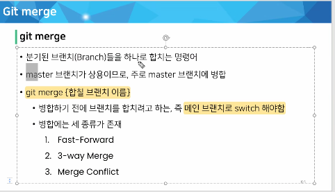

- Working Directory 작업 단계
  - Working Directory에서 수정한 파일 내용을 이전 커밋 상태로 되돌리기
  - `git restore`
- Staging Area 작업 단계
  - Staging Area 에 반영된 파일을 Working Directory 로 되돌리기
  - `git rm --cached`
  - `git restore --staged`
- Repository 작업단계
  - 커밋을 완료한 파일을 Staging Area 로 되돌리기
  - `git commit --amend`

