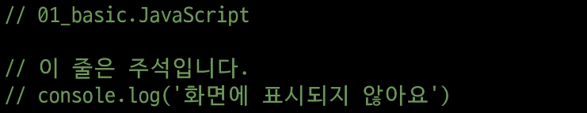
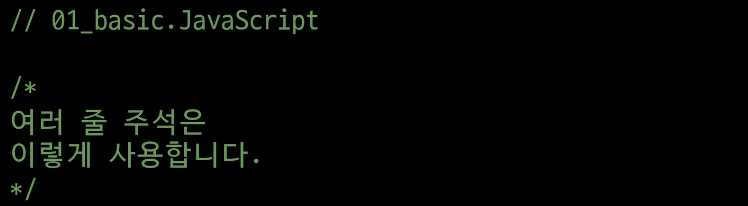
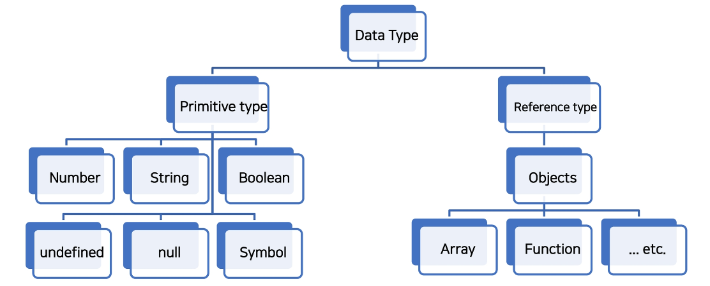

# 💫 JavaScript

## ✨ JavaScript 시작하기

### 📌 JavaScript 를 배워야 하는 이유

#### 💡 Web 기술의 기반이 되는 언어

- HTML 문서의 콘텐츠를 동적으로 변경할 수 있는 언어
- Web 이라는 공간에서 채팅, 게임 등 다양한 동작을 할 수 있게 된 기반


#### 💡 다양한 분야로 확장이 가능한 언어

- JavaScript 는 Web 을 위해 탄생한 언어로, 초기에는 언어의 특성상 많은 개발자에게 환영 받지 못함
- 하지만 버전이 올라가면서 하나의 단단한 언어로 자기 매김을 한 언어
- 단순히 Web 조작을 넘어서 서버 프로그래밍, 모바일 서비스, 컴퓨터 응용프로그래밍, 블록체인, 게임 개발 등 다양한 분야에서 활용이 가능한 언어가 됨
- 과거에는 단순히 Web Front-end 를 뒤해서만 JavaScript 개발자를 찾았다면 이제는 그 영역이 매우 넓어져 다양한 직군에서 찾는 언어가 됨


### 📌 JavaScript의 역사

- Web 을 조작하기 위한 언어인 만큼 **Web Browser와도 깊은 연관 관계가 있음**
- 이러한 이유 때문에 JavaScript를 처음 학습할 때 다양한 용어를 접하게 되는데 역사를 통해 전체적으로 보고자 한다

#### 💡 웹 브라우저의 역할

- URL 을 통해 Web(WWW) 을 탐색함
- HTML/CSS/JavaScript 를 이해한 뒤 해석해서 사용자에게 하나의 화면으로 보여줌
- 웹 서비스 이용 시 클라이언트의 역할을 함
- 즉, 웹 페이지 코드를 이해하고, 보여주는 역할을 하는 것이 바로 웹 브라우저


#### 💡 웹 브라우저와 스크립트 언어

- **1993, Mosaic Web Brower**
  - 유저가 웹을 쉽게 탐색할 수 있게 버튼 등을 탑재한 GUI 기반의 웹 브라우저
- **1994, Netscape Navigator**
  - Mosiac Web Browser 를 개선한 후속작, 시장 점유율 80% 차지


- 이 때 까지만 해도 정적 웹페이지를 단순히 보여주는 용도에 그침
- 웹 브라우저에 탑재해서 웹 페이지를 동적으로 바꿔줄 Script 언어 개발 필요
  - **Script 언어?**
    - 소스 코드를 기계어로 바꿔주는 컴파일러 없이 바로 실행 가능한 언어
      속도가 느리다는 단점이 있음
- Netscape 에서 약 10일의 개발 기간을 통해 Script 언어인 Mocha 개발
- 이후 LiveScript 로 이름 변경 후 브라우저에 LiveScript 를 해석해주는 Engine 을 내장
- 이후 당시 인기있던 JAVA의 명성에 기대보고자 JavaScript 로 이름 변경


- **1995, Microsoft 와 Internet Explorer**
  - "Netscape가 너무 잘나가는데? 우리도 Web Browser 만들어보자"
  - JavaScript 를 그대로 복사한 JavaScriptcript 라는 언어 제작 후 이를 탑재한 Web Browser 인 Internet Explorer 출시
  - 이후 JavaScript 와 JavaScriptcript 는 각자의 기능을 추가하기 시작
  - 개발자들은 Netscape Navigator 와 Internet Explorer 각각에 대한 코드를 작성 해야하는 상황을 맞이하게 됨


- **1996-2000, ECMA 표준 발의**
  - Netscape 가 정보 통신에 관한 규약을 만드는 비영리 단체 ECMA 에게 JavaScript 기반의 표준안 발의 제안, ECMAScript 1 출시
  - 이후 여러가지 문법이 추가되며 ECMAScript 의 버전이 올라감
  - 이 상황을 지켜보던 Microsoft
    - "Windows알지? 우리는 거기에 기본적으로 Internet Explorer 탑재함!"
  - 결국 시장 점유율 95% 이상으로 증가, ECMAScript 표준안 지키지 않겠다 선언


- **2001-2004, 다양한 웹 브라우저의 등장**
  - **ActionScript3** 라는 스크립트 언어를 기반으로 한 Firefox 웹 브라우저 출시
  - 개발자 : 개빡침
    - Netscape Navigator & Internet Explorer & Firefox 지원을 위해 고통
  - 이후 Opera 등의 다양한 웹 브라우저가 계속 시장에 출시됨
  - 다양성으로 인해 더더욱 많은 개발자가 필요해졌고, 이는 집단 지성을 형성

- **jQuery 등의 라이브러리 등장**
  - 각 브라우저의 엔진에 맞는 스크립트를 여러 번 작성하는 것이 고통스러움
  - 중간에 하나의 레이어를 두고 코딩하는 것 = jQuery
    - jQuery 문법에 맞춰 작성하면 브라우저별 엔진에 맞는 스크립트 변환은 jQuery가 알아서 변환해줌
  - 이후 아주 많은 코드가 jQuery 로 작성됨

- **2008, Google의 Chrome 등장과 대통합의 시대**
  - V8 이라는 강력한 엔진을 탑재한 Chrome 등장
    - JavaScript 해석이 다른 웹 브라우저에 비해 월등히 빠름
    - 이로 인해 웹 브라우저가 버벅임이 없고 매우 빠르게 동작
  - Chrome 의 성능 앞에서 다른 웹 브라우저들이 함께 표준안을 만들자고 제안
- 2009, ECMAScript5 (ES5) 표준안 제정
- 2015, ECMAScript6 (ES6) 표준안 제정
- 이후에도 계속해서 버전이 업데이트 되고 있으나, **큰 변화는 ES6에서 이루어짐**


#### 💡 정리

- 웹 브라우저는 JavaScript 를 해석하는 엔진을 가지고 있음
- 현재의 JavaScript 는 이제 시장에서 자리를 잡은 언어이며, 개발에서 큰 축을 담당하는 언어
- 더 이상 jQuery 등의 라이브러리를 사용할 필요가 없음 (모든 웹 브라우저가 표준안을 따름)
- 특히, Chrome 의 V8 의 경우 JavaScript 를 번역하는 속도가 매우 빠름
  - 물건인데 ? Web Browser 에서만 사용하지 말고 다른 개발에서도 활용해보자 !
  - node.JavaScript, react.JavaSciprt, electron 등의 내부 엔진으로 사용
  - 그 결과, back-end, mobile, desktop app 등을 모두 JavaScript로 개발이 가능해짐


### 📌 JavaScript 실행환경 구성

1. **Web Browser로 실행하기**
   - HTML 파일에 포함시키기
   - 외부 JavaScript 파일 사용하기
   - Web Browser 에서 바로 입력하기
2. **Node.JavaScript로 실행하기**


## ✨ JavaScript 기초 문법 

### 📌 코드 작성법

#### 💡 세미콜론 (semicolon)

- 자바스크립트는 세미콜론을 선택적으로 사용 가능
- 세미콜론이 없으면 ASI 에 의해 자동으로 세미콜론이 삽입됨
  - ASI (Automatic Semicolon Insertion, 자동 세미콜론 삽입 규칙)
- 본 수업에서는 자바스크립트의 문법 및 개념적 측면에 집중하기 위해 세미콜론을 사용하지 않고 진행


#### 💡 들여쓰기와 코드 블럭

- python 은 4칸 들여쓰기를 사용했으나, JavaScript 는 2칸 들여쓰기를 사용

- 블럭(block) 은 if, for, 함수에서 중괄호 `{}` soqnfmf akfgka

  - python 은 들여쓰기를 이용해서 코드 블럭을 구분
  - JavaScript 는 중괄호 `{}` 를 사용해 코드 블럭을 구분

  ```javascript
  if (isClean) {	// 중괄호를 사용해서 코드 블럭 구분
    console.log('clean!')	// 2칸 들여쓰기
  }
  ```


#### 💡 코드 스타일 가이드

- 코딩 스타일의 핵심은 합의된 원칙과 일관성
- 코드의 품질에 직결되는 중요한 요소
  - 코드의 가독성, 유지보수 또는 팀원가의 커뮤니케이션 등 개발 과정 전체에 영향을 끼침
- Python 에도 PEP8 이라는 코드 스타일 가이드가 있었듯, JavaScript 에도 코드 스타일 가이드 존재
- 수업에서는 Airbnb Style Guide를 기반으로 사용할 것


#### [참고] 다양한 JavaScript 코드 스타일 가이드

- Airbnb JavaScript Style Guide
- Google JavaScript Style Guide
- standardJavaScript


#### 💡 주석

- 한 줄 주석(`//`) 과 여러 줄 (`/* */`) 주석






### 📌 변수와 식별자

#### 💡 식별자 정의와 특징

- 식별자(identifier) 는 변수를 구분할 수 있는 변수명을 말함
- 식별자는 반드시 문자, 달러($) 또는 밑줄(_) 로 시작
- 대소문자를 구분하며, 클래스명 외에는 모두 소문자로 시작
- 예약어 사용 불가능
  - 예약어 예시 : for, if, function 등


- **카멜 케이스** (`camelCase`, `lower-camel-case`)
  - 변수, 객체, 함수에 사용
  
  ```javascript
  // 변수
  let dog
  let variableName
  
  // 객체
  const userInfo = { name: 'Tom', age: 20 }
  
  // 함수
  function add() {}
  function getName() {}
  ```
  
  
  
- **파스칼 케이스** (`PascalCase`, `upper-camel-case`)
  - 클래스, 생성자에 사용
  
  ```javascript
  // 클래스
  class User {
      constructor(options) {
          this.name = options.name
      }
  }
  
  // 생성자 함수
  function User(options) {
      this.name = options.name
  }
  ```
  
  
  
- **대문자 스네이크 케이스** (`SNAKE_CASE`)
  - 상수 (cnstants) 에 사용
  - 상수 : 개발자의 의도와 상관없이 변경될 가능성이 없는 값을 의미
  
  ```javascript
  // 값이 바뀌지 않을 상수
  const API_KEY = 'my-key'
  const PI = Math.PI
  
  // 재할당이 일어나지 않는 변수
  const NUMBERS = [1, 2, 3]
  ```
  
  


#### 💡 변수 선언 키워드

- Python 과 다르게 JavaScript 는 변수를 선언하는 키워드가 정해져 있음
  1. `let`
     - 블록 스코프 지역 변수를 선언 (추가로 동시에 값을 초기화)
  2. `const`
     - 블록 스코프 읽기 전용 상수를 선언 (추가로 동시에 값을 초기화)
  3. `var`
     - 변수를 선언 (추가로 동시에 값을 초기화)


#### 💡 [참고] 선언, 할당, 초기화

- **선언 (Declaration)**
  - 변수를 생성하는 행위 또는 시점
- **할당 (Assignment)**
  - 선언된 변수에 값을 저장하는 행위 또는 시점
- **초기화 (Initialization)**
  - 선언된 변수에 처음으로 값을 저장하는 행위 또는 시점

```javascript
let foo				// 선언
console.log(foo)	// undefined

foo = 11			// 할당
console.log(foo)	// 11

let bar = 0			// 선언 + 할당
console.log(bar)	// 0
```


#### 💡 [참고] 블록 스코프 (block scope)

- if, for, 함수 등의 중괄호 내부를 가리킴
- 블록 스코프를 가지는 변수는 블록 바깥에서 접근 불가능

```javascript
let x = 1

if (x === 1) {
    let x = 2
    console.log(x)		// 2
}

console.log(x)			// 1
```


#### 💡 변수 선언 키워드 - `let`

- 재할당 가능 & 재선언 불가능

  ```javascript
  let number = 10	// 1. 선언 및 초기값 할당
  number = 20		// 2. 재할당
  
  let number = 10	// 1. 선언 및 초기값 할당
  let number = 20	// 2. 재선언 불가능
  ```

- 블록 스코프를 갖는 지역 변수를 선언, 선언과 동시에 원하는 값으로 초기화 할 수 있음


#### 💡 변수 선언 키워드 - `const`

- 재할당 불가능 & 재선언 불가능

  ```javascript
  const number = 10 	// 1. 선언 및 초기값 할당
  number = 10			// 2. 재할당 불가능
  
  const number = 10	// 1. 선언 및 초기값 할당
  const number = 10	// 2. 재선언 불가능
  ```

- 선언 시 반드시 초기값을 설정해야 하며, 이후 값 변경이 불가능
- let 과 동일하게 블록 스코프를 가짐


#### 💡 변수 선언 키워드 - `var`

- 재할당 가능 & 재선언 가능
- ES6 이전에 변수를 선언할 때 사용되던 키워드
- **"호이스팅"** 되는 특성으로 인해 예기치 못한 문제 발생 가능
  - 따라서 ES6 이후부터는 var 대신 **const 와 let 을 사용하는 것을 권장**
- 함수 스코프 (function scope) 를 가짐
- 변수 선언 시 var, const, let 키워드 중 하나를 사용하지 않으면 자동으로 var 로 선언됨


#### 💡 [참고] 함수 스코프 (function scope)

- 함수의 중괄호 내부를 가리킴
- 함수 스코프를 가지는 변수는 함수 바깥에서 접근 불가능

```javascript
function foo(){
    var x = 5
    console.log(x)		// 5
}

// ReferenceError: x is not defined
console.log(x)
```


#### 💡 [참고] 호이스팅 (hoisting)

- 변수를 선언 이전에 참조할 수 있는 현상
- var 로 선언된 변수는 선언 이전에 참조할 수 있으며, 이러한 현상을 호이스팅이라 함
- 변수 선언 이전의 위치에서 접근 시 `undefined`를 반환

```javascript
console.log(name)		// undefined => 선언 이전에 참조

var name = '홍길동'      // 선언

// 위 코드를 암묵적으로 아래와 같이 이해함
var name 				// undefined 로 초기화
console.log(name)

var name = '홍길동'
```

- 즉, JavaScript 에서 변수들은 실제 실행시에 코드의 최상단으로 끌어 올려지게 되며 (hosited)
  이러한 이유 때문에 var 로 선언된 변수는 선언 시에 undefined 로 값이 초기화되는 과정이 동시에 일어남
- 반면 let, const 는 호이스팅이 일어나면 에러를 발생시킴

```javascript
console.log(username)			// undefined
var username = '홍길동'

console.log(email)				// Uncaught ReferenceError
let email = 'gildong@gmail.com'

console.log(age)				// Uncaught ReferenceError
const age = 50
```

- 변수를 선언하기 전에 접근이 가능한 것은 코드의 논리적인 흐름을 깨뜨리는 행위이며 이러한 것을 방지하기 위해 `let`, `const` 가 추가되었음
  -  즉 `var` 는 사용하지 않아야 하는 키워드
- 다만, 아직까지도 많은 기존의 JavaScript 코드는 ES6 이전의 문법으로 작성되어 있으므로 호이스팅에 대한 이해가 필요


#### 💡 변수 선언 키워드 정리

| 키워드 | 재선언 | 재할당 |   스코프    |     비교     |
| :----: | :----: | :----: | :---------: | :----------: |
|  let   |   X    |   O    | 블록 스코프 | ES6부터 도입 |
| const  |   X    |   X    | 블록 스코프 | ES6부터 도입 |
|  var   |   O    |   O    | 함수 스코프 |    사용 X    |

- 어디에 변수를 쓰고 상수를 쓸지 결정하는 것은 프로그래머의 몫
- Airbnb 스타일 가이드에서는 기본적으로 `const` 사용을 권장
  - 재할당 해야 하는 경우만 `let`


### 📌 데이터 타입

- JavaScript 의 모든 값은 특정한 데이터 타입을 가짐
- 크게 원시 타입 (Primitive type) 과 참조 타입 (Reference type) 으로 분류됨




#### 💡 Number

- 정수 또는 실수형 숫자를 표현하는 자료형

```javascript
const a = 13
const b = -5
const c = 3.14 			// float - 숫자 표현
const d = 2.998e8		// 2.998 * 10^8 = 299,800,000
const e = Infinity
const f = -Infinity
const g = NaN			// Not a Number 를 나타내는 값
```

- **NaN**
  - Not-A-Number (숫자가 아님) 를 나타냄
  - `Number.isNaN()` 의 경우 주어진 값의 유형이 Number 이고 값이 NaN 이면 true, 아니면 false 반환

```javascript
Number.isNaN(NaN)		// true
Number.isNaN(0 / 0)		// true

// isNaN() 으로는 True
Number.isNaN('NaN')		// flase
Number.isNaN(undefined)	// false
Number.isNaN({})		// false
Number.isNaN('blabla')	// false

// 이들 모두 false
Number.isNaN(true)
Number.isNaN(null)
Number.isNaN(37)
Number.isNaN('37')
Number.isNaN('37.37')
Number.isNaN('')
Number.isNaN(' ')
```

- **NaN을 반환하는 경우**
  1. 숫자로서 읽을 수 없음 (`parseInt("어쩌구")`, `Number(undefined)`)
  2. 결과가 허수인 수학 계산식 (`Math.sqrt(-1)`)
  3. 피연산자가 NaN ( `7 ** NaN`)
  4. 정의할 수 없는 계산식 (`0 * Infinity`)
  5. 문자열을 포함하면서 덧셈이 아닌 계산식 (`"가" / 3`)


#### 💡 String

- Quote 를 사용하면 선언 시 줄 바꿈이 안됨
- 대신 escape sequence 를 사용할 수 있기 때문에 `\n` 를 사용해야 함

```javascript
// Bad
const word = "안녕
하세요" // Uncaught SyntaxError: Invalid or unexpected token

// Good
const word1 = "안녕 \n하세요"
console.log(word1)
```

- Template Literal 을 사용하면 줄바꿈이 되며, 문자열 사이에 변수도 삽입이 가능
- (단, escape sequence 를 사용할 수 없다 ) == Python 의 "f-string"

```javascript
const word2 = `안녕
들 하세요`
console.log(word2)

const age = 10
const message = `홍길동은 ${age}세 입니다.`
console.log(message)
```


#### 💡 Template literals (템플릿 리터럴)

- 내장된 표현식을 허용하는 문자열 작성 방식

- ES6+ 부터 지원

- Backtick(``) 을 이용하며, 여러 줄에 걸쳐 문자열을 정의할 수도 있고 JavaScript 의 변수를 문자열 안에 바로 연결할 수 있는 이점이 생김

- 표현식을 넣을 수 있는데, 이는 $ 와 중괄호 (`$ {expression}` )로 표기

  ```javascript
  const age = 10
  const message = `홍길동은 ${age}세 입니다.`
  ```

  

#### 💡 Empty Value

- 값이 존재하지 않음을 표현하는 값으로 JavaScirpt 에서는 `null` 과 `undefined` 가 존재
- 동일한 역할을 하는 이 두개의 키워드가 존재하는 이유는 단순한 JavaScript 의 설계 실수
- 큰 차이를 두지 말고 interchangeable 하게 사용할 수 있도록 권장함


#### 💡 null

- null 값을 나타내는 특별한 키워드
- 변수의 **값이 없음을 의도적으로 표현** 할 때 사용하는 데이터 타입

```javascript
let lastName = null
console.log(lastName)	// null - 의도적으로 값이 없음을 표현함
```


#### 💡 undefined

- 값이 정의되어 있지 않음을 표현하는 값
- 변수 선언 직후 직접 값을 할당하지 않으면 자동으로 할당됨

```javascript
let firstName 			// 선언만 하고 할당하지 않음
console.log(firstName)	// undefined
```


#### 💡 null 과 undefined

- null 과 undefined 의 가장 대표적인 차이점은 `typeof` 연산자를 통해 타입을 확인했을 때 나타남

  ```javascript
  typeof null				// "object"
  typeof undefined		// "undefined"
  ```

- null 이 원시 타입임에도 불구하고 object 로 출력되는 이유는 JavaScript 설계 당시의 버그를 지금까지 해결하지 못한 것
- 쉽게 해결 할 수 없는 이유는 이미 null 타입에 의존성을 띄고 있는 많은 프로그램들이 망가질 수 있기 때문 (하위 호환 유지)


#### 💡 Boolean

- true 와 false
- 참과 거짓을 표현하는 값
- 조건문 또는 반복문에서 유용하게 사용
  - 조건문 또는 반복문에서 boolean 이 아닌 데이터 타입은 **자동 형변환 규칙** 에 따라 true 또는 false 로 변환됨


#### 💡 ToBoolean Conversions (자동 형변환)

| 데이터 타입 |   false    |       true       |
| :---------: | :--------: | :--------------: |
|  undefined  | 항상 거짓  |        X         |
|    null     | 항상 거짓  |        X         |
|   Number    | 0, -0, NaN | 나머지 모든 경우 |
|   String    | 빈 문자열  | 나머지 모든 경우 |
|   Object    |     X      |     항상 참      |


### 📌 연산자

#### 💡 할당 연산자

- 오른쪽에 있는 피연산자의 평가 결과를 왼쪽 피연산자에 할당하는 연산자
- 다양한 연산에 대한 단축 연산자 지원
- Increment 및 Decrement 연산자
  - `Increment(++)` : 피연산자의 값을 1 증가시키는 연산자
  - `Decrement(--)` : 피연산자의 값을 1 감소시키는 연산자
  - `+=` 또는 `-=` 와 같이 더 분명한 표현으로 적을 것을 권장

```javascript
let c = 0

c += 10
console.log(c)	// 10 - c에 10을 더한다

c -= 3
console.log(c)	// 7 - c에 3을 뺀다

c *= 10
console.log(c)	// 70 - c에 10을 곱한다

c++
console.log(c)	//  71 - c에 1을 더한다 (증감식)

c--
console.log(c)	// 70 - c에 1을 뺀다 (증감식)
```


#### 💡 비교 연산자

- 피연산자들 (숫자, 문자, Boolean 등) 을 비교하고 결과값을 boolean 으로 반환하는 연산자
- 문자열은 유니코드 값을 사용하며 표준 사전 순서를 기반으로 비교
  - ex) 알파벳끼리 비교할 경우
    - 알파벳 순서상 후순위가 더 크다
    - 소문자가 대문자보다 더 크다

```javascript
3 > 2			// true
3 < 2			// false

'A' < 'B'		// true
'Z' < 'a'		// true
'가' < '나'	   // true
```


#### 💡 동등 연산자

- 두 피연산자가 같은 값으로 평가되는지 비교 후 boolean 값을 반환
- 비교할 때 암묵적


## ✨ 함수

- 참조 타입 중 하나로써 function 타입에 속함
- JavaScript 에서 함수를 정의하는 방법은 주로 2가지로 구분됨
  - 함수 선언식 (function declaration)
  - 함수 표현식 (function expression)


### 📌 함수의 정의

#### 💡 함수 선언식 (Funtion declaration)

- 일반적인 프로그래밍 언어의 함수 정의 방식

  ```javascript
  function 함수명(){
      // do something
  }
  ```

- 예시

  ```js
  function add(num1, num2) {
      return num1 + num2
  }
  
  add(2, 7) // 9
  ```

  

#### 💡 함수 표현식 (Function expression)

- 표현식 내에서 함수를 정의하는 방식

- 함수 표현식은 함수의 이름을 생략한 익명 함수로 정의 가능

  ```js
  변수키워드 함수명 = function() {
      //do something
  }
  ```

- 예시

  ```js
  const sub = function (num1, num2) {
      return num1 - num2
  }
  
  sub(7, 2) // 5
  ```

- 표현식에서 함수 이름을 명시하는 것도 가능

- 다만 이 경우 함수 이름은 호출에 사용되지 못하고 디버깅 용도로 사용됨

  ```js
  const mySub = function namedSub(num1, num2) {
      return num1 - num2
  }
  
  mySub(1, 2) // -1
  namedSub(1, 2) // ReferenceError : nameSub is not defined
  ```

  

#### 💡 기본 인자 (Default arguments)

- 인자 작성 시 `=` 문자 뒤 기본 인자 선언 가능

  ```js
  const greeting = function (name='Anonymous') {
      return `Hi ${name}`
  }
  
  greeting() // Hi Anonymous
  ```


#### 💡 매개변수와 인자의 개수 불일치 허용

- 매개변수보다 인자의 개수가 많을 경우

  ```js
  const noArgs = function() {
      return 0
  }
  
  noArgs(1, 2, 3) // 0
  
  const twoArgs = funtion(arg1, arg2) {
      return [arg1, arg2]
  }
  
  twoArgs(1, 2, 3) // [1, 2]
  ```

- 매개변수보다 인자의 개수가 적을 경우

  ```js
  const threeArgs = function (arg1, arg2, arg3) {
      return [arg1, arg2, arg3]
  }
  
  threeArgs()			// [undefined, undefined, undefined]
  threeArgs(1)		// [1, undefined, undefined]
  threeArgs(1, 2)		// [1, 2, undefined]
  ```


#### 💡 Spread syntax (...)

- "전개 구문"

- 전개 구문을 사용하면 배열이나 문자열과 같이 반복 가능한 객체를 **배열의 경우는 요소**, **함수의 경우는 인자**로 확장할 수 있음

  1. **배열과의 사용**

     ```js
     let parts = ['shoulders', 'knees']
     let lyrics = ['head', ...parts, 'and', 'toes']
     // ['head', 'shoulders', 'knees', 'and', 'toes']
     ```

     

  2. **함수와의 사용 (Rest parameters)**

     - The rest parameter syntax 를 사용하여 정해지지 않은 수의 매개변수를 배열로 받을 수 있음

     ```js
     function func(a, b, ...theArgs) {
         //
     }
     ```

     ```js
     const rest0pr = function (arg1, arg2, ...restArgs) {
         return [arg1, arg2, restArgs]
     }
     
     restArgs(1, 2, 3, 4, 5) // [1, 2, [3, 4, 5]]
     restArgs(1, 2) // [1, 2, []]
     ```


### 📌 선언식과 표현식

#### 💡 함수의 타입

- 선언식 함수와 표현식 함수 모두 타입은 function 으로 동일

  ```js
  // 함수 표현식
  const add = function (args) {}
  
  // 함수 선언식
  function sub(args) {}
  
  console.log(typeof add) // function
  console.log(typeof sub) // function
  ```


#### 💡 호이스팅 - 선언식

- 함수 선언식으로 정의한 함수는 var로 정의한 변수처럼 호이스팅이 발생


## ✨ Array 와 Object 

- JavaScript의 데이터 타입 중 참조 타입 (reference) 에 해당 하는 타입은 **Array** 와 **Object** 이며, 객체라고 말함
- 객체는 속성들의 모음 (collection)
  - (참고) 객체 안쪽의 속성들은 메모리에 할당 되어있고, 해당 객체는 메모리의 시작 주소 값을 가리키고 있는 형태로 이루어져 있음


### 📌 배열 (Array)

#### 💡 배열 (Array)

- 키와 속성들을 담고 있는 참조 타입의 **객체(object)**
- 순서를 보장하는 특징이 있음
- 주로 대괄호(`[]`)를 이용하여 생성하고, 0을 포함한 양의 정수 인덱스로 특정 값에 접근 가능
- 배열의 길이는 `array.length` 형태로 접근 가능
  - (참고) 배열의 마지막 원소는  `array.length-1` 로 접근

```js
const numbers = [1, 2, 3, 4, 5]

console.log(numbers[0])		// 1
console.log(numbers[-1])	// undefined
console.log(numbers.length)	// 5
```

```js
const numbers = [1, 2, 3, 4, 5]

console.log(numbers[numbers.length - 1]) // 5
console.log(numbers[numbers.length - 2]) // 4
console.log(numbers[numbers.length - 3]) // 3
console.log(numbers[numbers.length - 4]) // 2
console.log(numbers[numbers.length - 5]) // 1
```


#### 💡 배열 메서드 기초

|     메서드      |                         설명                         |           비고           |
| :-------------: | :--------------------------------------------------: | :----------------------: |
|     reverse     |     **원본 배열**의 요소들의 순서를 반대로 정렬      |                          |
|   push & pop    |      배열의 **가장 뒤에** 요소를 추가 또는 제거      |                          |
| unshift & shift |      배열의 **가장 앞에** 요소를 추가 또는 제거      |                          |
|    includes     | 배열에 특정 값이 존재하는지 판별 후 **참/거짓 반환** |                          |
|     indexOf     | 배열에 특정 값이 존재하는지 판별 후 **인덱스 반환**  | 요소가 없을 경우 -1 반환 |
|      join       |    배열의 **모든 요소를 구분자를 이용하여 연결**     | 구분자 생략 시 쉼표 기준 |

- `array.reverse()`

  - **원본 배열**의 요소들의 순서를 반대로 정렬

  ```js
  const numbers = [1, 2, 3, 4, 5]
  
  numbers.reverse()
  console.log(numbers) // [5, 4, 3, 2, 1]
  ```


- `array.push()`
  -  배열의 가장 뒤에 요소 추가

- `array.pop()`

  - 배열의 마지막 요소 제거

  ```js
  const numbers = [1, 2, 3, 4, 5]
  
  numbers.push(100)
  console.log(numbers) // [1, 2, 3, 4, 5, 100]
  
  numbers.pop()
  console.log(numbers) // [1, 2, 3, 4, 5]
  ```


- `array.includes(value)`

  - 배열에 특정 값이 존재하는지 판별 후 참 또는 거짓 반환

  ```js
  const numbers = [1, 2, 3, 4, 5]
  
  console.log(numbers.includes(1))	// true
  console.log(numbers.includes(100))	// false
  ```


- `array.indexOf(value)`

  - 배열에 특정 값이 존재하는지 확인 후 가장 첫 번째로 찾은 요소의 인덱스 반환
  - 만약 해당 값이 없을 경우 -1 반환

  ```js
  const numbers = [1, 2, 3, 4, 5]
  let result
  
  result = numbers.indexOf(3)	// 2
  console.log(result)
  
  result = numbers.indexOf(100) // -1
  console.log(result)
  ```

  

- `array.join([separator])`

  - 배열의 모든 요소를 연결하여 반환
  - separator (구분자) 는 선택적으로 지정 가능하며, 생략 시 쉼표를 기본 값으로 사용

  ```js
  const numbers = [1, 2, 3, 4, 5]
  let result
  
  result = numbers.join()		// 1, 2, 3, 4, 5
  console.log(result)
  
  result = numbers.join('')	// 12345
  console.log(result)
  
  result = numbers.join(' ')	// 1 2 3 4 5 
  console.log(result)
  
  result = numbers.join('-')	// 1-2-3-4-5
  console.log(result)
  ```


### 📌 배열 메서드 심화

#### 💡 Array Helper Methods

- 배열을 순회하며 특정 로직을 수행하는 메서드
- 메서드 호출 시 인자로 **callback 함수**를 받는 것이 특징
  - **callback 함수** : 어떤 함수의 내부에서 실행될 목적으로 인자를 넘겨받는 함수

| 메서드  | 설명                                                         | 비고 |
| ------- | ------------------------------------------------------------ | ---- |
| forEach | 배열의 각 요소에 대해 콜백 함수를 한 번씩 실행               |      |
| map     | **콜백 함수의 반환 값**을 요소로 하는 **새로운 배열 반환**   |      |
| filter  | **콜백 함수의 반환 값이 참인 요소들만** 모아서 **새로운 배열을 반환** |      |
| reduce  | **콜백 함수의 반환 값들을 하나의 값(acc)에 누적 후 반환**    |      |
| find    |                                                              |      |
| some    |                                                              |      |
| every   |                                                              |      |


### 📌 객체 (Object)

- 객체는 속성 (property)의 집합이며, 중괄호 내부에 key 와 value의 쌍으로 표현
- key 는 문자열 타입만 가능
  - key 이름에 띄어쓰기 등의 구분자가 있으면 따옴표로 묶어서 표현
- value 는 모든 타입 (함수포함) 가능
- 객체 요소 접근은 점(`.`) 또는 대괄호 (`[]`) 로 가능
  - key 이름에 띄어쓰기 같은 구분자가 있으면 대괄호 접근만 가능


### 📌 객체 관련 ES6 문법 익히기

- ES6에 새로 도입된 문법들로 객체 생성 및 조작에 유용하게 사용 가능
  1. 속성명 축약
  2. 메서드명 축약
  3. 계산된 속성명 사용하기
  4. 구조 분해 할당
  5. 객체 전개 구문 (Spread Operator)


#### 💡 1. 속성명 축약

- 객체를 정의할 때 key와 할당하는 변수의 이름이 같으면 예시와 같이 축약 가능


