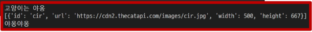

# 💫 JavaScript - Asynchronous JS

## ✨ 동기와 비동기

### 📌 동기 (Synchronous)

#### 💡 동기 (Synchronous)

- 모든 일을 **순서대로 하나씩** 처리하는 것

- 순서대로 처리한다  == 이전 작업이 끝나면 다음 작업을 시작한다

- 우리가 작성했던 Python 코드가 모두 동기식

  ```python
  print('첫번째 작업')
  for i in range(10):
      print('두번째 작업')
      print(i)
  print('세번째 작업')
  ```

- 요청과 응답을 동기식으로 처리한다면 ?

  요청을 보내고 응답이 올 때까지 기다렸다가 다음 로직을 처리


### 📌 비동기 (Asynchronous)

#### 💡 비동기 (Asynchronous)

- 작업을 시작한 후 **결과를 기다리지 않고** 다음 작업을 처리하는 것 (병렬적 수행)
- 시간이 필요한 작업들은 요청을 보낸 뒤 응답이 빨리 오는 작업부터 처리
- 예시 ) Gmail 에서 메일 전송을 누르면 목록 화면으로 전환되지만 실제로 메일을 보내는 작업은 병렬적으로 뒤에서 처리됨

```javascript
function slowRequest(callBack) {
    console.log('1. 오래 걸리는 작업 시작 ...')
    setTimeout(function () {				<< 3초를 기다리는 함수 (오래 걸리는 작업)
        callBack()
    }, 3000)
}

function myCallBack() {
    console.log('2. 콜백함수 실행됨')			<< 가장 마지막에 출력
}

slowRequest(myCallBack)
console.log('3. 다른 작업 실행')

// 출력 결과
// 1. 오래 걸리는 작업 시작 ...
// 3. 다른 작업 실행
// 2. 콜백함수 실행됨
```


#### 💡 비동기(Asynchronous) 를 사용하는 이유

##### - **사용자 경험**

- 예를 들어 아주 큰 데이터를 불러온 뒤 실행되는 앱이 있을 때,
  동기로 처리한다면 데이터를 모두 불러온 뒤에야 앱의 실행 로직이 수행되므로 
  사용자들은 마치 앱이 멈춘 것과 같은 경험을 만들게 됨
- 즉, 동기식 처리는 특정 로직이 실행되는 동안 다른 로직 실행을 차단하기 때문에 마치 프로그램이 응답하지 않는 듯한 사용자 경험을 만들게 됨
- **비동기로 처리한다면 먼저 처리되는 부분부터 보여줄 수 있으므로,**
  사용자 경험에 긍정적인 효과를 볼 수 있음
  이와 같은 이유로 많은 웹 기능은 비동기 로직을 사용해서 구현되어 있음


## ✨ JavaScript의 비동기 처리

#### 💡 Single Thread 언어, JavaScript

- 그러면 응답이 먼저 오는 순서대로 처리하지 말고, 아예 여러 작업을 동시에 처리하면 안되나?
- JavaSciprt 는 한 번에 하나의 일만 수행할 수 있는 **Single Thread** 언어로 동시에 여러 작업 처리 못함
- **Thread란?**
  - 작업을 처리할 때 실제로 작업을 수행하는 주체로, 
    multi-thread 라면 업무를 수행할 수 있는 주체가 여러 개라는 의미
- 즉, **JavaScript 는 하나의 작업을 요청한 순서대로 처리**할 수 밖에 없다 !


#### 💡 JavaScript Runtime

- JavaSciprt 자체는 Single Thread 이므로 비동기 처리를 할 수 있도록 도와주는 환경이 필요
- 특정 언어가 동작할 수 있는 환경을 런타임 (Runtime) 이라 함
- JavaScript 에서 **비동기와 관련한 작업은 브라우저 또는 Node 환경에서 처리**
- 이 중에서 브라우저 환경에서의 비동기 동작은 크게 아래의 요소들로 구성됨
  1. JavaScript Engine 의 `Call Stack`
  2. `Web API`
  3. `Task Queue`
  4. `Event Loop`


#### 💡 비동기 처리 동작 방식

- 브라우저 환경에서의 JavaScript 의 비동기는 아래와 같이 처리된다.
  1. 모든 작업은 `Call Stack(LIFO)` 으로 들어간 후 처리된다.
  2. 오래 걸리는 작업이 `Call Stack` 으로 들어오면 `Web API` 로 보내서 처리하도록 한다.
  3. `Web API` 에서 처리가 끝난 작업들은 `Task Queue(FIFO)` 에 순서대로 들어간다.
  4. `Event Loop` 가 `Call Stack` 이 비어 있는 것을 체크하고, 
     `Task Queue` 에서 가장 오래된 작업을 `Call Stack`으로 보낸다.

##### 1. Call Stack

- 요청이 들어올 때 마다 순차적으로 처리하는 Stack (LIFO) 기본적인 JavaScript 의 Single Thread 작업 처리

##### 2. Web API

- JavaSciprt 엔진이 아닌 브라우저에서 제공하는 runtime 환경으로 시간이 소요되는 작업을 처리
  (setTimeout, DOM Event, AJAX 요청 등)

##### 3. Task Queue

- 비동기 처리된 Callback 함수가 대기하는 Queue (FIFO)

##### 5. Event Loop

- Call Stack 과 Task Queue 를 지속적으로 모니터링
- Call Stack 이 비어 잇는지 확인 후 비어 있다면 Task Queue 에서 대기 중인 오래된 작업을 Call Stack 으로 Push


### 📌 정리

```
JavaScript는 한 번에 하나의 작업을 수행하는 Single Thread 언어로 동기적 처리를 하지만, 
브라우저 환경에서는 Web API 에서 처리된 작업이 지속적으로 Task Queue 를 거쳐 Event Loop 에 의해
Call Stack 에 들어와 순차적으로 실행됨으로써 비동기 작업이 가능한 환경이 된다.
```


## ✨ Axios 라이브러리

#### 💡 Axios

- JavaScript의 HTTP 웹 통신을 위한 라이브러리
- 확장 가능하나 인터페이스와 쉽게 사용할 수 있는 비동기 통신 기능을 제공
- node 환경은 npm 을 이용해서 설치 후 사용할 수 있고, browser 환경은 CDN 을 이용해서 사용할 수 있음


### 📌 Axios 기본 구조

#### 💡 Axios 사용해보기

```javascript
<script src="https://cdn.jsdelivr.net/npm/axios/dist/axios.min.js"></script>
  <script>
    axios.get('요청할 URL')
		.then(성공하면 수행할 콜백함수)
		.catch(실패하면 수행할 콜백함수)
  </script>
```

- get, post 등 여러 method 사용 가능
- `then` 을 이용해서 성공하면 수행할 로직을 작성
- `catch` 를 이용해서 실패하면 수행할 로직을 작성


#### 💡 고양이 사진 가져오기

- The Cat API (https://api.thecatapi.com/v1/images/search)
  - 이미지를 요청해서 가져오는 작업을 비동기로 처리
- **response 구조**

```django
// https://api.thecatapi.com/v1/images/search

[
  {
	"id": "d6n",
	"url": "https://cdn2.thecatapi.com/iamges/d6n.jpg"
	"width": 333,
	"height": 500,
  }
]
```


- Python 으로 요청해보기 (동기)

```python
import requests

print('고양이는 야옹')

cat_image_serach_url = 'https://api.thecatapi.com/v1/images/search'
response = requests.get(cat_image_search_url)

if response.status_code == 200:
    print(response.json())
else:
    print('실패했다옹')
    
print('야옹야옹')
```




### 📌 정리

- axios 는 비동기로 데이터 통신을 가능하게 하는 라이브러리
- 같은 방식으로 우리가 배운 Django REST API 로 요청을 보내서 데이터를 받아온 후 처리할 수 있음


## ✨ Callback 과 Promise

#### 💡 비동기 처리의 단점

- 비동기 처리의 핵심은 Web API 로 들어오는 순서가 아니라 **작업이 완료되는 순서에 따라 처리** 한다는 것 !

- 그런데 이는 개발자 입장에서 코드의 실행 순서가 불명확하다는 단점이 있음
  이와 같은 단점은 **실행 결과를 예상하면서 코드를 작성할 수 없게 함**

  → 어떻게 해야할까 ? → 콜백 함수를 사용하자 !


### 📌 콜백 함수 (Callback Function) 

#### 💡 콜백 함수란 ?

- 특별한 함수가 아님 ! **다른 함수의 인자로 전달되는 함수** 를 콜백 함수라고 한다.
- 비동기에만 사용되는 함수가 아니며 동기, 비동기 상관없이 사용 가능
- 시간이 걸리는 **비동기 작업이 완료된 후 실행할 작업을 명시하는 데 사용**되는 콜백 함수를 **비동기 콜백(asynchronous callback)**이라 부름


### 📌 프로미스 (Promise)

- Callback Hell 문제를 해결하기 위해 등장한 비동기 처리를 위한 객체
- "작업이 끝나면 실행 시켜줄게" 라는 약속 (promise)
- **비동기 작업의 완료 또는 실패를 나타내는 객체**
- Promise 기반의 클라이언트가 바로 이전에 사용한 `Axios` 라이브러리 !
  - "Promise based HTTP client for the browser and node.js"
  - 성공에 대한 약속 `then()`
  - 실패에 대한 약속 `catch()`


#### 💡 then & catch

- `then(callback)`
  - 요청한 작업이 성공하면 callback 실행
  - callback 은 **이전 작업의 성공 결과를 인자로 전달 받음**
- `catch(callback)`
  - `then()`이 하나라도 실패하면 callback 실행
  - callback 은 이전 작업의 실패 객체를 인자로 전달 받음

- then 과 catch 는 모두 항상 promise 객체를 반환 
  즉, 계속해서 **chainging을 할 수 있음**
- **axios로 처리한 비동기 로직이 항상 promise 객체를 반환**
  그래서 then 을 계속 이어 나가면서 작성할 수 있던 것

```javascript
axios.get('요청할 URL').then(...).then(...).catch(...)
```

```javascript
axios.get('요청할 URL') // Promise 객체 return
  .then(성공하면 수행할 1번 콜백함수)
  .then(1번 콜백함수가 성공하면 수행할 2번 콜백함수)
  .then(2번 콜백함수가 성공하면 수행할 3번 콜백함수)
  ...
  .catch(실패하면 수행할 콜백함수)
```


## ✨ AJAX

#### 💡 AJAX 란?

- 비동기 통신을 이용하면 화면 전체를 새로고침 하지 않아도 서버로 요청을 보내고, 데이터를 받아 화면의 일부분만 업데이트 가능
- 이러한 '비동기 통신 웹 개발 기술' 을 Asynchronous Javascript And XML (AJAX 라 함
- **AJAX의 특징**
  1. 페이지 새로고침 없이 서버에 요청
  2. 서버로부터 응답(데이터)을 받아 작업을 수행
- 이러한 비동기 웹 통신을 위한 라이브러리 중 하나가 Axios


### 📌 비동기 적용하기

#### 💡사전 준비

- 마지막 Django 프로젝트 준비하기 (M:N까지 진행한 프로젝트)
- 가상 환경 생성 및 활성화, 패키지 설치


#### 💡 팔로우 (follow)

- 각각의 템플릿에서 script 코드를 작성하기 위한 block tag 영역 작성

```django
<!-- base.html -->

<body>
    ...
    
    
</body>
</html>
```


- axios CDN 작성

```django
<!-- accounts/profile.html -->


  <script src="https://cdn.jsdelivr.net/npm/axios/dist/axios.min.js"></script>
  <script>
  </script>

```


- form 요소 선택을 위해 id 속성 지정 및 선택
- 불필요해진 action 과 method 속성은 삭제 (요청은 axios 로 대체되기 때문)

```django
<!-- accounts/profile.html -->

<form id="follow-form">
    ...
</form>
```

```django
<!-- accounts/profile.html -->

<script>
  const form = document.querySelector('#follow-form')
</script>
```


- form 요소에 이벤트 핸들러 작성 및 submit 이벤트 취소

```django
<!-- accounts/profile.html -->

<script>
  const form = document.querySelector('#follow-form')
  form.addEventListener('submit', function (event) {
      event.preventDefault()
  })
</script>
```

