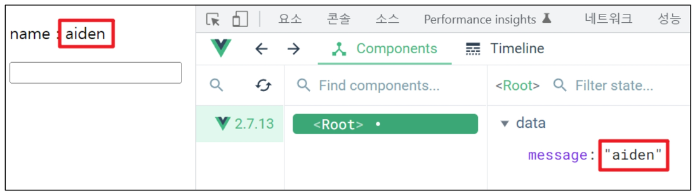
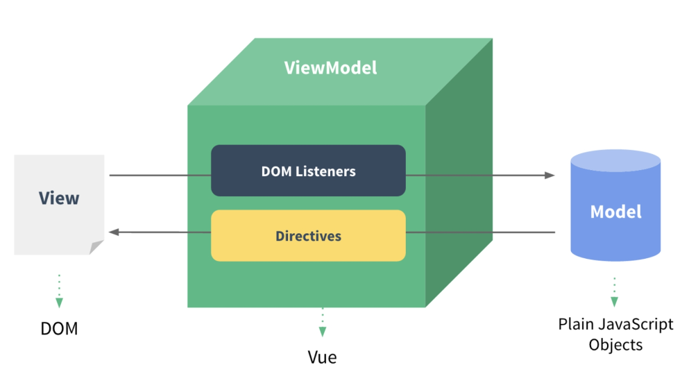

# 💫 Vue_01

## ✨ Vue intro

### 📌 Front-end Development

- Javascript 를 활용한 Frontend 개발
- Front-end 개발은?
  - `Vue.js`
  - Vue.js === JavaScript Front-end Framework


#### 💡 Front-end Famework

- Front-end(FE) 개발이란?
  - 사용자에게 보여주는 화면 만들기
- **Web APP**(SPA)을 만들 때 사용하는 도구
  - SPA - Single Page Application


#### 💡 Web App 이란 ?

- 웹 브라우저에서 실행되는 어플리케이션 소프트웨어
- 웹 페이지가 그대로 보이는 것이 아닌 **디바이스에 설치된 App**처럼 보이는 것
- 웹 페이지가 디바이스에 맞는 적절한 UX/UI로 표현되는 형태


#### 💡 SPA (Single Page Application)

- SPA 는 서버에서 최초 1장의 HTML 만 전달받아 모든 요청에 대응하는 방식을 의미
  - 어떻게 한 페이지로 모든 요청에 대응할 수 있을까 ?
  - **CSR (Cilent Side Rendering)** 방식으로 요청을 처리하기 때문


#### 💡 [참고] SSR (Server Side Rendering) 이란 ?

- 기존 요청 처리 방식은 SSR
- Server 가 사용자의 요청에 적합한 HTML 을 렌더링하여 제공하는 방식
- 전달받은 새 문서를 보여주기 위해 브라우저는 새로고침을 진행


#### 💡 CSR (Client Side Rendring) 이란 ?

- 최초 한 장의 HTML 을 받아오는 것은 동일
  - 단, server로부터 최초로 받아오는 문서는 빈 html 문서
- 각 요청에 대한 대응을 JavaScirpt 를 사용하여 필요한 부분만 다시 렌더링
  1. 새로운 페이지를 서버에 `AJAX`로 요청
  2. 서버는 화면을 그리기 위해 필요한 데이터를 JSON 방식으로 전달
  3. JSON 데이터를 JavaScript 로 처리, DOM 트리에 반영 (렌더링)


#### 💡 왜 CSR 방식을 사용하는 걸까 ?

1. 모든 HTML 페이지를 서버로부터 받는 것이 아니기 때문
   - 클라이언트 - 서버간 통신 즉, 트래픽이 감소
   - 트래픽이 감소한다 = 응답 속도가 빨라진다.
2. 매번 새 문서를 받아 새로고침하는 것이 아니라 필요한 부분만 고쳐 나가므로 각 요청이 끊임없이 진행
   - SNS 에서 추천을 누를 때 마다 첫 페이지로 돌아간다 = 끔찍한 App !
   - 요청이 자연스럽게 진행이 된다 = UX 향상
3. BE 와 FE 의 작업 영역을 명확히 분리할 수 있음
   - 각자 맡은 역할을 명확히 분리한다 = 협업이 용이해짐


#### 💡 CSR 은 만능일까 ?

- 첫 구동 시 필요한 데이터가 많으면 많을수록 최초 작동 시작까지 오랜 시간이 소요
- **검색 엔진 최적화 (SEO, Search Engine Optimization)** 가 어려움
  - 서버가 제공하는 것은 텅 빈 HTML
  - 내용을 채우는 것은 AJAX 요청으로 얻은 JSON 데이터로 클라이언트(브라우저)가 진행
- 대체적으로 HTML 에 작성된 내용을 기반으로 하는 검색 엔진에 빈 HTML 을 공유하는 SPA 서비스가 노출되기는 어려움


#### 💡 SEO (Search Engine Optimization)

- google, bing 과 같은 검색 엔진 등에 내 서비스나 제품 등이 효율적으로 검색 엔진에 노출되도록 개선하는 과정을 일컫는 작업
- **검색** = 각 사이트가 운용하는 검색 엔진에 의해 이루어지는 작업
- **검색 엔진** = 웹 상에 존재하는 가능한 모든 정보들을 긁어 모으는 방식으로 동작
  - 정보의 대상은 주로 HTML 에 작성된 내용
  - JavaScript 가 실행된 이후의 결과를 확인하는 과정이 없음

- 최근에는 SPA, 즉 CSR 로 구성된 서비스의 비중이 증가
  - SPA 서비스도 검색 대상으로 넓히기 위해 JS 를 지원하는 방식으로 발전
- 단, 단순 HTML 만을 분석하는 것보다 몇 배의 리소스가 필요한 작업이기에 여전히 CSR의 검색 엔진 최적화 문제가 모두 해결된 것은 아님


#### 💡 CSR vs SSR

- CSR 과 SSR 은 흑과 백이 아님
  - 내 서비스에 적합한 렌더링 방식을 적절하게 활용할 수 있어야 함
- SPA 서비스에서도 SSR을 지원하는 Framework 도 발전하고 있음
  - Vue 의 Nuxt.js
  - Reat 의 Next.js
  - Angular Universal 등


#### 💡 여러가지 Front-end Framework

- Front-end Framework == HTML + CSS + JS 를 더 편하게 작업하기 위한 툴
  - React, Angular, Svelte, **Vue** 등

- 꼭 써야하는 것은 아님

- 실제로 Github은 Front-end Framework 를 사용하지 않음

- 하지만 **대부분의 기업** 에서는 생산성과 협업을 위해 Framework 를 사용해서 개발

  

## ✨ Why Vue

- 쉽다.
- 입문자가 시작하기에 좋은 Framework
- Angular 보다  **가볍고, 간편하게 사용** 할 수 있다.
- Programmers, GoogleCareers, VIBE, Louis Vuitton, Gitlab


#### 💡 Vue는 정말 쉬울까 ?

- Vue 구조는 매우 직관적임
- FE Framework를 빠르고 쉽게 학습하고 활용 가능


#### 💡 Vue CDN

- Vue 로 작업을 시작하기 위하여 CDN을 가져와야 함
- Django == Python Web Framework
  - pip install
- Vue === JS Front-end Framework
  - Bootstrap 에서 사용하였던 CDN 방식 제공
  - npm 활용


#### 💡 Vue 로 코드 작성하기

1. Vue CDN 가져오기
2. Vue instance 생성
   - Vue instance - 1개의 Object
   - 정해진 속성명을 가진 Object
3. `el, data` 설정
   - data 에 관리할 속성 정의
4. 선언적 렌더링 `{{ }}`
   - Vue data 를 화면에 렌더링
5. input tag에 `v-model` 작성
   - input 에 값 입력 > Vue data 반영
   - Vue data > DOM 반영

```html
<!DOCTYPE html>
<html lang="en">
<head>
  <meta charset="UTF-8">
  <meta http-equiv="X-UA-Compatible" content="IE=edge">
  <meta name="viewport" content="width=device-width, initial-scale=1.0">
  <title>Document</title>
</head>
<body>
  <div id="app">
    <p id="name">name : {{ message }}</p>
    <input id="inputName" type="text" v-model="message">
  </div>
  
  <script src="https://cdn.jsdelivr.net/npm/vue@2/dist/vue.js"></script>
  <script>
    // CODE HERE
    const app = new Vue({
      el: '#app',
      data: {
        message: '',
      }
    })
  </script>
</body>
</html>

```


#### 💡[참고] Dev Tools 확인

- Vue devtools 에서 data 변경 > DOM 반영
- 눈에 보이는 화면을 조작하는 것이 아닌 Vue 가 가진 data 를 조작




## ✨ Vue instance

#### 💡 MVVM Pattern

- 소프트웨어 아키텍처 패턴의 일종
- 마크업 언어로 구현하는 그래픽 사용자 인터페이스(view)의 개발을 Back-end(model)로부터 분리시켜 view가 어느 특정한 모델 플랫폼에 종속되지 않도록 함




- **View** - 우리 눈에 보이는 부분 = DOM
- **Model** - 실제 데이터 = JSON
- **View Model** (Vue)
  - View를 위한 Model
  - View와 연결(binding) 되어 Action 을 주고 받음
  - Model 이 변경되면 View Model 도 변경되고 바인딩된 View 도 변경됨
  - View 에서 사용자가 데이터를 변경하면 View Model의 데이터가 변경되고 바인딩된 다른 View 도 변경됨


#### 💡 MVVM Pattern 정리

- MVC 패턴에서 Controller 를 제외하고 View Model을 넣은 패턴

- View 는 Model을 모르고, Model도 View 를 모른다

  == DOM은 Data를 모른다. Data도 DOM을 모른다. (독립성 증가, 적은 의존성)

- View 에서 데이터를 변경하면 View Model의 데이터가 변경되고, 연관된 다른 View도 함께 변경된다.


#### 💡Vue instance

1. Vue CDN 가져오기
2. `new` 연산자를 사용한 생성자 함수 호출
   - vue instance 생성
3. 인스턴스 출력 및 확인

- Vue instance === 1개의 객체
- 아주 많은 속성과 메서드를 이미 가지고 있고, 이러한 기능들을 사용하는 것

```html
<!DOCTYPE html>
<html lang="en">
<head>
  <meta charset="UTF-8">
  <meta http-equiv="X-UA-Compatible" content="IE=edge">
  <meta name="viewport" content="width=device-width, initial-scale=1.0">
  <title>Document</title>
</head>
<body>

  <div id="app">
    {{ message }}
  </div>

  <div>
    {{ message }}
  </div>

  <!-- Vue CDN -->
  <script src="https://cdn.jsdelivr.net/npm/vue@2/dist/vue.js"></script>
  <script>
    // CODE HERE
    // 1. Vue instance constructor
    const vm = new Vue()
    console.log(vm)
  </script>
</body>
</html>

```


#### 💡 생성자 함수

- JS 에서의 객체 생성

  ```javascript
  const member = {
      name: 'aiden',
      age: 22,
      sId: 20022311491,
  }
  ```

- `new` 연산자로 사용하는 함수

  ```javascript
  function Member(name, age, sId) {
      this.name = name
      this.age = age
      this.sId = sId
  }
  
  const member3 = new Member('isaac', 21, 2022654321)
  ```

- 함수 이름은 반드시 대문자로 시작
- 생성자 함수를 사용할 때는 반드시 `new` 연산자를 사용


#### 💡 `el` (element)

- Vue instance 와 DOM 을 mount(연결) 하는 옵션
  - View 와 Model 을 연결하는 역할
  - HTML id 혹은 class 와 마운트 가능
- Vue instance와 **연결되지 않은 DOM 외부는 Vue의 영향을 받지 않음**
  - Vue 속성 및 메서드 사용 불가


```html
<div id="app">
  
</div>
...
<script>
  const app = new Vue({
      el: '#app'
  })
  console.log(app)
</script>
```

- 새로운 `Vue instance` 생성
- 생성자 함수 첫번째 인자로 `Object` 작성
- `el` 옵션에 `#app` 작성 = DOM 연결
- 인스턴스 출력

```html
<div id="app">
    {{ message }}
</div>
<div>
    {{ message }}
</div>
<script>
  const app = new Vue({
      el: '#app'
  })
  console.log(app)
</script>
```

- Vue 와 연결되지 않은 `div` 생성
  - 두 `div` 모두에 `{{ message }}` 작성
  - 결과 확인
- `message` 속성이 정의되지 않았다는 경고와 
- `{{ message }}` 가 그대로 출력되는 차이


#### 💡 `data`

- Vue instance 의 **데이터 객체** 혹은 **인스턴스 속성**
- 데이터 객체는 반드시 기본 객체 `{}` (Object)  여야 함
- 객체 내부의 아이템들은 value 로 모든 타입의 객체를 가질 수 있음
- 정의된 속성은 `interpolation {{ }}` 을 통해 view 에 렌더링 가능함


```html
<div id="app">
    {{ message }}
</div>

<script>
  const app = new Vue({
      el: '#app',
      data: {
      message: 'Hello, Vue!'
  }
  })
  console.log(app)
</script>
```

- `Vue insatnce` 에 `data` 객체 추가
- `data` 객체에 `message` 값 추가
- 추가된 객체의 각 값들은 `this.message` 형태로 접근 가능


#### 💡 `methods`

- Vue instance 의 `method` 들을 정의하는 곳
- `methods` 객체 정의
  - 객체 내 **print method** 정의
  - print method 실행 시 Vue instance의 data 내 message 출력
- 콘솔 창에서 `app.print()` 실행

```html
<script>
  const app = new Vue({
      el: '#app',
      data: {
      message: 'Hello, Vue!'
  	  },
      methods: {
          print: funtion(){
          console.log(this.message)
      	  },
      }
  })

</script>
```

- method 를 호출하여 data 변경 가능
  - 객체 내 `bye method` 정의
  - print method 실행 시 Vue instance 의 data 내의 message 변경
- 콘솔창에서 `app.bye()` 실행
  - DOM 에 바로 변경된 결과 반영
  - Vue의 강력한 반응성 (reactivity)

```html
<script>
  const app = new Vue({
      el: '#app',
      data: {
      message: 'Hello, Vue!'
  	  },
      methods: {
          print: funtion(){
          console.log(this.message)
      	  },
          bye: funtion(){
              this.message = 'Bye, Vue!'
          }
      }
  })

</script>
```

- **메서드를 정의할 때, Arrow Function 을 사용하면 안됨**
- Arrow Function 의 this 는 함수가 선언될 때 상위 스코프를 가리킴
- 즉 this가 상위 객체 window 를 가리킴
- 호출은 문제없이 가능하나 this 로 Vue의 data 를 변경하지 못함


## ✨ Basic of syntax

#### 💡 Template Syntax

- Vue2 guide > template syntax 참고
- **렌더링 된 DOM** 을 기본 Vue instance 의 data 에 **선언적으로 바인딩** 할 수 있는
  **HTML 기반 template syntax**를 사용
  - 렌더링 된 DOM - 브라우저에 의해 보기 좋게 그려질 HTML 코드
  - HTML 기반 template syntax - HTML 코드에 직접 작성할 수 있는 문법 제공
  - 선언적으로 바인딩 - Vue instance와 DOM 을 연결


#### 💡 Template Interpolation

- 가장 기본적인 바인딩(연결) 방법
- 중괄호 2개로 표기
- DTL 과 동일한 형태로 작성
- Template interpolation 방법은 HTML을 일반 텍스트로 표현


#### 💡 RAW HTML

- `v-html` directive을 사용하여 data와 바인딩
- directive - HTML 기반 template syntax
- HTML의 기본 속성이 아닌 Vue가 제공하는 특수 속성의 값으로 data를 작성


#### 💡 [참고] JS 표현식

- 표현식 형태로 작성 가능

```html
<div id="app">
    <p>{{ msg.split('').reverse().join('') }}</p>
</div>
<script>
    const app = new Vue({
        el: '#app',
        data: {
            msg: 'Text interpolation',
            rawHTML: '<span style="color:red"> 빨간 글씨</span>'
        }
    })
</script>
```


### 📌 Directives

#### 💡 Directives 기본 구성

- v-접두사가 있는 특수 속성에는 값을 할당 할 수 있음
  - 값에는 JS 표현식을 작성 할 수 있음
- directive의 역할은 **표현식의 값**이 **변경**될 때 **반응적**으로 DOM에 적용하는 것


- `:` 을 통해 전달인자를 받을 수 있음
- `.` 으로 표시되는 특수 접미사 - directive 를 특별한 방법으로 바인딩 해야 함ㅇ


#### 💡 `v-text`

- Template Interpolation 과 함께 가장 기본적인 바인딩 방법
- `{{ }}` 와 동일한 역할
  - 정확히 동일한 역할인 것은 아님

```html
<div id="app2">
    <p v-text="message"></p>
    <!-- 같음 -->
    <p>{{ message }}</p>
</div>
<script>
    const app2 = new Vue({
        el: '#app2',
        data: {
            message: 'Hello!',
            html: '<a href="https://www.google.com">GOOGLE</a>'
        }
    })
</script>
```


#### 💡 `v-html`

- RAW HTML 을 표현할 수 있는 방법
- 단, 사용자가 입력하거나 제공하는 컨텐츠에는 **절대 사용 금지**
  - XSS 공격 참고

```html
<div id="app2">
    <p v-text="message"></p>
    <!-- 같음 -->
    <p>{{ message }}</p>
    <p v-html="html"></p>
</div>
<script>
    const app2 = new Vue({
        el: '#app2',
        data: {
            message: 'Hello!',
            html: '<a href="https://www.google.com">GOOGLE</a>'
        }
    })
</script>
```


#### 💡 `v-show`

- 표현식에 작성된 값에 따라 element 를 보여 줄 것인지 결정
  - boolean 값이 변경 될 때 마다 반응
- 대상 element 의 display 속성을 기본 속성과 none 으로 toggle
- 요소 자체는 항상 DOM 에 렌더링 됨

```html
<div id="app3">
    <p v-show="isActive">
        보이니? 안보이니?
    </p>
</div>

<script>
	const app3 = new Vue({
        el: '#app3',
        data: {
            isActive: false
        }
    })
</script>
```

- 바인딩 된 isActive 의 값이 false 이므로 첫 방문 시 p tag 는 보이지 않음
  - vue dev tools 에서 isActive 변경 시 화면에 출력
  - 값을 false로 변경 시 다시 사라짐
- 화면에서만 사라졌을 뿐, DOM 에는 존재한다.
  - display 속성이 변경되었을 뿐


#### 💡`v-if`

- v-show 와 사용 방법은 동일
- isActive의 값이 변경될 때 반응
- 단, 값이 false 인 경우 **DOM에서 사라짐**
- `v-if v-else-if v-else` 형태로 사용

```html
<div id="app3">
    <p v-if="isActive">
        보이니? 안보이니?
    </p>
</div>

<script>
	const app3 = new Vue({
        el: '#app3',
        data: {
            isActive: false
        }
    })
</script>
```


#### 💡 `v-show` vs `v-if`

- `v-show` (Expensive initial load, cheap toggle)
  - 표현식 결과와 관계 없이 렌더링 되므로 초기 렌더링에 필요한 비용은 `v-if` 보다 높을 수 있음
  - display 속성 변경으로 표현 여부를 판단하므로 렌더링 후 toggle 비용은 적음
- `v-if` (Cheap initial load, expensivr toggle)
  - 표현식 결과가 false 인 경우 렌더링조차 되지 않으므로 초기 렌더링 비용은 `v-show` 보다 낮을 수 있음
  - 단, 표현식 값이 자주 변경되는 경우 잦은 재 렌더링으로 비용이 증가할 수 있음


#### 💡 `v-for`

- `for .. in .. ` 형식으로 작성
- 반복한 데이터 타입에 모두 사용 가능
- index를 함께 출력하고자 한다면 `(char, index)` 형태로 사용 가능


- 배열 역시 문자열과 동일하게 사용 가능
- 각 요소가 객체라면 dot notation 으로 접근할 수 있음


- 객체 순회 시 value 가 할당되어 출력
- 2번째 변수 할당 시 key 출력 가능

```html
  <div id="app">
    <h2>String</h2>
    <div v-for="char in myStr">
      {{ char }}
    </div>
    <div v-for="(char, index) in myStr" :key="index">
      <p>{{ index }}번째 문자열 {{ char }}</p>
    </div>

    <h2>Array</h2>
    <div v-for="(item, index) in myArr" :key="`ssafy-${index}`">
      <p>{{ index }}번째 아이템 {{ item }}</p>
    </div>

    <div v-for="(item, index) in myArr2" :key="`arry-${index}`">
      <p>{{ index }}번째 아이템</p>
		  <p>{{ item.name }}</p>
    </div>

    <h2>Object</h2>
    <div v-for="value in myObj">
      <p>{{ value }}</p>
    </div>

    <div v-for="(value, key) in myObj" :key="key">
      <p>{{ key }} : {{ value }}</p>
    </div>
  </div>

  <script src="https://cdn.jsdelivr.net/npm/vue@2/dist/vue.js"></script>
  <script>
    const app = new Vue({
      el: '#app',
      data: {
        // 1. String
        myStr: 'Hello, World!',

        // 2-1. Array
        myArr: ['python', 'django', 'vue.js'],

        // 2-2. Array with Object
        myArr2: [
          { id: 1, name: 'python', completed: true},
          { id: 2, name: 'django', completed: true},
          { id: 3, name: 'vue.js', completed: false},
			  ],
        
        // 3. Object
        myObj: {
          name: 'harry',
          age: 27
        },
      }
    })
  </script>
```


#### 💡[참고] 특수 속성 key

- **"v-for 사용 시 반드시 key 속성을 각 요소에 작성"**
- 주로 `v-for directive` 작성 시 사용
- vue 화면 구성 시 이전과 달라진 점을 확인하는 용도로 활용
  - 따라서 key 가 중복되어서는 안됨
- 각 요소가 고유한 값을 가지고 있지 않다면 생략할 수 있음


#### 💡 `v-on`

- `:` 을 통해 전달받은 인자를 확인
- 값으로 JS 표현식 작성
- `addEventListener` 의 첫 번째 인자와 동일한 값들로 구성
- 대기하고 있던 이벤트가 발생하면 할당된 표현식 실행

```html
<div id="app">
    <button v-on:click="number++">increase Number</button>
    <p>{{ number }}</p>
</div>

<script>
    const app = new Vue({
      el: '#app',
      data: {
        number: 0,
      },
    })
</script>
```

- method 를 통한 data 조작도 가능
- method 에 인자를 넘기는 방법은 일반 함수를 호출할 때와 동일한 방식
- `:` 을 통해 전달된 인자에 따라 특별한 modifiers (수식어) 가 있을 수 있음
  - ex) `v-on:keyup.enter` 등
  - vue2 가이드 > api > v-on 파트 참고
- `@` shortcut 제공
  - ex) `@keyup.click`


#### 💡 `v-bind`

- HTML 기본 속성에 Vue data 를 연결
- class의 경우 다양한 형태로 연결 가능
  - **조건부 바인딩**
    - `{'class Name': '조건 표현식'}`
    - 삼항 연산자도 가능
  - **다중 바인딩**
    - ['JS 표현식', 'JS 표현식', ...]

```html
<div id="app2">
    <a v-bind:href="url">Go To GOOGLE</a>
</div>
<script>
    const app2 = new Vue({
        el: '#app2',
        data: {
            url: 'https://www.google.com/',
        },
    })
</script>
```

- Vue data 의 변화에 반응하여 DOM 에 반영하므로 상황에 따라 유동적 할당 가능
- `:` shortcut 제공
  - ex) `:class` 등
  - `v-for`  에서 사용하였던 `:key` 는 `v-bind` 의 shortcut 을 활용한 것


#### 💡 `v-model`

- Vue instance와 DOM 의 **양방향 바인딩**
- Vue data 변경 시 `v-model`로 연결된 사용자 입력 element 에도 적용

```html
<div id="app">
    <h2>1. Input -> Data</h2>
    <h3>{{ myMessage }}</h3>
    <input @input="onInputChange" type="text">
    <hr>

    <h2>2. Input <-> Data</h2>
        <h3>{{ myMessage2 }}</h3>
        <input v-model="myMessage2" type="text">
        <hr>
        </div>

    <script src="https://cdn.jsdelivr.net/npm/vue@2/dist/vue.js"></script>
    <script>
        const app = new Vue({
            el: '#app',
            data: {
                myMessage: '',
                myMessage2: '',
            },
            methods: {
                onInputChange: function (event) {
                    this.myMessage = event.target.value
                },
            }
        })
    </script>
```


## ✨ Vue advanced

#### 💡 `computed`

- Vue instance 가 가진 options 중 하나
- computed 객체에 정의한 함수를 페이지가 최초로 렌더링 될 때 호출하여 계산
  - 계산 결과가 변하기 전까지 함수를 재호출하는 것이 아닌 계산된 값을 반환


#### 💡 `method` vs `computed`

- **method**
  - 호출 될 때마다 함수를 실행
  - 같은 결과여도 매번 새롭게 계산
- **computed**
  - 함수의 종속 대상의 변화에 따라 계산 여부가 결정됨
  - 종속 대상이 변하지 않으면 항상 저장(캐싱) 된 값을 반환


#### 💡 `watch`

- 특정 데이터의 변화를 감지하는 기능
  1. watch 객체를 정의
  2. 감시할 대상 data 를 지정
  3. data 가 변할 시 실행 할 함수를 정의
- 첫 번째 인자는 변동 전 data
- 두 번째 인자는 변동 후 data

```html
<button @click="number++">+</button>

<script>
    const app = new Vue({
        el: '#app',
        data: {
            number: 0,
        },
        watch: {
            number: function (val, oldVal) {
                console.log(val, oldVal)
            },
        }
    })
</script>
```

- 실행 함수를 Vue method 로 대체 가능
  1. 감시 대상 data의 이름으로 객체 생성
  2. 실행하고자 하는 method 를 handler 에 문자열 형태로 할당
- Array, Object 의 내부 요소 변경을 감지하기 위해서는 `deep` 속성 추가 필요


#### 💡`filters`

- 텍스트 형식화를 적용할 수 있는 필터
- interpolation 혹은 `v-bind` 를 이용할 때 사용 가능
- 필터는 자바스크립트 표현식 마지막에 `|` (파이프) 와 함께 추가되어야 함
- 이어서 사용 (chaining) 가능
