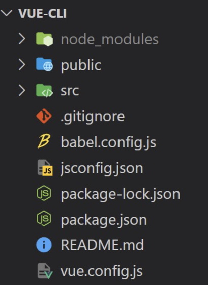

# 💫 Vue_02

## ✨ Vue CLI

### 📌 Node.js

#### 💡 `Node.js`

- 자바스크립트는 브라우저를 조작하는 유일한 언어
  - 하지만 브라우저 밖에서는 구동할 수 없었음
- 자바스크립트를 구동하기 위한 런타임 환경인 `Node.js` 로 인해 브라우저가 아닌 환경에서도 구동할 수 있게 됨
  - Chrome V8 엔진을 제공하여 여러 OS 환경에서 실행할 수 있는 환경을 제공
  - Browser만 조작 가능했으나, Server-Side-Programming 또한 가능


#### 💡 NPM (Node Package Manage)

- 자바스크립트 패키지 관리자
  - `Python` 에 `pip` 가 있다면 `Node.js` 에는 `npm`
  - pip 와 마찬가지로 다양한 의존성 패키지를 관리
- `Node.js` 의 기본 패키지 관리자
- `Node.js` 설치 시 함께 설치됨


### 📌 Vue CLI

- Vue 개발을 위한 표준 도구
- 프로젝트의 구성을 도와주는 역할
- 확장 플러그인, GUI, Babel 등 다양한 tool 제공


#### 💡 Vue CLI Quick Start

- **설치**

```
$ npm install -g @vue/cli
```

- **프로젝트 생성**
  - vscode terminal 에서 진행

```
$ vue create vue-cli
```

- **Vue 버전 선택 (Vue2)**

- 프로젝트 생성 성공

```bash
$ cd vue-cli
$ npm run serve
```


### 📌 Vue CLI 프로젝트 구조



#### 💡 node_modules

- `node.js` 환경의 여러 의존성 모듈
- python 의 venv 와 비슷한 역할을 함
  - 따라서 `.gitignore` 에 넣어주어야 하며, Vue 프로젝트를 생성하면 자동으로 추가됨

#### 💡 node_modules  - `Babel`

- "JavaScript compiler"
- 자바스크립트의 ES6+ 코드를 구버전으로 번역/변환 해주는 도구
- 자바스크립트의 파편화, 표준화의 영향으로 작성된 코드의 스펙트럼이 매우 다양
  - 최신 문법을 사용해도 브라우저의 버전 별로 동작하지 않는 상황이 발생
  - 버전에 따른 같은 의미의 다른 코드를 작성하는 등의 대응이 필요해졌고, 이러한 문제를 해결하기 위한 도구
  - 원시 코드 (최신 버전)를 목적 코드(구 버전)으로 옮기는 번역기가 등장하면서 코드가 특정 브라우저에서 동작하지 않는 상황에 대해 크게 고민하지 않게 됨 


#### 💡 node_modules - `Webpack`

- "static module bundler"
- 모듈 간의 의존성 문제를 해결하기 위한 도구
- 프로젝트에 필요한 모든 모듈을 매핑하고 내부적으로 종속성 그래프를 빌드함


#### 💡 Module

- 개발하는 애플리케이션의 크기가 커지고 복잡해지면 파일 하나에 모든 기능을 담기가 어려워짐
- 따라서 자연스럽게 파일을 여러 개로 분리하여 관리를 하게 되었고, 이 때 분리된 파일이 각각 모듈(module) 즉, js 파일 하나가 하나의 모듈
- 모듈은 대개 기능 단위로 분리하며, 클래스 하나 혹은 특정한 목적을 가진 복수의 함수로 구성된 라이브러리 하나로 구성됨
- 여러 모듈 시스템
  - ESM (ECMA Script Module), AMD, CommonJS, UMD


#### 💡 Module 의존성 문제

- 모듈의 수가 많아지고 라이브러리 혹은 모듈 간의 의존성 (연결성) 이 깊어지면서 특정한 곳에서 발생한 문제가 어떤 모듈 간의 문제인지 파악하기 어려움
  - **Webpack**은 이 모듈 간의 의존성 문제를 해결하기 위해 등장


#### 💡 `Bundler`

- 모듈 의존성 문제를 해결해주는 작업이 Bundling
- 이러한 일을 해주는 도구가 Bundler 이고, Webpack 은 다양한 Bundler 중 하나
- 모듈들을 하나로 묶어주고 묶인 파일은 하나(혹은 여러개)로 만들어짐
- Bundling 된 결과물은 개별 모듈의 실행 순서에 영향을 받지 않고 동작하게 됨
- snowpack, parcel, rollup.js 등의 webpack 이외에도 다양한 모듈 번들러 존재
- **Vue CLI 는 이러한 Babel, Webpack 에 대한 초기 설정이 자동으로 되어 있음**


#### 💡 Webpack - static moduler bundler

- 의존성을 Webpack 이 담당해 주므로 개발자는 `npm install` 을 사용해 다양한 모듈을 한 번에 설치하고 각 모듈을 사용해 개발에 집중할 수 있음


#### 💡 `package.json`

- 프로젝트의 종속성 목록과 지원되는 브라우저에 대한 구성 옵션을 포함


#### 💡 `package-lock.json`

- `node_modules`에 설치되는 모듈과 관련된 모든 의존성을 설정 및 관리
- 협업 및 배포 환경에서 정확히 동일한 종속성을 설치하도록 보장하는 표현
- 사용 할 패키지의 버전을 고정
- 개발 과정 간의 의존성 패키지 충돌 방지
- python 의 `requirements.txt` 역할


#### 💡 `public/index.html`

- Vue  앱의 뼈대가 되는 html 파일
- Vue 앱과 연결될 요소가 있음


#### 💡 `src/`

- `src/assets`
  - 정적 파일을 저장하는 디렉토리
- `src/components`
  - 하위 컴포넌트들이 위치
- `src/App.vue`
  - 최상위 컴포넌트
  - `public/index.html` 과 연결됨
- `src/main.js`
  - webpack 이 빌드를 시작할 때 가장 먼저 불러오는 entry point
  - `public/index.html` 과 `src/App.vue`를 연결시키는 작업이 이루어지는 곳
  - Vue 전역에서 활용 할 모듈을 등록할 수 있는 파일


## ✨ SFC

### 📌 Component

- UI 를 독립적이고 재사용 가능한 조각들로 나눈 것
  - 즉, 기능별로 분화한 코드 조각
- CS 에서는 다시 사용할 수 있는 범용성을 위해 개발된 소프트웨어 구성 요소를 의미
- 하나의 app 을 구성할 때 중첩된 컴포넌트들의 tree 로 구성하는 것이 보편적임
  - Web 시간에 배운 HTML 요소들의 중첩을 떠올려 보자 !
    - Body tag 를 root node 로 하는 tree 의 구조이다.
    - 마찬가지로, Vue 에서는 `src/App.vue` 를 root node로 하는 tree 의 구조를 가짐
- 컴포넌트는 유지보수를 쉽게 만들어 줄 뿐만 아니라 재사용성의 측면에서도 매우 강력한 기능을 제공


#### 💡 Component based architecture 특징

- 관리가 용이
  - 유지 / 보수 비용 감소
- 재사용성
- 확장 가능
- 캡슐화
- 독립적


### 📌 SFC

#### 💡 component in Vue

- Vue 에서 말하는 component 란 무엇일까 ?
  - 이름이 있는 재사용 가능한 **Vue instance**
- Vue instance 란 ?
  - `new Vue()` 로 만든 인스턴스


#### 💡 SFC (Single File Component)

- 하나의 `.vue` 파일이 하나의 `Vue instance` 이고, 하나의 `컴포넌트` 이다.
  - 즉, **Single File Component**
- Vue instance 에서는 HTML, CSS, JavaScript 코드를 한번에 관리
  - 이 Vue instance 를 기능 단위로 작성하는 것이 핵심
- 컴포넌트 기반 개발의 핵심 기능


#### 💡 정리

- HTML, CSS, 그리고 JavaScript 를 `.vue` 라는 확장자를 가진 파일 안에서 관리하며 개발
- 이 파일을 Vue instance, 또는 Vue componenet 라고 하며, 기능 단위로 작성
- Vue CLI 가 Vue 를 Component based 하게 사용하도록 도와줌


### 📌 Vue component

#### 💡 Vue component 구조

- **템플릿 (HTML)**
  - HTML 의 body 부분
  - 눈으로 보여지는 요소 작성
  - 다른 컴포넌트를 HTML 요소처럼 추가 가능
- **스크립트 (JavaScript)**
  - JavaScript 코드가 작성되는 곳
  - 컴포넌트 정보, 데이터, 메서드 등 vue 인스턴스를 구성하는 대부분이 작성 됨
- **스타일 (CSS)**
  - CSS 가 작성되며 컴포넌트의 스타일을 담당


#### 💡 Vue component 구조 정리

- 컴포넌트들이 tree 구조를 이루어 하나의 페이지를 만듦
- root 에 해당하는 최상단의 component 가 `App.vue`
- 이 `App.vue` 를 `index.html` 과 연결
- 결국 `index.html` 파일 하나만을 rendering
  - 이게 바로 SPA


### 📌 Vue component 실습

#### 💡 `MyComponent.vue`

1. `src/components/` 안에 생성
2. script 에 이름 등록
3. template 에 요소 추가

```vue
// MyComponent.vue

<template>
  <div>
    <h1>This is my component</h1>
  </div>
</template>

<script>
export default {
    name: 'MyComponent',
}
</script>

<style>

</style>
```


#### 💡 component 등록 3단계

1. 불러오기
2. 등록하기
3. 보여주기

```vue
// App.vue

<template>

</template>
```


- 주의 ) templates 안에는 반드시 하나의 요소만 추가 가능
  - 비어 있어도 안됨
  - 해당 요소 안에 추가 요소를 작성해야 함


## ✨ Pass Props & Emit Events

### 📌 Data in components

#### 💡 Data in components

- 우리는 정적 웹페이지가 아닌, 동적 웹페이지를 만들고 있음

  - 즉, 웹페이지에서 다뤄야 할 데이터가 등장
  - User data, 게시글 data, 등등 ...

- 한 페이지 내에서 같은 데이터를 공유 해야 함

  - 하지만 페이지들은 component 로 구분이 되어 있음

  

#### 💡 `pass props` & `emit event`

- 부모 > 자식으로의 데이터의 흐름
  - **pass props** 의 방식
- 자식 > 부모로의 데이터의 흐름
  - **emit event**의 방식


### 📌 Pass Props

- 요소의 속성(property)을 사용하여 데이터 전달
- props 는 부모(상위) 컴포넌트의 정보를 전달하기 위한 사용자 지정 특성
- 자식(하위) 컴포넌트는 props 옵션을 사용하여 수신하는 props 를 명시적으로 선언해야 함

- 부모 > 자식 으로의 data 전달 방식
- 정적인 데이터를 전달하는 경우 static props 라고 명시하기도 함
- 요소에 속성을 작성하듯이 사용 가능하여, `prop-data-name="value"` 의 형태로 데이터를 전달
  - 이 때 속성의 키 값은 **kebab-case** 를 사용