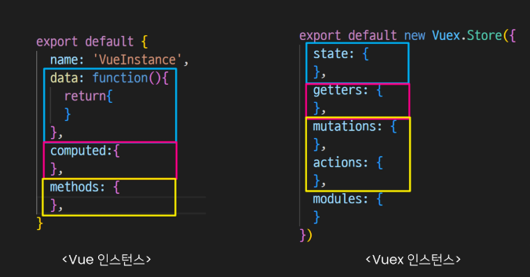
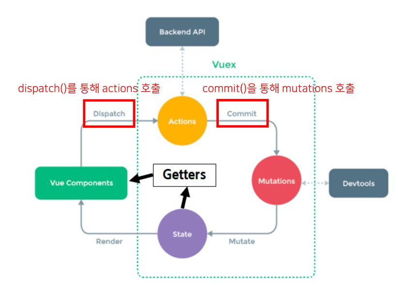
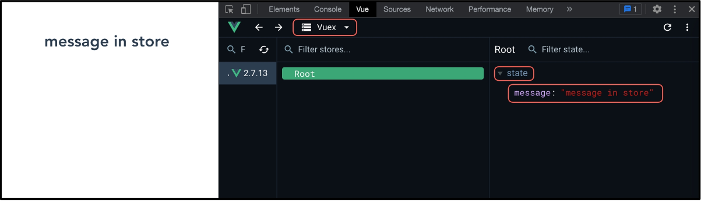

# 💫 Vue_03

## ✨ Vuex

### 📌 State Management

#### 💡 상태 관리 (State Management)

- 상태 (State) 란?
  - **현재에 대한 정보(data)**
- Web Application 에서의 상태는 어떻게 표현할까 ?
  - **현재 App이 가지고 있는 Data로 표현**
- 여러 개의 component를 조합해서 하나의 App을 만듦
- 각 component는 독립적이기 때문에 각각의 상태(data) 를 가짐
- 여러 개의 component가 같은 상태 (data) 를 유지할 필요가 있음
  - 상태 관리 (State Management) 필요 !


#### 💡 Pass Props & Emit Event

- 각 컴포넌트는 독립적으로 데이터를 관리
- 같은 데이터를 공유하고 있으므로, 각 컴포넌트가 동일한 상태를 유지하고 있음
- 데이터의 흐름을 직관적으로 파악 가능
- 그러나 component의 중첩이 깊어지면 데이터 전달이 쉽지 않음
- 공통의 상태를 유지해야 하는 componenet가 많아지면 데이터 전달 구조가 복잡해짐


#### 💡 Centralized Store

- **중앙 저장소 (store) 에 데이터를 모아서 상태 관리**
- 각 component 는 중앙 저장소의 데이터를 사용
- component 의 계층에 상관없이 중앙 저장소에 접근해서 데이터를 얻거나 변경할 수 있음
- 중앙 저장소의 데이터가 변경되면 각각의 component는 해당 데이터의 변화에 반응하여 새로 변경된 데이터를 반영함
- 규모가 크거나 컴포넌트 중첩이 깊은 프로젝트의 관리가 매우 편리


#### 💡 Vuex

- **"state management pattern + Library"** for vue.js (상태 관리 패턴 + 라이브러리)
- 중앙 저장소를 통해 상태 관리를 할 수 있도록 하는 라이브러리
- 데이터가 예측 가능한 방식으로만 변경 될 수 있도록 하는 **규칙을 설정하며, Vue의 반응성을 효율적으로 사용하는 상태 관리 기능**을 제공
- Vue의 공식 도구로써 다양한 기능을 제공


### 📌 Vuex 시작하기

```bash
$ vue create vuex-app	// Vue 프로젝트 생성
$ cd vuex-app			// 디렉토리 이동
$ vue add vuex			// Vue CLI 를 통해 vuex plugin 적용
```

- `src`/ `store`/ `index.js` 가 생성됨
- **vuex** 의 핵심 컨셉 4가지
  1. `state`
  2. `getters`
  3. `mutations`
  4. `actions`


#### 💡 Vue 와 Vuex 인스턴스 비교




#### 1. State

- vue 인스턴스의 data에 해당
- **중앙에서 관리하는 모든 상태 정보**
- 개별 component 는 state 에서 데이터를 가져와서 사용
  - 개별 component 가 관리하던 data 를 중앙 저장소 (Vuex Store의 state) 에서 관리하게 됨
- state 의 데이터가 변화하면 해당 데이터를 사용(공유)하는 component도 자동으로 다시 렌더링
- `$store.state`로 state 데이터에 접근


#### 2. Mutations

- **실제로 state 를 변경하는 유일한 방법**
- vue 인스턴스의 methods에 해당하지만 Mutations 에서 호출되는 핸들러(handler) 함수는 반드시 **동기적**이어야 함
  - 비동기 로직으로 mutations 를 사용해서 state를 변경하는 경우, state의 변화의 시기를 특정할 수 없기 때문
- 첫 번째 인자로 `state`를 받으며, component 혹은 Actions 에서 `commit()` 메서드로 호출됨

- `mutation, action 에서 호출되는 함수를 handler 함수라고 함`


#### 3. Actions

- mutations 와 비슷하지만 **비동기** 작업을 포함할 수 있다는 차이가 있음
- **state를 직접 변경하지 않고 `commit()` 메서드로 mutations 를 호출해서 state를 변경함**
- `context` 객체를 인자로 받으며, 이 객체를 통해 `store.js`의 모든 요소와 메서드에 접근할 수 있음 
  (== 즉 state를 직접 변경할 수 있지만 하지 않아야 함)

- component 에서 `dispatch()` 메서드에 의해 호출됨


#### 4. Getters

- vue 인스턴스의 computed 에 해당
- **state를 활용하여 계산된 값을 얻고자 할 때 사용**
  state의 원본 데이터를 건들지 않고 계산된 값을 얻을 수 있음

- computed와 마찬가지로 getters 의 결과는 캐시(cache) 되며, 종속된 값이 변경된 경우에만 재계산됨
- getters에서 계산된 값은 state에 영향을 미치지 않음
- 첫번째 인자로 `state`, 두 번째 인자로 `getter`를 받음


#### 💡 Mutations & Actions

- vue component 의 methods 역할이 vuex 에서는 아래와 같이 분화됨
- **Mutations**
  - state 를 변경
- **Actions**
  - state 변경을 제외한 나머지 로직




#### 💡 모든 데이터를 Vuex에서 관리해야 할까 ?

- Vuex 를 사용한다고 해서 모든 데이터를 state 에 넣어야 하는 것은 아님
- Vuex 에서도 pass props, emit event 를 사용하여 상태를 관리할 수 있음
- 개발 환경에 따라 적절하게 사용하는 것이 필요함


#### 💡 정리

- **state**
  - 중앙에서 관리하는 **모든 상태 정보**
- **mutations**
  - **state를 변경** 하기 위한 methods
- **actions**
  - **비동기 작업이 포함될 수 있는 (외부 API 와의 소통 등)** methods
  - state 를 변경하는 것 외의 모든 로직 진행
- **getters**
  - state 를 활용해 **계산한 새로운 변수 값**

- component 에서 데이터를 조작하기 위한 데이터의 흐름
  - component → (actions) → mutations → state
- component 에서 데이터를 사용하기 위한 데이터의 흐름
  - state → (getters) → component


### 📌 Vuex 실습

#### 💡 Object method shorthand

- 객체 메서드 축약형

```javascript
// before
const obj1 = {
    addValue: function (value) {
        return value
    },
}

// after
const obj2 = {
    accValue(value) {
        return value
    }
}
```


#### 💡 state

- 중앙에서 관리하는 모든 상태 정보
- `$store.state`로 접근 가능
- store의 state 에 message 데이터 정의

```javascript
// store/index.js

import Vue from 'vue'
import Vuex from 'vuex'

Vue.use(Vuex)

export default new Vuex.Store({
  state: {
    message: 'message in store',
  },
  getters: {
  },
  mutations: {
  },
  actions: {
  },
  modules: {
  }
})
```

- component 에서 state 사용

```vue
// App.vue

<template>
  <div id="app">
    <h1>{{ $store.state.message }}</h1>
  </div>
</template>
```

- `$store.state`로 바로 접근하기 보다 `computed` 에 정의 후 접근하는 것을 권장

```vue
// App.vue

<template>
  <div id="app">
    <h1>{{ message }}</h1>
  </div>
</template>

<script>
export default {
  name: 'App',
  computed: {
    message() {
      return this.$store.state.message
    },
  },
}
</script>
```

- Vue 개발자 도구에서의 Vuex
- 관리 화면을 Vuex로 변경
- 관리 되고 있는 state 확인 가능




#### 💡 actions

- state를 변경할 수 있는 **mutations 호출**
- component 에서 `dispatch()` 에 의해 호출됨
- `dispatch(A, B)`
  - **A** : 호출하고자 하는 actions 함수
  - **B** : 넘겨주는 데이터 (payload)

- `actions` 에 정의된 `changeMessage` 함수에 데이터 전달하기
- `component` 에서 `actions` 는 `dispatch()` 에 의해 호출됨

```vue
<template>
  <div id="app">
    <h1>{{ message }}</h1>
    <input 
      type="text"
      @keyup.enter="changeMessage"
      v-model="inputData"
    >
  </div>
</template>

<script>
export default {
  name: 'App',
  data() {
    return {
      inputData: null,
    }
  },
  methods: {
    changeMessage() {
      const newMessage = this.inputData
      this.$store.dispatch('changeMessage', newMessage)
    }
  }
}
</script>
```

- `actions`의 첫 번째 인자는 `context`
  - `context`는 store의 전반적인 속성을 모두 가지고 있으므로 `context.state`와 `context.getters`를 통해 mutations 를 호출하는 것이 모두 가능
  - `dispatch()`를 사용해 다른 actions 도 호출할 수 있음
  - **단, actions 에서 state 를 직접 조작하는 것은 삼가야 함**
- `actions`의 두 번째 인자는 `payload`
  - 넘겨준 데이터를 받아서 사용

```javascript
// store/index.js

export default new Vuex.Store({
    ...
    actions: {
        changeMessage(context, message) {
            console.log(context)
            console.log(message)
        },
    },
    ...
})
```


#### 💡 mutations

**"actions에서 `commit()` 을 통해 mutations 호출하기"**

- mutations 는 state 를 변경하는 유일한 방법
- component 또는 actions 에서 **`commit()` 에 의해 호출됨**
- **`commit(A, B)`**
  - **A** : 호출하고자 하는 mutations 함수
  - **B** : payload

```javascript
// store/index.js

export default new Vuex.Store({
    ...
    actions: {
        changeMessage(context, message) {
            context.commit('CHANGE_MESSAGE', message)
        }
    },
    ...
})
```

**" mutations 함수 작성하기 "**

- mutations 는 state 를 변경하는 유일한 방법
- mutations 함수의 
  - 첫 번째 인자는 `state`
  - 두 번째 인자는 `payload`

```javascript
// store/index.js

export default new Vuex.Store({
    ...
    mutations: {
        CHANGE_MESSAGE(state, message) {
            state.message = message
        }
        }
    },
    ...
})
```


#### 💡 getters

**" getters 사용해 보기 "**

- **getters는 state를 활용한 새로운 변수**
- getters 함수의
  - 첫 번째 인자는 `state`
  - 두 번째 인자는 `getters`

```javascript
// store/index.js

export default new Vuex.Store({
    ...
    getters: {
        messageLength(state) {
            return state.message.length
        }
    },
    ...
})
```

**" getters의 다른 함수 사용해 보기 "**

```javascript
// store/index.js

export default new Vuex.Store({
    ...
    getters: {
        messageLength(state) {
            return state.message.length
        },
        
        // messageLength 를 이용해서 새로운 값을 계산
        doubleLength(state, getters) {
            return getters.messageLength * 2
        }
    },
    ...
})
```

**" getters 출력하기 "**

- getters 역시 state 와 마찬가지로 computed에 정의해서 사용하는 것을 권장

```javascript
// App.vue

<template>
  <div id="app">
    <h1>{{ message }}</h1>
    <h2>입력된 문자의 길이는 {{ messageLength }}</h2>
    <input type="text" @keyup.enter="changeMessage" v-model="inputData">
  </div>
</template>

<script>
export default {
  ...
    computed: {
        message() {
            return this.$store.state.message
        },
        messageLength() {
            return this.$store.getters.messageLength
        },
        doubleLength() {
            return this.$store.getters.doubleLength
        }

    }
}
</script>
```


## ✨ Lifecycle Hooks

### 📌 Lifecycle Hooks

- 각 Vue 인스턴스는 생성과 소멸의 과정 중 단계별 초기화 과정을 거침
  - Vue 인스턴스가 생성된 경우, 인스턴스를 DOM에 마운트하는 경우, 데이터가 변경되어 DOM을 업데이트하는 경우 등
- 각 단계가 트리거가 되어 특정 로직을 실행할 수 있음


#### 💡 created

- Vue instance 가 생성된 후 호출됨
- data, computed 등의 설정이 완료된 상태
- 서버에서 받은 데이터를 vue instance의 data에 할당하는 로직을 구현하기 적합
- 단, mount 되지 않아 요소에 접근할 수 없음

- 버튼을 누르지 않아도 첫 실행 시 기본 사진이 출력되도록 하고 싶다면 ?

  - created 함수에 강아지 사진을 가져오는 함수를 추가

  ```vue
  export default {
    ...
    created() {
      this.getDogImage()
    },
  ```


#### 💡 mounted

- Vue instance 가 요소에 mount  된 후 호출됨
- mount 된 요소를 조작할 수 있음

- `created` 의 경우, mount 되기 전이기 때문에 DOM 에 접근할 수 없으므로 동작하지 않음


#### 💡 updated

- 데이터가 변경되어 DOM 에 변화를 줄 때 호출됨


#### 💡 LifeCylce Hooks 특징

- instance마다 각각의 Lifecycle 을 가지고 있음
- LifeCycle Hooks 는 컴포넌트별로 정의할 수 있음

- 부모 컴포넌트의 mounted hook이 실행 되었다고 해서 자식이 mount 된 것이 아니고,
  부모 컴포넌트가 updated hook이 실행 되었다고 해서 자식이 updated 된 것이 아님
  - 부착 여부가 부모-자식 관계에 따라 순서를 가지고 있지 않은 것
- **instance마다 각각의 Lifecycle을 가지고 있기 때문**

## ✨ Todo with Vuex


## ✨ Local Storage

- 브라우저의 **Local Storage**에 todo 데이터를 저장하여 브라우저를 종료하고 다시 실행해도 데이터가 보존될 수 있도록 하기


#### 💡 `Window.localStorage`

- 브라우저에서 제공하는 저장공간 중 하나인 Local Storage 에 관련된 속성
- 만료되지 않고 브라우저를 종료하고 다시 실행해도 데이터가 보존됨
- 데이터가 문자열 형태로 저장됨
- 관련 메서드
  - `setItem(key, value)` - key, value 형태로 저장
  - `getItem(key)` -key 에 해당하는 데이터 조회
