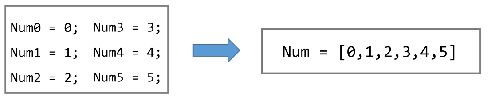

# 💫 알고리즘

### ✨ 알고리즘

- 유한한 단계를 통해 문제를 해결하기 위한 절차나 방법
- 주로 컴퓨터 용어로 쓰이며, 컴퓨터가 어떤 일을 수행하기 위한 단계적 방법을 말한다.
- **어떤 문제를 해결하기 위한 절차**

#### 📢 컴퓨터 분야에서 알고리즘을 표현하는 방법은 크게 두 가지

1. 의사코드 (슈도코드, Pseudocode)

   

2. 순서도


#### 📢 APS 과정의 목표 중의 하나는 보다 좋은 알고리즘을 이해하고 활용하는 것이다.

#### 📢 무엇이 좋은 알고리즘인가?

1. 정확성 : 얼마나 정확하게 동작하는가
2. 작업량 : 얼마나 적은 연산으로 원하는 결과를 얻어내는가
3. 메모리 사용량 : 얼마나 적은 메모리를 사용하는가
4. 단순성 : 얼마나 단순한가
5. 최적성 : 더 이상 개선할 여지없이 최적화 되었는가


#### 📢 알고리즘의 성능은 무엇으로 측정하는가

- 주어진 문제를 해결하기 위해 여러 개의 다양한 알고리즘이 가능
- 알고리즘의 성능 분석 필요
  - 많은 문제에서 성능 분석의 기준으로 알고리즘의 작업량을 비교한다.

##### 🎶 알고리즘의 작업량을 표현할 때 시간복잡도로 표현한다.

- **시간 복잡도(Time Complexity)**
  - 실제 걸리는 시간을 측정
  - 실행되는 명령문의 개수를 계산

- **빅-오(O) 표기법**
  - 빅-오 표기법 (Big-Oh Notation)
  - 시간 복잡도 함수 중에서 가장 큰 영향력을 주는 n에 대한 항만을 표시
  - 계수(Coefficient)는 생략하여 표시
- n개의 데이터를 입력 받아 저장한 후 각 데이터에 1씩 증가시킨 후 각 데이터를 화면에 출력하는 알고리즘의 시작복잡도는 ?  **O(n)**
- 요소 수가 증가함에 따라 각기 다른 시간복잡도의 알고리즘은 아래와 같은 연산 수를 보인다.


## ✨ 배열

#### 📢 배열이란 무엇인가

- 일정한 자료형의 변수들을 하나의 이름으로 열거하여 사용하는 자료구조
- 아래의 예는 6개의 변수를 사용해야 하는 경우, 이를 배열로 바꾸어 사용하는 것이다. 



#### 📢 배열의 필요성

- 프로그램 내에서 여러 개의 변수가 필요할 때, 일일이 다른 변수명을 이용하여 자료에 접근하는 것은 매우 비효율적일 수 있다.
- 배열을 사용하면 하나의 선언을 통해서 둘 이상의 변수를 선언할 수 있다.
- 단순히 다수의 변수 선언을 의미하는 것이 아니라, 다수의 변수로는 하기 힘든 작업을 배열을 활용해 쉽게 할 수 있다. 


#### 📢 1차원 배열

- **1차원 배열의 선언**

  - 별도의 선언 방법이 없으면 변수에 처음 값을 할당할 때 생성

  - 이름 : 프로그램에서 사용할 배열의 이름

    `Arr = list()` , `Arr = []`,  `Arr = [1, 2, 3]`,  `Arr = [0] * 10 `

- **1차원 배열의 접근**
  - Arr[0] = 10 # '배열 Arr의 0번 원소에 10을 저장하라'
  - Arr[idx] = 20 # '배열 Arr의 idx번 원소에 20을 저장하라'


## ✨ 정렬

- 2개 이상의 자료를 특정 기준에 의해 작은 값부터 큰 값(오름차순: ascending), 혹은 그 반대의 순서대로(내림차순: descending) 재배열 하는 것
- 키
  - 자료를 정렬하는 기준이 되는 특정 값

### 📢 정렬의 종류

- 버블 정렬 (Bubble Sort)
- 카운팅 정렬 (Counting Sort)
- 선택 정렬 (Selection Sort)
- 퀵 정렬 (Quick Sort)
- 삽입 정렬 (Insertion Sort)
- 병합 정렬 (Merge Sort)


### 1. 버블 정렬 (Bubble Sort)

- 인접한 두 개의 원소를 비교하며 자리를 계속 교환하는 방식
- **정렬 과정**
  - 첫 번째 원소부터 인접한 원소끼리 계속 자리를 교환하면서 맨 마지막 자리까지 이동한다.
  - 한 단계가 끝나면 가장 큰 원소가 마지막 자리로 정렬된다.
  - 교환하며 자리를 이동하는 모습이 물 위에 올라오는 거품 모양과 같다고 하여 버블 정렬이라고 한다.

- **시작복잡도**
  - O(n²)

- **배열을 활용한 버블 정렬**

```python
# 슈도코드
BubbleSort(a, N)					# 정렬할 배열과 배열의 크기
	for i : N-1 -> 1				# 정렬될 구간의 끝
		for j : 0 -> i-1			# 비교할 원소 중 왼쪽 원소의 인덱스
        	if a[j] > a[j+1]		# 왼쪽 원소가 더 크면
            	a[j] <-> a[j+1]		# 오른쪽 원소와 교환
                
# 파이썬코드
def BubbleSort(a, N):				# 정렬할 List, N 원소 수
    for i in range(N-1, 0, -1):		# 범위의 끝 위치
        for j in range(0, i):
            if a[j] > a[j+1]:
                a[j], a[j+1] = a[j+1], a[j]

```


### 2. 카운팅 정렬 (Counting Sort)

- 항목들의 순서를 결정하기 위해 집합에 각 항목이 몇 개씩 있는지 세는 작업을 하여, 선형 시간에 정렬하는 효율적인 알고리즘
- **제한 사항**
  - 정수나 정수로 표현할 수 있는 자료에 대해서만 적용 가능 
    : 각 항목의 발생 횟수를 기록하기 위해, 정수 항목으로 인덱스 되는 카운트들의 배열을 사용하기 때문이다.
  - 카운트들을 위한 충분한 공간을 할당하려면 집합 내의 가장 큰 정수를 알아야 한다.
- **시간 복잡도**
  - O(n + k) : n은 리스트 길이, k는 정수의 최댓값

#### 📢 카운팅 정렬 과정

**[0, 4, 1, 3, 1, 2, 4, 1] 을 카운팅 정렬하는 과정**

```python
def Counting_Sort(A, B, k)
# A [] -- 입력 배열 (1 to k)
# B [] -- 정렬된 배열.
# C [] -- 카운트 배열.
	
    C = [0] * (k+1)
    
    for i in range(0, len(A)):
        C[A[i]] += 1
        
    for i in range(1, len(C)):
        C[i] += C[i-1]
        
    for i in range(len(B)-1, -1, -1):
        C[A[i]] -= 1
        B[C[A[i]]] = A[i]
```


### 📢 정렬 알고리즘 비교

|  알고리즘   | 평균 수행시간 | 최악 수행시간 | 알고리즘 기법 |                           비고                            |
| :---------: | :-----------: | :-----------: | :-----------: | :-------------------------------------------------------: |
|  버블 정렬  |     O(n²)     |     O(n²)     |  비교와 교환  |                    코딩이 가장 손쉽다.                    |
| 카운팅 정렬 |    O(n+k)     |    O(n+k)     |  비교환 방식  |              n이 비교적 작을 때만 가능하다.               |
|  선택 정렬  |     O(n²)     |     O(n²)     |  비교와 교환  |        교환의 회수가 버블,<br />삽입정렬보다 작다.        |
|   퀵 정렬   |  O(n log n)   |     O(n²)     |   분할 정복   | 최악의 경우 O(n²) 이지만, <br />평균적으로는 가장 빠르다. |
|  삽입 정렬  |     O(n²)     |     O(n²)     |  비교와 교환  |              n의 개수가 작을 때 효과적이다.               |
|  병합 정렬  |  O(n log n)   |  O(n log n)   |   분할 정복   |           연결리스트의 경우 가장 효율적인 방식            |


## ✨ 완전 검색 (Exaustive Search)

- 완전 검색 방법은 문제의 해법으로 생각할 수 있는 모든 경우의 수를 나열해보고 확인하는 기법이다.
- Brute-force 혹은 generate-and-test 기법이라고도 불리운다.
- 모든 경우의 수를 테스트한 후, 최종 해법을 도출한다.
- 일반적으로 경우의 수가 상대적으로 작을 때 유용하다.
- 모든 경우의 수를 생성하고 테스트하기 때문에 수행 속도는 느리지만, 해답을 찾아내지 못할 확률이 작다.
- 자격검정평가 등에서 주어진 문제를 풀 때, 우선 완전 검색으로 접근하여 해답을 도출한 후, 성능 개선을 위해 다른 알고리즘을 사용하고 해답을 확인하는 것이 바람직하다.


## ✨ 탐욕(Greedy) 알고리즘

- 탐욕 알고리즘은 최적해를 구하는 데 사용되는 근시안적인 방법
- 여러 경우 중 하나를 결정해야 할 때마다 그 순간에 최적이라고 생각되는 것을 선택해 나가는 방식으로 진행하여 최종적인 해답에 도달한다.
- 각 선택의 시점에서 이루어지는 결정은 지역적으로는 최적이지만,
  그 선택들을 계속 수집하여 최종적인 해답을 만들었다고 하여, 그것이 최적이라는 보장은 없다.
- 일반적으로, 머릿속에 떠오르는 생각을 검증 없이 바로 구현하면  Greedy 접근이 된다.


#### 📢 탐욕 알고리즘의 동작 과정

1. 해 선택 : 현재 상태에서 부분 문제의 최적 해를 구한 뒤, 이를 부분해 집합(Solution Set)에 추가한다.
2. 실행 가능성 검사 : 새로운 부분해 집합이 실행 가능한지를 확인한다. 곧, 문제의 제약 조건을 위반하지 않는지를 검사한다.
3. 해 검사 : 새로운 부분해 집합이 문제의 해가 되는지를 확인한다. 아직 전체 문제의 해가 완성되지 않았다면 1)의 해 선택부터 다시 시작한다.


### - Baby-Gin 

```python
num = 456789 
c = [0] * 12
# 자릿수가 정해져있는 코드
for i in range(6):
    c[num % 10] += 1
    num //= 10
    
i = 0
tri = run = 0
while i < 10:
    if c[i] >= 3			# triplete 조사 후 데이터 삭제
    c[i] -= 3
    tri += 1
    continue;
    if c[i] >= 1 and c[i+1] >= 1 and c[i+2] >= 1:	# run 조사 후 데이터 삭제
        c[i] -= 1
        c[i+1] -= 1
        c[i+2] -= 1
        run += 1
    i += 1
if run + tri == 2 : print("baby Gin")
else:
    print("Lose")
```


```python
# 자릿수가 정해져있지 않을 때 코드

while num > 0:
    c[num % 10] += 1
    num //= 10
```

